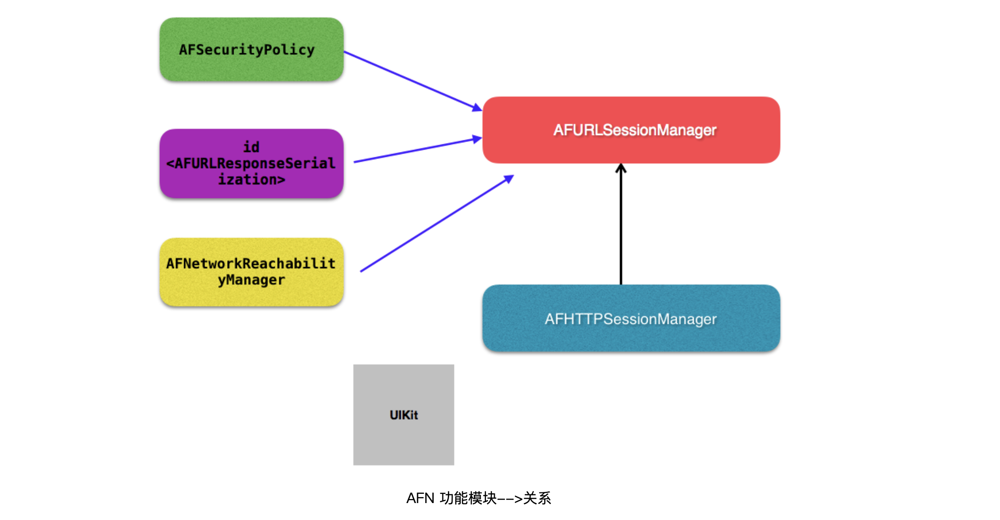
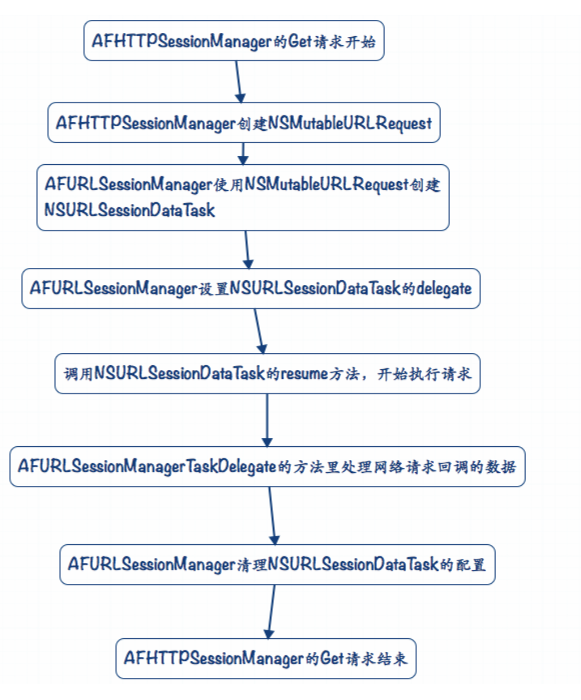

# AFNetworking

[源码](https://github.com/AFNetworking/AFNetworking)

TODO:

- [ ] RequestSerialization 源码分析理解
- [ ] 知识点补充内容


## 网络编程基础

https://www.jianshu.com/p/ecf853976bd9

https://developer.aliyun.com/article/38002?spm=a2c6h.12873639.article-detail.27.47e76a7fkhSnmp


1. HTTP通信过程 - 请求

HTTP协议规定：1个完整的由客户端发给服务器的HTTP请求中包含以下内容

请求头：包含了对客户端的环境描述、客户端请求信息等

GET /minion.png HTTP/1.1 // 包含了请求方法、请求资源路径、HTTP协议版本

Host: 120.25.226.186:32812 // 客户端想访问的服务器主机地址

User-Agent: Mozilla/5.0 // 客户端的类型，客户端的软件环境

Accept: text/html, */* // 客户端所能接收的数据类型

Accept-Language: zh-cn // 客户端的语言环境

Accept-Encoding: gzip // 客户端支持的数据压缩格式

请求体：客户端发给服务器的具体数据，比如文件数据(POST请求才会有)


2. HTTP通信过程 - 响应

客户端向服务器发送请求，服务器应当做出响应，即返回数据给客户端

HTTP协议规定：1个完整的HTTP响应中包含以下内容

响应头：包含了对服务器的描述、对返回数据的描述

HTTP/1.1 200 OK // 包含了HTTP协议版本、状态码、状态英文名称

Server: Apache-Coyote/1.1 // 服务器的类型

Content-Type: image/jpeg // 返回数据的类型

Content-Length: 56811 // 返回数据的长度

Date: Mon, 23 Jun 2014 12:54:52 GMT // 响应的时间

响应体：服务器返回给客户端的具体数据，比如文件数据


3. 常见响应状态码


| 状态码 | 英文名称              | 中文描述                             |
| ------ | --------------------- | ------------------------------------ |
| 200    | OK                    | 请求成功                             |
| 400    | Bad Request           | 客户端请求的语法错误，服务器无法解析 |
| 404    | Not Found             | 服务器无法根据客户端的请求找到资源   |
| 500    | Internal Server Error | 服务器内部错误，无法完成请求         |


## 框架

[iOS 框架详解—「AFNetworking 框架结构及逻辑处理过程」](http://www.uml.org.cn/mobiledev/201709123.asp)

[AFNetworking框架分析](https://www.jianshu.com/u/38c0c4089e64)

[AFNetworking学习](https://chiyun1.github.io/2021/05/11/AFNetworking-learn/)


### Overview

- NSURLSession【管理者】
  - AFURLSessionManager
  - AFHTTPSessionManager（封装了常用的 HTTP 方法）
    - GET
    - POST
    - UIKit + AFNetworking 分类
    - NSProgress：利用KVO

- Serialization【序列化】
  - AFURLRequestSerialization【请求序列化】
    - AFHTTPRequestSerializer（请求的数据格式，默认二进制）
    - AFJSONRequestSerializer
    - AFPropertyListRequestSerializer
  - AFURLResponseSerialization【响应者序列化】
    - AFHTTPResponseSerializer（默认二进制响应数据，解析方案）
    - AFJSONResponseSerializer（返回JSON类型，JSON解析方案.默认）
    - AFXMLParserResponseSerializer（返回XML类型，XML解析方案）

- Additional Functionality【额外的功能】
  - AFSecurityPolicy【安全策略相关】
  - HTTPS（HTTP+SSL加密协议）
  - AFNetworkReachabilityManager【网络状态监听管理者】

- UIKit【类库扩展与工具类】

  - UIKit+AFNetworking

  

在AFN框架中，负责网络通讯请求最重要的两个类分别是AFURLSessionManager 和AFHTTPSessionManager。AFHTTPSessionManager 又是继承于 AFURLSessionManager，进行了封装。

AFHTTPRequestSerializer，实现AFURLRequestSerialization协议，主要用于网络请求之前的操作配置，负责配置网络请求的请求头部、序列化请求参数。

AFHTTPResponseSerializer，实现AFURLResponseSerialization协议，主要用于网络请求之后的数据处理，针对不同的数据进行处理，比如JSON、XML、plist、图片格式等数据。

附加功能类中，AFSecurityPolicy主要用于HTTPS环境下的认证安全请求通讯。如果是通过CA认证过的HTTPS访问地址，使用AFN时只需要拼接上https://即可，AFN的网络请求配置中默认使用CA认证访问HTTPS地址；若是自签的证书时，则需要当前类用于进行认证。

AFNetworkReachabilityManager，用于网络状态的监听，判断是否有网络，以及判断网络连接类型，比如蜂窝网络或WiFi环境。但当前类无法判断当前环境能否访问服务器服务。其原理是利用主机的数据包发送。





可以看到，AFN 的核心是 AFURLSessionManager 类，AFHTTPSessionManager 继承于 AFURLSessionManager， 针对HTTP协议传输做了特化。而 AFURLResponseSerialization，AFSecurityPolicy，AFNetworkReachabilityManager则被AFURLSessionManager所用。

其次，还可以看到一个单独的UIKit 包提供了对 iOS UIKit 类库的扩展与工具类。


### 流程




#### 时序图

##### 发起一个请求


##### 通过Delegate类处理一个请求


### 部分源码（按照流程顺序）


##### 核心方法：

```objective-c
//AFHTTPSessionManager在此方法上封装提供给调用者以get head post put patch delete命名的api，最终收归于此方法
- (NSURLSessionDataTask *)dataTaskWithHTTPMethod:(NSString *)method
                                       URLString:(NSString *)URLString
                                      parameters:(nullable id)parameters
                                         headers:(nullable NSDictionary <NSString *, NSString *> *)headers
                                  uploadProgress:(nullable void (^)(NSProgress *uploadProgress)) uploadProgress
                                downloadProgress:(nullable void (^)(NSProgress *downloadProgress)) downloadProgress
                                         success:(nullable void (^)(NSURLSessionDataTask *task, id _Nullable responseObject))success
                                         failure:(nullable void (^)(NSURLSessionDataTask * _Nullable task, NSError *error))failure
{
    NSError *serializationError = nil;
    //1. 调用AFHTTPRequestSerializer的requestWithMethod函数构建request
    NSMutableURLRequest *request = [self.requestSerializer requestWithMethod:method URLString:[[NSURL URLWithString:URLString relativeToURL:self.baseURL] absoluteString] parameters:parameters error:&serializationError]; //relativeToURL表示URLString拼接至baseURL
    for (NSString *headerField in headers.keyEnumerator) {
        [request setValue:headers[headerField] forHTTPHeaderField:headerField];
    }
    //处理request构建产生的错误 - serializationError
    if (serializationError) {
        if (failure) {
            dispatch_async(self.completionQueue ?: dispatch_get_main_queue(), ^{
                failure(nil, serializationError);
            });
        }

        return nil;
    }

    //2. 在NSMutableURLRequest对象初始化之后(此时request已经将参数拼接在url后面），创建了一个NSURLSessionDataTask任务类对象，并将request传入。                                       
    __block NSURLSessionDataTask *dataTask = nil;
    dataTask = [self dataTaskWithRequest:request
                          uploadProgress:uploadProgress
                        downloadProgress:downloadProgress
                       completionHandler:^(NSURLResponse * __unused response, id responseObject, NSError *error) {
        if (error) {
            if (failure) {
                failure(dataTask, error);
            }
        } else {
            if (success) {
                success(dataTask, responseObject);
            }
        }
    }];

    return dataTask;
}
```


#### 1. 调用AFHTTPRequestSerializer的requestWithMethod函数构建request

```objc
@property (nonatomic, strong) AFHTTPRequestSerializer <AFURLRequestSerialization> * requestSerializer;

//可以自定义，默认为
self.requestSerializer = [AFHTTPRequestSerializer serializer]; //return [[self alloc] init];
```


```objc
//AFHTTPRequestSerializer
- (NSMutableURLRequest *)requestWithMethod:(NSString *)method
                                 URLString:(NSString *)URLString
                                parameters:(id)parameters
                                     error:(NSError *__autoreleasing *)error
{
    NSParameterAssert(method);
    NSParameterAssert(URLString);

    NSURL *url = [NSURL URLWithString:URLString];

    NSParameterAssert(url);

    NSMutableURLRequest *mutableRequest = [[NSMutableURLRequest alloc] initWithURL:url];
    //设置请求方式
    mutableRequest.HTTPMethod = method;

    //将request（被监听到变动的）属性遍历，给 mutable request 通过kvc赋值
    for (NSString *keyPath in self.mutableObservedChangedKeyPaths) {
        //通过key value coding 动态赋值
        [mutableRequest setValue:[self valueForKeyPath:keyPath] forKey:keyPath];
    }

    //将传入的参数进行编码,将params整理成字符串，接入url后面 （使用到queryStringSerialization，可以自定义）
    mutableRequest = [[self requestBySerializingRequest:mutableRequest withParameters:parameters error:error] mutableCopy];

	return mutableRequest;
}
```

以上，就是AFN框架中，发起网络请求之前，关于request处理相关的操作全部流程分析，其中最主要的功能就是对传参参数进行了数据的递归解析，其次对request的六个相关属性进行KVO监听，可以在初始化AFHTTPSessionManager对象之后，自定义修改指定request属性时，通过KVO代理方法以及动态KVC最终在request中实现配置修改。

>  需要学习的点：通过KVO代理方法以及动态KVC实现配置修改

```objc
// 将传入的参数进行编码,将params整理成字符串，接入url后面 （使用到queryStringSerialization，可以自定义）
- (NSURLRequest *)requestBySerializingRequest:(NSURLRequest *)request
                               withParameters:(id)parameters
                                        error:(NSError *__autoreleasing *)error
{
    NSParameterAssert(request);

    NSMutableURLRequest *mutableRequest = [request mutableCopy];

    [self.HTTPRequestHeaders enumerateKeysAndObjectsUsingBlock:^(id field, id value, BOOL * __unused stop) {
        if (![request valueForHTTPHeaderField:field]) {
            [mutableRequest setValue:value forHTTPHeaderField:field];
        }
    }];

    NSString *query = nil;
    //将我们传入的字典转成字符串
    if (parameters) {
        //如果自定义解析方式
        if (self.queryStringSerialization) {
            NSError *serializationError;
            query = self.queryStringSerialization(request, parameters, &serializationError);

            if (serializationError) {
                if (error) {
                    *error = serializationError;
                }

                return nil;
            }
        } else {
            //默认的解析方式 key=value&key=value
            switch (self.queryStringSerializationStyle) {
                case AFHTTPRequestQueryStringDefaultStyle:
                    query = AFQueryStringFromParameters(parameters);
                    break;
            }
        }
    }

    // 判断是否是GET/HEAD/DELETE方法， 对于GET/HEAD/DELETE方法，把参数加到URL后面
    if ([self.HTTPMethodsEncodingParametersInURI containsObject:[[request HTTPMethod] uppercaseString]]) {
      // 判断是否有参数
        if (query && query.length > 0) {
            mutableRequest.URL = [NSURL URLWithString:[[mutableRequest.URL absoluteString] stringByAppendingFormat:mutableRequest.URL.query ? @"&%@" : @"?%@", query]];
        }
    } else {
        // #2864: an empty string is a valid x-www-form-urlencoded payload
        if (!query) {
            query = @"";
        }
      // 参数带在body上，大多是POST PUT
        if (![mutableRequest valueForHTTPHeaderField:@"Content-Type"]) {
          // 设置Content-Type HTTP头，告诉服务端body的参数编码类型
            [mutableRequest setValue:@"application/x-www-form-urlencoded" forHTTPHeaderField:@"Content-Type"];
        }
        [mutableRequest setHTTPBody:[query dataUsingEncoding:self.stringEncoding]];
    }

    return mutableRequest;
}
```

##### 内部实现：

1. 通过KVO代理方法以及动态KVC实现配置修改

```objc
static NSArray * AFHTTPRequestSerializerObservedKeyPaths() {
    static NSArray *_AFHTTPRequestSerializerObservedKeyPaths = nil;
    static dispatch_once_t onceToken;
    dispatch_once(&onceToken, ^{
        _AFHTTPRequestSerializerObservedKeyPaths = @[NSStringFromSelector(@selector(allowsCellularAccess)), NSStringFromSelector(@selector(cachePolicy)), NSStringFromSelector(@selector(HTTPShouldHandleCookies)), NSStringFromSelector(@selector(HTTPShouldUsePipelining)), NSStringFromSelector(@selector(networkServiceType)), NSStringFromSelector(@selector(timeoutInterval))];
    });

    return _AFHTTPRequestSerializerObservedKeyPaths;
}
```

关于AFHTTPRequestSerializerObservedKeyPaths()，查看实现方法可以发现返回一个带有方法名的数组，定义了一个static的方法，表示该方法只能在本文件中使用。利用runtime的反射调用NSStringFromSelector方法，将六个方法名转换成字符串存入数组中。而这个六个方法又分别对应了mutableRequest的六个属性名称。

>  [objc static关键字](https://juejin.cn/post/6844903590205587469) 隐藏性

```objc
    self.mutableObservedChangedKeyPaths = [NSMutableSet set];
    for (NSString *keyPath in AFHTTPRequestSerializerObservedKeyPaths()) {
        if ([self respondsToSelector:NSSelectorFromString(keyPath)]) {
            [self addObserver:self forKeyPath:keyPath options:NSKeyValueObservingOptionNew context:AFHTTPRequestSerializerObserverContext];
        }
    }
```

```objc
//当数组的元素发生变化时，判断新值是否为空。若为空则从mutableObservedChangedKeyPaths可变集合中移除；不为空，则添加至可变集合中。
- (void)observeValueForKeyPath:(NSString *)keyPath
                      ofObject:(__unused id)object
                        change:(NSDictionary *)change
                       context:(void *)context
{
    if (context == AFHTTPRequestSerializerObserverContext) {
        if ([change[NSKeyValueChangeNewKey] isEqual:[NSNull null]]) {
            [self.mutableObservedChangedKeyPaths removeObject:keyPath];
        } else {
            [self.mutableObservedChangedKeyPaths addObject:keyPath];
        }
    }
}
```

2. 内部params解析字符串方法：

> AFQueryStringPair： 
>
> ```objc
> @interface AFQueryStringPair : NSObject
> @property (readwrite, nonatomic, strong) id field;
> @property (readwrite, nonatomic, strong) id value;
> 
> - (instancetype)initWithField:(id)field value:(id)value;
> 
> - (NSString *)URLEncodedStringValue;
> @end
> 
> @implementation AFQueryStringPair
> 
> - (instancetype)initWithField:(id)field value:(id)value {
>     self = [super init];
>     if (!self) {
>         return nil;
>     }
> 
>     self.field = field;
>     self.value = value;
> 
>     return self;
> }
> 
> //百分号编码：[百分号编码](https://www.cnblogs.com/nyw1983/p/11755792.html)
> - (NSString *)URLEncodedStringValue {
>     if (!self.value || [self.value isEqual:[NSNull null]]) {
>         return AFPercentEscapedStringFromString([self.field description]);
>     } else {
>         return [NSString stringWithFormat:@"%@=%@", AFPercentEscapedStringFromString([self.field description]), AFPercentEscapedStringFromString([self.value description])];
>     }
> }
> 
> @end
> FOUNDATION_EXPORT NSArray * AFQueryStringPairsFromDictionary(NSDictionary *dictionary);
> FOUNDATION_EXPORT NSArray * AFQueryStringPairsFromKeyAndValue(NSString *key, id value);
> 
> // c语言方法
> NSString * AFQueryStringFromParameters(NSDictionary *parameters) {
>     NSMutableArray *mutablePairs = [NSMutableArray array];
>     for (AFQueryStringPair *pair in AFQueryStringPairsFromDictionary(parameters)) {
>         [mutablePairs addObject:[pair URLEncodedStringValue]];
>     }
> 
>     return [mutablePairs componentsJoinedByString:@"&"];
> }
> 
> NSArray * AFQueryStringPairsFromDictionary(NSDictionary *dictionary) {
>     return AFQueryStringPairsFromKeyAndValue(nil, dictionary);
> }
> 
> //递归
> NSArray * AFQueryStringPairsFromKeyAndValue(NSString *key, id value) {
>     NSMutableArray *mutableQueryStringComponents = [NSMutableArray array];
> 
>     NSSortDescriptor *sortDescriptor = [NSSortDescriptor sortDescriptorWithKey:@"description" ascending:YES selector:@selector(compare:)];
> 
>     if ([value isKindOfClass:[NSDictionary class]]) {
>         NSDictionary *dictionary = value;
>         // Sort dictionary keys to ensure consistent ordering in query string, which is important when deserializing potentially ambiguous sequences, such as an array of dictionaries
>         for (id nestedKey in [dictionary.allKeys sortedArrayUsingDescriptors:@[ sortDescriptor ]]) {
>             id nestedValue = dictionary[nestedKey];
>             if (nestedValue) {
>                 [mutableQueryStringComponents addObjectsFromArray:AFQueryStringPairsFromKeyAndValue((key ? [NSString stringWithFormat:@"%@[%@]", key, nestedKey] : nestedKey), nestedValue)];
>             }
>         }
>     } else if ([value isKindOfClass:[NSArray class]]) {
>         NSArray *array = value;
>         for (id nestedValue in array) {
>             [mutableQueryStringComponents addObjectsFromArray:AFQueryStringPairsFromKeyAndValue([NSString stringWithFormat:@"%@[]", key], nestedValue)];
>         }
>     } else if ([value isKindOfClass:[NSSet class]]) {
>         NSSet *set = value;
>         for (id obj in [set sortedArrayUsingDescriptors:@[ sortDescriptor ]]) {
>             [mutableQueryStringComponents addObjectsFromArray:AFQueryStringPairsFromKeyAndValue(key, obj)];
>         }
>     } else {
>         [mutableQueryStringComponents addObject:[[AFQueryStringPair alloc] initWithField:key value:value]];
>     }
> 
>     return mutableQueryStringComponents;
> }
> ```


#### 2. 创建了一个NSURLSessionDataTask任务类对象，并将request传入

```objc
- (NSURLSessionDataTask *)dataTaskWithRequest:(NSURLRequest *)request
                               uploadProgress:(nullable void (^)(NSProgress *uploadProgress)) uploadProgressBlock
                             downloadProgress:(nullable void (^)(NSProgress *downloadProgress)) downloadProgressBlock
                            completionHandler:(nullable void (^)(NSURLResponse *response, id _Nullable responseObject,  NSError * _Nullable error))completionHandler {

    NSURLSessionDataTask *dataTask = [self.session dataTaskWithRequest:request];

    [self addDelegateForDataTask:dataTask uploadProgress:uploadProgressBlock downloadProgress:downloadProgressBlock completionHandler:completionHandler];

    return dataTask;
}

```

```objc
- (void)addDelegateForDataTask:(NSURLSessionDataTask *)dataTask
                uploadProgress:(nullable void (^)(NSProgress *uploadProgress)) uploadProgressBlock
              downloadProgress:(nullable void (^)(NSProgress *downloadProgress)) downloadProgressBlock
             completionHandler:(void (^)(NSURLResponse *response, id responseObject, NSError *error))completionHandler
{
    AFURLSessionManagerTaskDelegate *delegate = [[AFURLSessionManagerTaskDelegate alloc] initWithTask:dataTask];
               //delegate初始化 见下文
    delegate.manager = self;
    //completionhandler
    delegate.completionHandler = completionHandler;

    dataTask.taskDescription = self.taskDescriptionForSessionTasks;
    [self setDelegate:delegate forTask:dataTask]; 

    delegate.uploadProgressBlock = uploadProgressBlock;
    delegate.downloadProgressBlock = downloadProgressBlock;
}

//将一个session task和一个AFURLSessionManagerTaskDelegate类型的delegate变量绑在一起，而这个绑在一起的工作是由我们的AFURLSessionManager所做
- (void)setDelegate:(AFURLSessionManagerTaskDelegate *)delegate
            forTask:(NSURLSessionTask *)task
{
    NSParameterAssert(task);
    NSParameterAssert(delegate);
    //[self.lock lock]与[self.lock unlock]方法用于确保中间代码块为原子操作，保证线程安全
    [self.lock lock];
    //将delegate存入字典，以task的id作为key，说明每个task都有各自的代理
    self.mutableTaskDelegatesKeyedByTaskIdentifier[@(task.taskIdentifier)] = delegate; //以该session task的taskIdentifier为key（taskIdentifier是在创建task的时候NSURLSessionTask为其设置的，不需要手动设置，保证唯一性），delegate为value。
    //给session task添加了监听KVO事件，用于实时监听task的状态
    [self addNotificationObserverForTask:task];
    [self.lock unlock];
}
```

```objc
- (void)addNotificationObserverForTask:(NSURLSessionTask *)task {
    [[NSNotificationCenter defaultCenter] addObserver:self selector:@selector(taskDidResume:) name:AFNSURLSessionTaskDidResumeNotification object:task];
    [[NSNotificationCenter defaultCenter] addObserver:self selector:@selector(taskDidSuspend:) name:AFNSURLSessionTaskDidSuspendNotification object:task];
}
```

> 需要学习的点：NSNotification

> 这里为什么要在AFN内部添加delegate，并将其和task进行一一绑定？
>  在上面的更新进度状态时操作，完全可以放到AFURLSessionManager核心类本身中进行执行，但这样全部放在同一类下处理会不断增加核心类的复杂度。因此将请求过程与完成，交给delegate去处理，提高可维护性。

delegate：

> ```objc
> @interface AFURLSessionManagerTaskDelegate : NSObject <NSURLSessionTaskDelegate, NSURLSessionDataDelegate, NSURLSessionDownloadDelegate>
> - (instancetype)initWithTask:(NSURLSessionTask *)task;
> @property (nonatomic, weak) AFURLSessionManager *manager;
> @property (nonatomic, strong) NSMutableData *mutableData;
> @property (nonatomic, strong) NSProgress *uploadProgress;
> @property (nonatomic, strong) NSProgress *downloadProgress;
> @property (nonatomic, copy) NSURL *downloadFileURL;
> #if AF_CAN_INCLUDE_SESSION_TASK_METRICS
> @property (nonatomic, strong) NSURLSessionTaskMetrics *sessionTaskMetrics AF_API_AVAILABLE(ios(10), macosx(10.12), watchos(3), tvos(10));
> #endif
> @property (nonatomic, copy) AFURLSessionDownloadTaskDidFinishDownloadingBlock downloadTaskDidFinishDownloading;
> @property (nonatomic, copy) AFURLSessionTaskProgressBlock uploadProgressBlock;
> @property (nonatomic, copy) AFURLSessionTaskProgressBlock downloadProgressBlock;
> @property (nonatomic, copy) AFURLSessionTaskCompletionHandler completionHandler;
> @end
>   
> ```

`- (instancetype)initWithTask:(NSURLSessionTask *)task`: 初始化，配置上传uploadProgress和下载downloadProgress变量

```objc
- (instancetype)initWithTask:(NSURLSessionTask *)task {
    self = [super init];
    if (!self) {
        return nil;
    }
    
    _mutableData = [NSMutableData data];
    _uploadProgress = [[NSProgress alloc] initWithParent:nil userInfo:nil];
    _downloadProgress = [[NSProgress alloc] initWithParent:nil userInfo:nil];
    
    __weak __typeof__(task) weakTask = task;
    for (NSProgress *progress in @[ _uploadProgress, _downloadProgress ])
    {
        progress.totalUnitCount = NSURLSessionTransferSizeUnknown;
        progress.cancellable = YES;
        progress.cancellationHandler = ^{
            [weakTask cancel];
        };
        progress.pausable = YES;
        progress.pausingHandler = ^{
            [weakTask suspend];
        };
#if AF_CAN_USE_AT_AVAILABLE
        if (@available(macOS 10.11, *))
#else
        if ([progress respondsToSelector:@selector(setResumingHandler:)])
#endif
        {
            progress.resumingHandler = ^{
                [weakTask resume];
            };
        }
        
        [progress addObserver:self
                   forKeyPath:NSStringFromSelector(@selector(fractionCompleted))
         //从效率的角度上来说，执行的时候不是通过方法名字而是通过方法的ID来查找方法，由于整数的查找比匹配字符串快得多，所以这样可以在某种程序上提高执行的效率
                      options:NSKeyValueObservingOptionNew
                      context:NULL];
    }
    return self;
}

- (void)observeValueForKeyPath:(NSString *)keyPath ofObject:(id)object change:(NSDictionary<NSString *,id> *)change context:(void *)context {
   if ([object isEqual:self.downloadProgress]) {
        if (self.downloadProgressBlock) {
            self.downloadProgressBlock(object);
        }
    }
    else if ([object isEqual:self.uploadProgress]) {
        if (self.uploadProgressBlock) {
            self.uploadProgressBlock(object);
        }
    }
}
```


#### 3. task任务执行resume方法

当task任务执行resume方法开始请求网络后，会执行NSURLSession相关的代理方法。

1. 当收到返回数据时，会执行`- (void)URLSession:(__unused NSURLSession *)session dataTask:(__unused NSURLSessionDataTask *)dataTask didReceiveData:(NSData *)data`代理方法。该代理方法可能会在收到数据时多次执行，因此需要拼接其中的data数据。

```objc
- (void)URLSession:(NSURLSession *)session
          dataTask:(NSURLSessionDataTask *)dataTask
    didReceiveData:(NSData *)data
{

    AFURLSessionManagerTaskDelegate *delegate = [self delegateForTask:dataTask];
    [delegate URLSession:session dataTask:dataTask didReceiveData:data];

    if (self.dataTaskDidReceiveData) {
        self.dataTaskDidReceiveData(session, dataTask, data);
    }
}

//AFURLSessionManagerTaskDelegate
- (void)URLSession:(__unused NSURLSession *)session
          dataTask:(__unused NSURLSessionDataTask *)dataTask
    didReceiveData:(NSData *)data
{
    self.downloadProgress.totalUnitCount = dataTask.countOfBytesExpectedToReceive;
    self.downloadProgress.completedUnitCount = dataTask.countOfBytesReceived;

    [self.mutableData appendData:data];
}

```

2. 当task任务完成之后，不管请求成功还是失败，都会执行`- (void)URLSession:(NSURLSession *)session task:(NSURLSessionTask *)task didCompleteWithError:(NSError *)error`代理方法，而此处返回的error并不是服务端的error，而是客户端本身的error，例如网络不可用、访问地址不可达等等。

```objc
- (void)URLSession:(NSURLSession *)session
              task:(NSURLSessionTask *)task
didCompleteWithError:(NSError *)error
{
    AFURLSessionManagerTaskDelegate *delegate = [self delegateForTask:task];

    // delegate may be nil when completing a task in the background
    if (delegate) {
        [delegate URLSession:session task:task didCompleteWithError:error];
        //就是将网络请求相关的所有数据添加至名为userInfo字典中，并最终通过AFURLSessionTaskCompletionHandler代码块返回出去。

        //task结束，就移除对应的delegate
        [self removeDelegateForTask:task];
    }
    //自定义Block回调
    if (self.taskDidComplete) {
        self.taskDidComplete(session, task, error);
    }
}
```

```objc
- (void)URLSession:(__unused NSURLSession *)session
              task:(NSURLSessionTask *)task
didCompleteWithError:(NSError *)error
{
    error = objc_getAssociatedObject(task, AuthenticationChallengeErrorKey) ?: error;
    __strong AFURLSessionManager *manager = self.manager;

    __block id responseObject = nil;

    NSMutableDictionary *userInfo = [NSMutableDictionary dictionary];
    userInfo[AFNetworkingTaskDidCompleteResponseSerializerKey] = manager.responseSerializer;

    //Performance Improvement from #2672
    NSData *data = nil;
    if (self.mutableData) {
        data = [self.mutableData copy];
        //We no longer need the reference, so nil it out to gain back some memory.
        self.mutableData = nil;
    }

#if AF_CAN_USE_AT_AVAILABLE && AF_CAN_INCLUDE_SESSION_TASK_METRICS
    if (@available(iOS 10, macOS 10.12, watchOS 3, tvOS 10, *)) {
        if (self.sessionTaskMetrics) {
            userInfo[AFNetworkingTaskDidCompleteSessionTaskMetrics] = self.sessionTaskMetrics;
        }
    }
#endif

    if (self.downloadFileURL) {
        userInfo[AFNetworkingTaskDidCompleteAssetPathKey] = self.downloadFileURL;
    } else if (data) {
        userInfo[AFNetworkingTaskDidCompleteResponseDataKey] = data;
    }

    ...
}

打印下userInfo，可以发现字典中存储的key值以及意义：
1. AFNetworkingTaskDidCompleteResponseDataKey session存储task获取到的原始response数据，与序列化后的response有所不同
2. AFNetworkingTaskDidCompleteSerializedResponseKey 存储经过序列化（serialized）后的response
3. AFNetworkingTaskDidCompleteResponseSerializerKey保存序列化response的序列化器(serializer)
4. AFNetworkingTaskDidCompleteAssetPathKey 存储下载任务后，数据文件存放在磁盘上的位置。若downloadFileURL存在，则保存downloadFileURL地址；若不存在，则取出self.mutableData中的data数据保存。
5. AFNetworkingTaskDidCompleteErrorKey 错误信息
```

当userInfo字典全部保存完成后，首先判断是否存在error。

```objc
 if (error) {
        userInfo[AFNetworkingTaskDidCompleteErrorKey] = error;

        dispatch_group_async(manager.completionGroup ?: url_session_manager_completion_group(), manager.completionQueue ?: dispatch_get_main_queue(), ^{
            if (self.completionHandler) {
            //在调度组中执行AFURLSessionTaskCompletionHandler代码块并将task.response, responseObject和error返回出去。
                self.completionHandler(task.response, responseObject, error);
            }
          
            dispatch_async(dispatch_get_main_queue(), ^{
                [[NSNotificationCenter defaultCenter] postNotificationName:AFNetworkingTaskDidCompleteNotification object:task userInfo:userInfo];
            });
        });
    }
//此处运用到了GCD中dispatch_group调度组（通常在项目中需要指定多个任务全部完成后再执行其它任务时，使用dispatch_group调度组可以最快捷的实现该功能）
//利用三位运算符，判断如果没有实现自定义的completionGroup和completionQueue，那么就使用AFNetworking提供的私有的dispatch_group_t和dispatch_get_main_queue线程。
```

```objc
else {
        dispatch_async(url_session_manager_processing_queue(), ^{
            NSError *serializationError = nil;
            responseObject = [manager.responseSerializer responseObjectForResponse:task.response data:data error:&serializationError];

            if (self.downloadFileURL) {
                responseObject = self.downloadFileURL;
            }

            if (responseObject) {
                userInfo[AFNetworkingTaskDidCompleteSerializedResponseKey] = responseObject;
            }

            if (serializationError) {
                userInfo[AFNetworkingTaskDidCompleteErrorKey] = serializationError;
            }

            dispatch_group_async(manager.completionGroup ?: url_session_manager_completion_group(), manager.completionQueue ?: dispatch_get_main_queue(), ^{
                if (self.completionHandler) {
                    self.completionHandler(task.response, responseObject, serializationError);
                }

                dispatch_async(dispatch_get_main_queue(), ^{
                    [[NSNotificationCenter defaultCenter] postNotificationName:AFNetworkingTaskDidCompleteNotification object:task userInfo:userInfo];
                });
            });
        });
    }
```

> 需要学习的知识点：GCD中dispatch_group调度组


#### [请求序列化](https://www.jianshu.com/p/5bcdf75294a2) 待补充

> [AFNetworking对form-data请求体的处理](https://juejin.cn/post/6844903764546027528)


#### [响应序列化](https://www.jianshu.com/p/8a35778a643e) 

AFURLResponseSerialization协议，协议中只有一个方法

```objc
//将response解码成指定的相关数据，这是所有响应类都需要遵循的协议。
- (nullable id)responseObjectForResponse:(nullable NSURLResponse *)response
                           data:(nullable NSData *)data
                          error:(NSError * _Nullable __autoreleasing *)error NS_SWIFT_NOTHROW;
```

之后声明了一个`AFHTTPResponseSerializer`类，作为响应类的根类。再往下的类，都是继承自AFHTTPResponseSerializer的子类，分别是

`AFJSONResponseSerializer`（JSON格式数据响应，默认）

`AFXMLParserResponseSerializer`（iOS端XML数据解析响应）

`AFXMLDocumentResponseSerializer`（MAC OS端XML数据解析响应）

`AFPropertyListResponseSerializer`（PList格式数据解析响应）

`AFImageResponseSerializer`（图片数据解析响应）

`AFCompoundResponseSerializer`（复合式数据解析响应）


在父类AFHTTPResponseSerializer中，遵循的协议方法不做任何事情 只做一次response的验证。实现方法中，只有`[self validateResponse:(NSHTTPURLResponse *)response data:data error:error]`验证response是否合规的方法。而且初始化init方法中，父类只是设置编码格式为UTF-8，设置http状态码为200-299，表示只有这些状态码获得了有效的响应，而不在接受范围内的状态码和内容类型会在数据解析时发生错误。而且其中一句代码`self.acceptableContentTypes = nil;`，本身acceptableContentTypes用于设置可接受的contentType，这里置为nil，也从侧面建议不要直接使用父类。

```objc
+ (instancetype)serializer {
    return [[self alloc] init];
}

- (instancetype)init {
    self = [super init];
    if (!self) {
        return nil;
    }

    self.acceptableStatusCodes = [NSIndexSet indexSetWithIndexesInRange:NSMakeRange(200, 100)];
    self.acceptableContentTypes = nil;

    return self;
}

- (id)responseObjectForResponse:(NSURLResponse *)response
                           data:(NSData *)data
                          error:(NSError *__autoreleasing *)error
{
    [self validateResponse:(NSHTTPURLResponse *)response data:data error:error];

    return data;
}

```

所以，当需要响应具体不同类型的数据序列化操作时，都是由其对应的子类来完成任务。


以JSON格式的数据为例，当响应到JSON格式的数据时，就需要AFJSONResponseSerializer子类去完成response序列化工作。
 首先在初始化方法init中，设置了acceptableContentTypes的集合内容`self.acceptableContentTypes = [NSSet setWithObjects:@"application/json", @"text/json", @"text/javascript", nil];`（小提示：json格式是 js 代码的一个子集。也就是说 json 格式的数据，也是 js 代码，也会被浏览器的js引擎执行，从而生成 json 对象）
 接下来，AFJSONResponseSerializer类遵循的协议方法会对JSON格式的数据进行删除空数据处理，利用遍历与递归将value值为空的key进行删除操作。类似的，AFXMLParserResponseSerializer、AFXMLDocumentResponseSerializer、AFPropertyListResponseSerializer都是将返回数据进行对应格式类型的数据转换，并删除其中无效的key，最终返回出response。AFCompoundResponseSerializer类型的，会进行所有支持数据类型的遍历，以匹配哪种类型的数据可以进行数据解析。


### 使用

[AFNetworking基础使用指南](https://juejin.cn/post/6844903557041225736)

[用法详解](https://blog.csdn.net/chennai1101/article/details/116016109)


##### 文件下载：

```objc
    // 1.创建一个管理者
    AFHTTPSessionManager *manager = [AFHTTPSessionManager manager];
    // 2. 创建请求对象
    NSURL *url = [NSURL URLWithString:@"http://120.25.226.186:32812/resources/images/minion_03.png"];
    NSURLRequest *request =[NSURLRequest requestWithURL:url];
    // 3. 下载文件
    NSURLSessionDownloadTask *downloadTask = [manager downloadTaskWithRequest:request progress:^(NSProgress * _Nonnull downloadProgress) {
    // downloadProgress.completedUnitCount 当前下载大小
    // downloadProgress.totalUnitCount 总大小
    NSLog(@"%f", 1.0 * downloadProgress.completedUnitCount / downloadProgress.totalUnitCount);
    } destination:^NSURL * _Nonnull(NSURL * _Nonnull targetPath, NSURLResponse * _Nonnull response) {
        // targetPath  临时存储地址
        NSLog(@"targetPath:%@",targetPath);
        NSString *path =[NSSearchPathForDirectoriesInDomains(NSCachesDirectory, NSUserDomainMask, YES) lastObject];
        NSString *filePath = [path stringByAppendingPathComponent:response.suggestedFilename];
        NSURL *url = [NSURL fileURLWithPath:filePath];
        NSLog(@"path:%@",filePath);
        // 返回url 我们想要存储的地址
        // response 响应头
        return url;
    } completionHandler:^(NSURLResponse * _Nonnull response, NSURL * _Nullable filePath, NSError * _Nullable error) {
        // 下载完成之后调用
        // response 响应头
        // filePath 下载存储地址
        NSLog(@"filePath:%@",filePath);
    }];
    // 需要手动开启
    [downloadTask resume];
```

1. 下载文件需要获取NSURLSessionDownloadTask对象手动开启

2. 第一个block块：downloadProgress 有两个属性completedUnitCount（已经下载文件大小）、totalUnitCount（文件总大小）。

3. 第二个block块：需要返回一个url，表示想要将文件存储的地方。targetPath：表示临时存储地址在tmp临时文件中。response：响应头  可以拿到一些文件信息

4. 第三个block块：下载完成之后调用。response：响应头。filePath：文件存储地址，与第二个block块中返回的url是一个地址


##### 文件上传

```objc
    //方法一：formData 添加data形式数据
    AFHTTPSessionManager *manager = [AFHTTPSessionManager manager];
    NSString *url =@"http://120.25.226.186:32812/upload";
    [manager POST:url parameters:nil constructingBodyWithBlock:^(id<AFMultipartFormData>  _Nonnull formData) {
        // formData 将要上传的数据
        UIImage *image =[UIImage imageNamed:@"123"];
        NSData *data =UIImagePNGRepresentation(image);
        // 方法一
        /** 
          data:上传文件二进制数据
          name:接口的名字
          fileName:文件上传到服务器之后叫什么名字
          mineType:上传文件的类型，可以上传任意二进制mineType.
         */
        [formData appendPartWithFileData:data name:@"file" fileName:@"123.png" mimeType:@"image/png"];
        // 方法二
        /**
         data:上传文件二进制数据
         name:接口的名字
         这种方法内部会将文件名当做上传到服务器之后的名字，并自动获取其类型
         */
        [formData appendPartWithFormData:data name:@"file"];
    } progress:^(NSProgress * _Nonnull uploadProgress) {
        // 上传进度
    } success:^(NSURLSessionDataTask * _Nonnull task, id  _Nullable responseObject) {
        // 上传成功
        NSLog(@"上传成功");
    } failure:^(NSURLSessionDataTask * _Nullable task, NSError * _Nonnull error) {
        // 上传失败
        NSLog(@"上传失败");
    }];


    //方法二：formData直接添加url
    AFHTTPSessionManager *manager = [AFHTTPSessionManager manager];
    NSString *url =@"http://120.25.226.186:32812/upload";
    [manager POST:url parameters:nil constructingBodyWithBlock:^(id<AFMultipartFormData>  _Nonnull formData) {
        // formData 将要上传的数据
        // 直接传URL
        NSURL *url =[NSURL fileURLWithPath:@"/Users/yangboxing/Desktop/Snip20160905_7.png"];
        // 方法一
        [formData appendPartWithFileURL:url name:@"file" fileName:@"hhaha.png" mimeType:@"image/png" error:nil];
        // 方法二
        /** 
         这个方法会自动截取url最后一块的文件名作为上传到服务器的文件名 
         也会自动获取mimeType，如果没有办法获取mimeType 就使用@"application/octet-stream" 表示任意的二进制数据 ，当我们不在意文件类型的时候 也可以用这个。
         */
        [formData appendPartWithFileURL:url name:@"file" error:nil];
    } progress:^(NSProgress * _Nonnull uploadProgress) {
        // 上传进度
    } success:^(NSURLSessionDataTask * _Nonnull task, id  _Nullable responseObject) {
        // 上传成功
        NSLog(@"上传成功");
    } failure:^(NSURLSessionDataTask * _Nullable task, NSError * _Nonnull error) {
        // 上传失败
        NSLog(@"上传失败");
    }];
```


---

### 其他：

##### 共享session （复用tcp链接）

  共享的`Session`将会复用`TCP`的连接，而每次都新建`Session`的操作将导致每次的网络请求都开启一个`TCP`的三次握手。

  同样都是两次HTTP请求，共享`Session`的代码在第二次网络请求时少了`TCP`的三次握手的过程。即加速了整个网络的请求时间。

  但是afnetworking内部每次都初始化单例manager，所以封装成networklib我们进行了重新配置，和复用manager逻辑

##### 使用KVO

1. kvo可以观察什么？

   - attributes
   - to-one relationships
   - to-many relationships

   > 实现`KVO`的前提是被观察对象是符合`KVO`机制的，一般来说，继承于`NSObject`根类的对象及其属性都自动符合`KVO`机制。当然我们也可以自己去实现，使其同样符合`KVO`机制，这就是`Manual Change Notification`（手动变更通知），所以`KVO`包含`Automatic Change Notification`（自动变更通知）和`Manual Change Notification`（手动变更通知）两种机制。

2. kvo三个步骤

   1. 注册观察者

      监听者对每个可观察的路径发送`addObserver:forKeyPath:options:context:`消息

      `observer`（监听者）、`keyPath`（被监听者）、`options`（监听策略）、`context`（上下文）

   2. 被观察者触发回调

      为了接收变更通知，监听者需要实现`observeValueForKeyPath:ofObject:change:context:`方法。被观察者将在任何改变的时候向观察者发送该消息，观察者可以根据通知做出相应的措施。

      `change`包含五个`key`，如下：

      | key                                    |       value        |                                            描述 |
      | -------------------------------------- | :----------------: | ----------------------------------------------: |
      | NSKeyValueChangeKindKey                |    NSNumber类型    |   1:Setting,2:Insertion,3:Removal,4:Replacement |
      | NSKeyValueChangeNewKey                 |         id         |                                    变化后的新值 |
      | NSKeyValueChangeOldKey                 |         id         |                                    变化后的旧值 |
      | NSKeyValueChangeIndexesKey             |     NSIndexSet     |                    插入、删除或替换的对象的索引 |
      | NSKeyValueChangeNotificationIsPriorKey | NSNumber boolValue | Option为Prior时标识属性值是变化前和还是变化后的 |

   3. 移除观察

      最后，当不需要监听的时候就可以通过`removeObserver:forKeyPath:`方法移除监听，但是移除必须在监听者对象销毁前执行。

      ```objc
      - (void)removeObserver:(NSObject *)observer forKeyPath:(NSString *)keyPath context:(nullable void *)context;
      - (void)removeObserver:(NSObject *)observer forKeyPath:(NSString *)keyPath;
      ```

   

实例代码：

```objc
static void *PersonNameContext = &PersonNameContext;

- (void)viewDidLoad {
    [super viewDidLoad];
    
    self.person  = [LGPerson new];
    self.person.name = @"nameA";
    
    [self.person addObserver:self forKeyPath:@"name" options:(NSKeyValueObservingOptionNew) context:PersonNameContext];
}

- (void)observeValueForKeyPath:(NSString *)keyPath ofObject:(id)object change:(NSDictionary<NSKeyValueChangeKey,id> *)change context:(void *)context{
  
    if (context == PersonNameContext) {
        NSLog(@"person name change %@ - %@",self, change);
    } else {
        [super observeValueForKeyPath:keyPath ofObject:object change:change context:context];
    }
}

- (void)touchesBegan:(NSSet<UITouch *> *)touches withEvent:(UIEvent *)event{
    self.person.name  = @"nameB";
}
```

[iOS KVC和KVO详解](https://juejin.cn/post/6844903602545229831)

[KVC集合操作符](https://www.jianshu.com/p/2c2af5695904)

[kvo原理](https://www.jianshu.com/p/3e12f28baaff)

[kvo官网](https://developer.apple.com/library/archive/documentation/Cocoa/Conceptual/KeyValueObserving/Articles/KVOCompliance.html#//apple_ref/doc/uid/20002178-BAJEAIEE)


##### \__block 和 __weak 认识


##### NSStringFromSelector(_:)


##### gcd  dispatch_group_async

https://cloud.tencent.com/developer/article/1521135