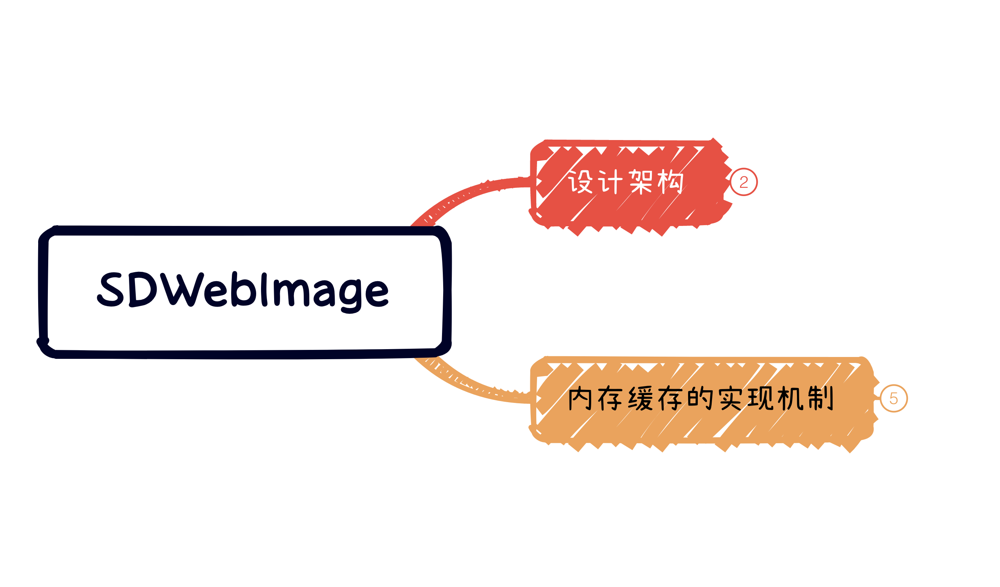
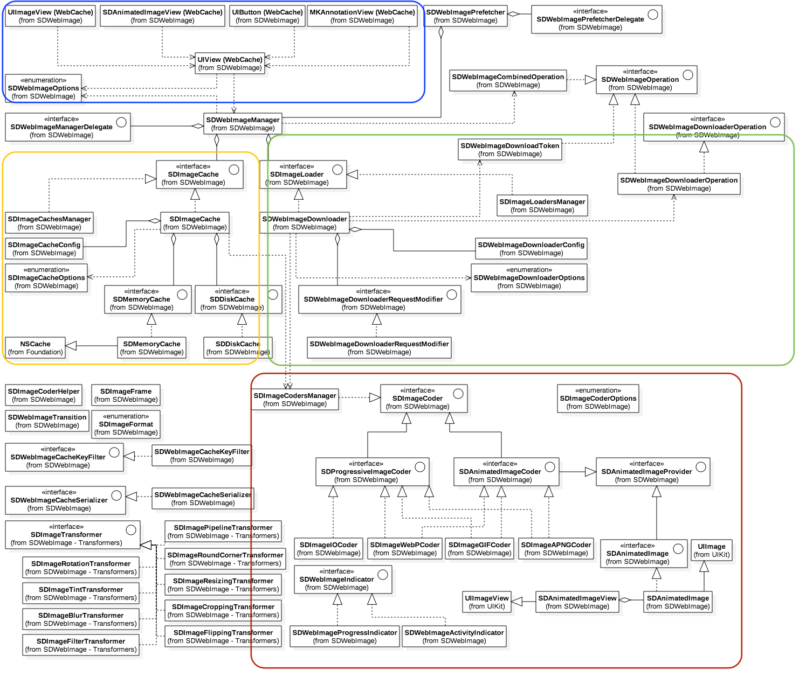
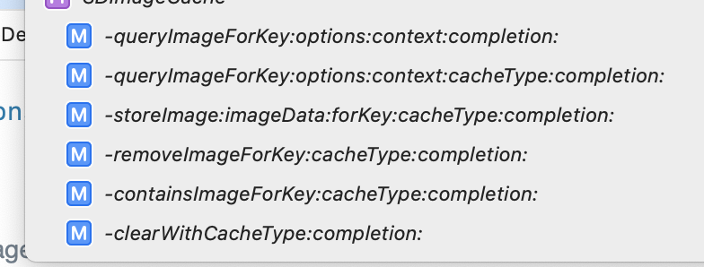
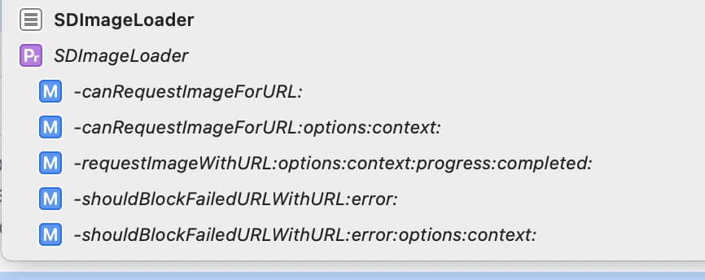
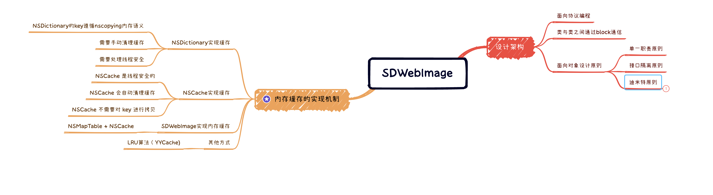

# SDWebImage 分享




## 1. 设计架构


#### UML类图




Top level： 一系列分类组成的调用， 分类调用的核心逻辑汇总到uiview webcache中，是真正发起业务逻辑的地方，加载一张图片（分为请求和缓存）把任务交给manager，manager相当于一个中间者，负责调度，将我们需要的任务交给对应的类去完成对应的职责


#### 源码理解

1. 所有 View Category 的 `setImageUrl:` 最终收口到 `UIView + WebCache` 这个方法:

```objc
- (nullable id<SDWebImageOperation>)sd_internalSetImageWithURL:(nullable NSURL *)url
                                              placeholderImage:(nullable UIImage *)placeholder
                                                       options:(SDWebImageOptions)options
                                                       context:(nullable SDWebImageContext *)context
                                                 setImageBlock:(nullable SDSetImageBlock)setImageBlock
                                                      progress:(nullable SDImageLoaderProgressBlock)progressBlock
                                                     completed:(nullable SDInternalCompletionBlock)completedBlock;
```


```objc
    if (context) {
        // 1. 将 SDWebImageContext 复制并转换为 immutable
        context = [context copy];
    } else {
        context = [NSDictionary dictionary];
    }
    // 并取其中的 validOperationKey 值作为校验 id，默认值为当前 view 的类名
    NSString *validOperationKey = context[SDWebImageContextSetImageOperationKey];
    if (!validOperationKey) {
        validOperationKey = NSStringFromClass([self class]);
        SDWebImageMutableContext *mutableContext = [context mutableCopy];
        mutableContext[SDWebImageContextSetImageOperationKey] = validOperationKey;
        context = [mutableContext copy];
    }
    self.sd_latestOperationKey = validOperationKey;
    
    //2. 取消上一次任务，保证没有当前正在进行的异步下载操作, 不会与即将进行的操作发生冲突
    [self sd_cancelImageLoadOperationWithKey:validOperationKey];
    self.sd_imageURL = url;
 
    SDWebImageManager *manager = context[SDWebImageContextCustomManager];
    if (!manager) {
        manager = [SDWebImageManager sharedManager];
    } else {
        SDWebImageMutableContext *mutableContext = [context mutableCopy];
        mutableContext[SDWebImageContextCustomManager] = nil;
        context = [mutableContext copy];
    }
    
    BOOL shouldUseWeakCache = NO;
    if ([manager.imageCache isKindOfClass:SDImageCache.class]) {
        shouldUseWeakCache = ((SDImageCache *)manager.imageCache).config.shouldUseWeakMemoryCache;
    }
    //3. 添加站位图
    if (!(options & SDWebImageDelayPlaceholder)) {
        if (shouldUseWeakCache) {
            NSString *key = [manager cacheKeyForURL:url context:context];
            [((SDImageCache *)manager.imageCache) imageFromMemoryCacheForKey:key];
        }
        dispatch_main_async_safe(^{
            [self sd_setImage:placeholder imageData:nil basedOnClassOrViaCustomSetImageBlock:setImageBlock cacheType:SDImageCacheTypeNone imageURL:url];
        });
    }
    id <SDWebImageOperation> operation = nil;
    if (url) {
        //4. 初始化SDWebImageManager,SDImageLoaderProgressBlock, 重置NSProgress, SDWebImageIndicator;
      ...
        
        //5. 开启下载 loadImageWithUR
        @weakify(self);
        operation = [manager loadImageWithURL:url options:options context:context progress:combinedProgressBlock completed:^(UIImage *image, NSData *data, NSError *error, SDImageCacheType cacheType, BOOL finished, NSURL *imageURL) {
            @strongify(self);
            if (!self) { return; }
            
            // ...
#endif
            dispatch_main_async_safe(^{
#if SD_UIKIT || SD_MAC
                // 6. 取到图片后，调用 `sd_setImage:` 同时为新的 image 添加 Transition 过渡动画；
                [self sd_setImage:targetImage imageData:targetData basedOnClassOrViaCustomSetImageBlock:setImageBlock transition:transition cacheType:cacheType imageURL:imageURL];
#else
                [self sd_setImage:targetImage imageData:targetData basedOnClassOrViaCustomSetImageBlock:setImageBlock cacheType:cacheType imageURL:imageURL];
#endif
                callCompletedBlockClosure();
            });
        }];
        // 7. 返回的 SDWebImageOperation 存入 sd_operationDictionary，key 为 validOperationKey
        [self sd_setImageLoadOperation:operation forKey:validOperationKey];
    } else {
#if SD_UIKIT || SD_MAC
        [self sd_stopImageIndicator];
#endif
        dispatch_main_async_safe(^{
            if (completedBlock) {
                NSError *error = [NSError errorWithDomain:SDWebImageErrorDomain code:SDWebImageErrorInvalidURL userInfo:@{NSLocalizedDescriptionKey : @"Image url is nil"}];
                completedBlock(nil, nil, error, SDImageCacheTypeNone, YES, url);
            }
        });
    }
    
    return operation;


```

2. SDWebImageManager: 中间者，管家，收集任务，指派对应的类去完成任务

```objc
@property (strong, nonatomic, readonly, nonnull) id<SDImageCache> imageCache;
@property (strong, nonatomic, readonly, nonnull) id<SDImageLoader> imageLoader;
@property (strong, nonatomic, nullable) id<SDImageTransformer> transformer;
@property (nonatomic, strong, nullable) id<SDWebImageCacheKeyFilter> cacheKeyFilter;
@property (nonatomic, strong, nullable) id<SDWebImageCacheSerializer> cacheSerializer;
@property (nonatomic, strong, nullable) id<SDWebImageOptionsProcessor> optionsProcessor;

@property (nonatomic, class, nullable) id<SDImageCache> defaultImageCache;
@property (nonatomic, class, nullable) id<SDImageLoader> defaultImageLoader;
```

```objc
- (nullable SDWebImageCombinedOperation *)loadImageWithURL:(nullable NSURL *)url
                                                   options:(SDWebImageOptions)options
                                                   context:(nullable SDWebImageContext *)context
                                                  progress:(nullable SDImageLoaderProgressBlock)progressBlock
                                                  completed:(nonnull SDInternalCompletionBlock)completedBlock;
```

1. 内部通过对 url 的 nil 判断以及对 NSString 类型的兼容 (强制转成 NSURL) 以保证后续的流程，否则结束调用

2.  operation 初始化  统一两种任务

   SDWebImageCombinedOperation: 聚合类， combine 了 cache 和 loader 的操作任务，使其可以一步到位清理缓存查询和下载任务的作用， 对于外层调用者都是操作SDWebImageCombinedOperation:

   ```objc
   SDWebImageCombinedOperation *operation = [SDWebImageCombinedOperation new];
   operation.manager = self;
   
   @interface SDWebImageCombinedOperation : NSObject <SDWebImageOperation>
   - (void)cancel;
   
   @property (strong, nonatomic, nullable, readonly) id<SDWebImageOperation> cacheOperation;
   @property (strong, nonatomic, nullable, readonly) id<SDWebImageOperation>loaderOperation;
   
   @end
   ```

3. 下载开始后, 又拆分成了一下 6 个方法, 你可以发现每个方法都是针对 operation 的操作，然后开始缓存查询。

- 先加载缓存： callCacheProcessForOperation  

  ```objc
  operation.cacheOperation = [imageCache queryImageForKey:key options:options context:context cacheType:queryCacheType completion:^(UIImage * _Nullable cachedImage, NSData * _Nullable cachedData, SDImageCacheType cacheType) {...}
  ```

- 开始网络请求下载：callDownloadProcessForOperation

  ```objc
  operation.loaderOperation = [imageLoader requestImageWithURL:url options:options context:context progress:progressBlock completed:^(UIImage *downloadedImage, NSData *downloadedData, NSError *error, BOOL finished) {...}
  ```

- 存储：callStoreCacheProcessForOperation

- 转换：callTransformProcessForOperation
- 执行回调： callCompletionBlockForOperation
- 清理回调：safelyRemoveOperationFromRunning





#### 面向对象设计原则

##### 单一职责原则

###### **定义：一个类应该是一组相关性很高的函数、数据的封装。**

`SDImageCache`专门负责图片的缓存逻辑，`SDWebImageDownloader`专门负责图片下载逻辑；

##### 接口隔离原则

###### **定义：客户端不应该依赖他不需要的接口。**

`SDWebImageDownloader`就是接口隔离运用，`SDWebImageManager`只需要知道该下载对象有`downloadImageWithURL`下载图片的接口即可。下载图片的具体实现对`SDWebImageManager`隐藏，他用最小化接口隔离了实现细节。

##### 迪米特原则

###### **定义：一个对象应该对其他对象有最少的了解。**

UIkit扩展模块就很明显的体现了这种思想，只需要知道有一个调用方法`sd_setImageWithURL:`能够设置图片，外部调用者（也就是程序员）不需要具体的图片下载缓存逻辑和缓存策略。


## 内存缓存实现原理

##### 1. NSDictionary 实现

```objc
- (void)testDic {
    Teacher *teacher = [[Teacher alloc] init]; //teacher遵守NSCoping协议
    NSLog(@"before ====== Teacher:%@", teacher);
    NSMutableDictionary *dic = [NSMutableDictionary dictionaryWithCapacity:2];
    Student *student1 = [[Student alloc] init];
    student1.name = @"student1";
    NSLog(@"student1:%@",student1);
    [dic setObject:student1 forKey:teacher];
    Student *student2 = [[Student alloc] init];
    student2.name = @"student2";
    NSLog(@"student2:%@",student2);
    [dic setObject:student2 forKey:teacher];
    NSLog(@"dic:%@",dic);
}

//打印结果
before ====== Teacher:<Teacher: 0x6000011341a0>
student1:<Student: 0x6000011341b0>
student2:<Student: 0x60000111c310>
dic:{
    "<Teacher: 0x600001120040>" = "<Student: 0x60000111c310>";
    "<Teacher: 0x60000111c2d0>" = "<Student: 0x6000011341b0>";
}
```

```objc
//NSDictionary / NSMutableDictionary
@interface NSMutableDictionary<KeyType, ObjectType> : NSDictionary<KeyType, ObjectType>
- (void)removeObjectForKey:(KeyType)aKey;
- (void)setObject:(ObjectType)anObject forKey:(KeyType <NSCopying>)aKey;
- (instancetype)init NS_DESIGNATED_INITIALIZER;
- (instancetype)initWithCapacity:(NSUInteger)numItems NS_DESIGNATED_INITIALIZER;
- (nullable instancetype)initWithCoder:(NSCoder *)coder NS_DESIGNATED_INITIALIZER;
@end
```

以同一个teacher作为key，因为key遵循nscopying协议，其实key是对原本的key执行了copy。

> NSDictionary 提供了 `key -> object` 的映射。从本质上讲，NSDictionary 中存储的 object 位置是由 `key` 来索引的。由于对象存储在特定位置，NSDictionary 中要求 key 的值不能改变（否则 object 的位置会错误）。为了保证这一点，NSDictionary 会始终复制 key 到自己私有空间。
>
> 这个 key 的复制行为也是 NSDictionary 如何工作的基础，但这也有一个限制：你只能使用 OC 对象作为 NSDictionary 的 key，并且必须支持 `NSCopying` 协议。此外，key 应该是小且高效的，以至于复制的时候不会对 CPU 和内存造成负担。

缺点：

- NSDictionary的key遵循nscopying内存语义，会对CPU 和内存造成负担，适合值类型的对象作为 key（如简短字符串和数字） 

- 需要手动清理缓存
- 需要处理线程安全


##### 2. NSCache 实现

[swift源码](https://github.com/apple/swift-corelibs-foundation/blob/main/Sources/Foundation/NSCache.swift)

在 Swift 版本中，采用一个 NSCacheEntry 类存储 cache 对象的相关信息，NSCacheEntry 的数据结构如下:

```swift
private class NSCacheEntry<KeyType : AnyObject, ObjectType : AnyObject> {
    var key: KeyType
    var value: ObjectType
    var cost: Int
    //NSCacheEntry 提供了 `prevByCost` 和 `nextByCost` ，用于实现双向链表。
    var prevByCost: NSCacheEntry?
    var nextByCost: NSCacheEntry?
    init(key: KeyType, value: ObjectType, cost: Int) {
        self.key = key
        self.value = value
        self.cost = cost
    }
}
```


在 Apple Swift 版的 NSCache 中，采用 Dictionary 存储缓存数据，实现了一个以缓存对象的 cost 升序的排序双向链表，提供 head 头节点，当需要淘汰缓存数据时，从头节点开始删除。同时，使用 NSLock 来保证线程安全。

###### 淘汰策略：

Swift 中的淘汰流程分为两部分：先根据缓存的总 cost 进行淘汰，再根据总 count 进行淘汰。

淘汰过程为：使用 while 循环从头开始 remove 排序双向链表中的元素，直到链表为空或者淘汰后的 cost/count 满足要求。因为是从链表的 head 开始删除，所以在 remove 的时候 head 会移动到下一个对象上。

###### 插入策略：

当缓存为空时，insert 的对象作为 head，insert 结束。

缓存不为空，如果 insert 的对象 cost `<=` head 的 cost，将对象添加到链表头部， insert 结束

缓存不为空，如果 insert 的对象 cost `>` head 的 cost，根据对象的 cost 找到合适的位置 insert，形成一个 cost 升序的双向链表

- 内存不足时，NSCache 会自动清理缓存
- NSCache 是线程安全的
- 区别于 NSMutableDictionary ，NSCache 不需要对 key 进行拷贝


##### 3. SDMemoryCache

SDMemoryCache 继承 NSCache

```objc
@interface SDMemoryCache <KeyType, ObjectType> : NSCache <KeyType, ObjectType> <SDMemoryCache>
```

SDMemoryCache 添加了`NSMapTable<KeyType, ObjectType> *weakCache`

```objc
@interface SDMemoryCache <KeyType, ObjectType> () {
@property (nonatomic, strong, nonnull) NSMapTable<KeyType, ObjectType> *weakCache; 
@end
```

**NSMapTable**（顾名思义）更适合于一般来说的映射概念。NSMapTable 可以处理的 `key -> obj` 式映射如 NSDictionary，但它也可以处理 `obj -> obj` 的映射。

NSMapTable 提供的选项是由三部分组成：一个 “memory option”(内存选项)，一个 “personality option” 和 “copy in” 标志。

###### 1. Memory options

NSPointerFunctionsStrongMemory

NSPointerFunctionsWeakMemory

###### 2. NSMapTableObjectPointerPersonality 

选项用于控制在将对象添加到集合中时是否调用对象上的 `isEqualTo：` 和 `hash` 方法。

###### 3. NSMapTableCopyIn，

如果指定，则 NSMapTable 在添加时使用 NSCopying 协议创建自己的数据副本。 如果不指定此选项（默认行为），则不会复制。

```objc
self.weakCache = [[NSMapTable alloc] initWithKeyOptions:NSPointerFunctionsStrongMemory valueOptions:NSPointerFunctionsWeakMemory capacity:0];
```

如上，SDMemoryCache中存在与一个key强引用，value弱引用的映射表，意思是存储的值销毁的时候，self.weakCache会安全（代码里加了信号量锁）的删除对应的key-value。

```objc
// SDMemoryCache
- (void)setObject:(id)obj forKey:(id)key cost:(NSUInteger)g {
    [super setObject:obj forKey:key cost:g];
    if (!self.config.shouldUseWeakMemoryCache) {
        return;
    }
    if (key && obj) {
        // Store weak cache
        SD_LOCK(_weakCacheLock);
        [self.weakCache setObject:obj forKey:key];
        SD_UNLOCK(_weakCacheLock);
    }
}
- (id)objectForKey:(id)key {
    id obj = [super objectForKey:key];
    if (!self.config.shouldUseWeakMemoryCache) {
        return obj;
    }
    if (key && !obj) {
        // Check weak cache
        SD_LOCK(_weakCacheLock);
        obj = [self.weakCache objectForKey:key];
        SD_UNLOCK(_weakCacheLock);
        if (obj) {
            // Sync cache
            NSUInteger cost = 0;
            if ([obj isKindOfClass:[UIImage class]]) {
                cost = [(UIImage *)obj sd_memoryCost];
            }
            [super setObject:obj forKey:key cost:cost];
        }
    }
    return obj;
}

- (void)removeObjectForKey:(id)key {
    [super removeObjectForKey:key];
    if (!self.config.shouldUseWeakMemoryCache) {
        return;
    }
    if (key) {
        // Remove weak cache
        SD_LOCK(_weakCacheLock);
        [self.weakCache removeObjectForKey:key];
        SD_UNLOCK(_weakCacheLock);
    }
}
```

当打开shouldUseWeakMemoryCache的时候赋值的时候可以将值同样付给weakCache，取值的时候如果缓存中没有同样会在weakCache里面找，因为weakCache存储的是引用不会有有额外的内存开销且weak不会影响对象的生命周期，所以在NSCache被清理，且对象没有被释放的情况下，同样可以在weakCache中取到缓存，在一定意义增加了缓存的广度，减少了请求次数。那么weakCache存在的意义就在于此。


## 总结



> **Reference:**
>
> [NSMapTable: more than an NSDictionary for weak pointers](https://www.cocoawithlove.com/2008/07/nsmaptable-more-than-nsdictionary-for.html)
>
> [SDMemoryCache中的NSMapTable](https://juejin.cn/post/6844903793033756686)
>
> [NSCache 源码阅读](https://juejin.cn/post/6942823617080066085)
>
> [浅析 SDWebImage 5.6](https://looseyi.github.io/post/sourcecode-ios/source-code-sdweb-1/)
>
> [通过UML类图迅速学习SDWebImage源码设计](https://juejin.cn/post/6844903687182090253)


