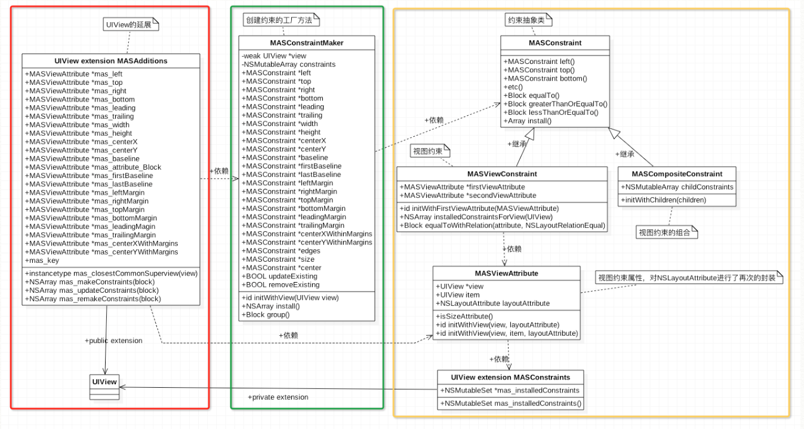
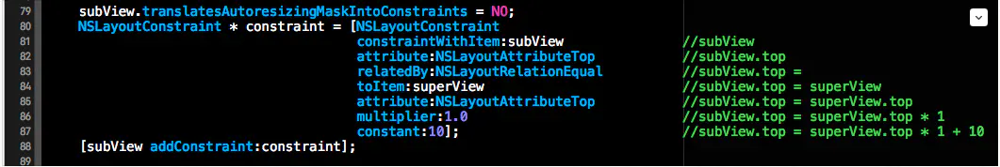

# Masonry

[Masonry框架解读](https://www.jianshu.com/p/a6db45a34095)

[Masonry详解（使用方法）](https://segmentfault.com/a/1190000019569119)

[源码](https://github.com/SnapKit/Masonry)

- `Masonry`是iOS在控件布局中经常使用的一个轻量级框架，是一个对系统`NSLayoutConstraint`进行封装的第三方自动布局框架， `Masonry`让`NSLayoutConstraint`使用起来更为简洁

- Masonry框架中支持约束的添加，约束的更新，约束的重建以及基本动画的实现等等

- 在Masonry框架主要中采用了链式调用和匿名闭包的方式来简化约束的添加

与SDWebImage相似，`Masonry`通过宏定义的方式，区分两个平台独有的一些关键字。

```cpp
// MASUtilities.h
#if TARGET_OS_IPHONE    
    #import <UIKit/UIKit.h>
    #define MAS_VIEW UIView
    #define MASEdgeInsets UIEdgeInsets
#elif TARGET_OS_MAC
    #import <AppKit/AppKit.h>
    #define MAS_VIEW NSView
    #define MASEdgeInsets NSEdgeInsets
#endif
```

### 框架

主要类框架图：



> 使用NSLayoutConstraint添加约束：
>
> 


#### 1. View+MASAdditions类目介绍

为Masonry框架对UIView的添加的分类(MASAdditions)，为UIView添加了类型为MASViewAttribute的成员属性。

该类目除了MASViewAttribute的成员属性，还包含四个公共方法

- mas_makeConstraints方法负责创建安装约束

- mas_updateConstraints负责更新已经存在的约束（若约束不存在就Install）

- mas_remakeConstraints方法则负责移除原来已经创建的约束并添加上新的约束

- mas_closestCommonSuperview方法负责寻找两个视图的最近的公共父视图（类比两个数字的最小公倍数）


黄色框内为masonry底层的四个类目，之间耦合性比较高，先看一下MASViewAttribute类。

#### 2. MASViewAttribute类的介绍

这个类是对UIView和NSLayoutAttribute的封装。

其中含有三个属性

```objc
/**
 *  The view which the reciever relates to. Can be nil if item is not a view.
 */
@property (nonatomic, weak, readonly) MAS_VIEW *view;
/**
 *  The item which the reciever relates to.
 */
@property (nonatomic, weak, readonly) id item;
/**
 *  The attribute which the reciever relates to
 */
@property (nonatomic, assign, readonly) NSLayoutAttribute layoutAttribute;
```

view属性表示所约束的对象，item就是该对象上可以被约束的部分。

item成员属性我们稍后要作为NSLayoutConstriant构造器中的constraintWithItem与toItem的参数

当然对于UIView来说该item就是UIView本身

而对于UIViewController，该处Item就topLayoutGuide，bottomLayoutGuide稍后会给出详细的介绍

三个方法

```objc
/**
 *  Convenience initializer.
 */
- (id)initWithView:(MAS_VIEW *)view layoutAttribute:(NSLayoutAttribute)layoutAttribute;

/**
 *  The designated initializer.
 */
- (id)initWithView:(MAS_VIEW *)view item:(id)item layoutAttribute:(NSLayoutAttribute)layoutAttribute;

/**
 *	Determine whether the layoutAttribute is a size attribute
 *
 *	@return	YES if layoutAttribute is equal to NSLayoutAttributeWidth or NSLayoutAttributeHeight
 */
- (BOOL)isSizeAttribute;
// isSizeAttribute方法，该方法用来判断MASViewAttribute类中的layoutAttribute属性是否是NSLayoutAttributeWidth或者NSLayoutAttributeHeight，如果是Width或者Height的话，那么约束就添加到当前View上，而不是添加在父视图上。
```


#### 3.MASViewConstraint, MASConstraint, MASCompositeConstraint

###### MASViewConstraint

- Contains the attributes neccessary for creating a NSLayoutConstraint and adding it to the appropriate view

- 该类是对NSLayoutConstriant类的进一步封装。MASViewConstraint做的最核心的一件事情就是初始化NSLayoutConstriant对象，并将该对象添加在相应的视图上

- 因为NSLayoutConstriant在初始化时需要NSLayoutAttribute和所约束的View，而MASViewAttribute正是对View与NSLayoutAttribute进行的封装，所以MASViewConstraint类要依赖于**MASViewAttribute**类

###### MASConstraint

MASConstraint是MASViewConstraint的父类，MASConstraint是一个抽象类，不可被实例化

###### MASCompositeConstraint

MASViewConstraint的兄弟类，从MASCompositeConstraint的命名中我们就可以看出来MASCompositeConstraint是约束的一个组合，也就是其中存储的是一系列的约束


#### 4.工厂类MASConstraintMaker

该类就是一个工厂类，负责创建MASConstraint类型的对象（依赖于MASConstraint接口，而不依赖于具体实现）。

在UIView的View+MASAdditions类目中就是调用的MASConstraintMaker类中的一些方法。

我们在使用Masonry给subView添加约束时，mas_makeConstraints方法中的Block的参数就是MASConstraintMaker的对象。用户可以通过该Block回调过来的MASConstraintMaker对象给View指定要添加的约束以及该约束的值。

该工厂中的constraints属性数组就记录了该工厂创建的所有MASConstraint对象。


### 源码理解

#### 1. View+MASAdditions类目

MASViewAttribute的成员属性：

以mas_left成员属性为例，因为MASViewAttribute是View与NSLayoutAttribute的合体，所以mas_left就代表着当前View的NSLayoutAttributeLeft属性。

共有方法：

- mas_makeConstraints方法

```objc
//新建约束并添加
- (NSArray *)mas_makeConstraints:(void(^)(MASConstraintMaker *))block {
    //关闭自动添加约束
    self.translatesAutoresizingMaskIntoConstraints = NO;
    //创建constraint maker
    MASConstraintMaker *constraintMaker = [[MASConstraintMaker alloc] initWithView:self];
    //通过block给constraint maker中的各种属性赋值
    block(constraintMaker);
    //进行约束添加，并返回所install的数组，数组中所存放的就是当前视图中所添加的所有约束，因为Masonry框架对NSLayoutConstraint封装成了MASViewConstraint，所有此处数组中存储的是MASViewConstraint对象。
    return [constraintMaker install];
}
```

下面两个方法与mas_makeConstraints类似，就是多了一个属性的设置

- mas_updateConstraints方法

`constraintMaker.updateExisting = YES;`

- mas_remakeConstraints方法

`constraintMaker.removeExisting = YES; `将当前视图上的旧约束进行移除，然后添加上新的约束

- mas_closestCommonSuperview方法

```objc
- (instancetype)mas_closestCommonSuperview:(MAS_VIEW *)view {
    MAS_VIEW *closestCommonSuperview = nil;

    MAS_VIEW *secondViewSuperview = view;
    while (!closestCommonSuperview && secondViewSuperview) {
        MAS_VIEW *firstViewSuperview = self;
        while (!closestCommonSuperview && firstViewSuperview) {
            if (secondViewSuperview == firstViewSuperview) {
                closestCommonSuperview = secondViewSuperview;
            }
            firstViewSuperview = firstViewSuperview.superview;
        }
        secondViewSuperview = secondViewSuperview.superview;
    }
    return closestCommonSuperview;
}
```

寻找两个视图的公共父视图对于约束的添加来说是非常重要的，因为相对的约束是添加到其公共父视图上的。比如举个列子 viewA.left = viewB.right + 10, 因为是viewA与viewB的相对约束，那么约束是添加在viewA与viewB的公共父视图上的。

#### 2. MASConstraintMaker

MASConstraintMaker是负责创建MASViewConstraint的对象，并调用MASViewConstraint对象的Install方法将该约束添加到相应的视图中。

- 创建MASViewConstraint的对象

```objc
//每个MASConstraint类型的属性都对应一个getter方法，在getter方法中都会调用addConstraintWithLayoutAttribute方法
- (MASConstraint *)left {
    return [self addConstraintWithLayoutAttribute:NSLayoutAttributeLeft];
}
- (MASConstraint *)addConstraintWithLayoutAttribute:(NSLayoutAttribute)layoutAttribute {
    return [self constraint:nil addConstraintWithLayoutAttribute:layoutAttribute];
}


//MASConstraintMaker工厂类的工厂方法，根据提供的参数创建MSAViewConstraint对象
- (MASConstraint *)constraint:(MASConstraint *)constraint addConstraintWithLayoutAttribute:(NSLayoutAttribute)layoutAttribute {
    MASViewAttribute *viewAttribute = [[MASViewAttribute alloc] initWithView:self.view layoutAttribute:layoutAttribute];
    MASViewConstraint *newConstraint = [[MASViewConstraint alloc] initWithFirstViewAttribute:viewAttribute];
    
  // 如果该函数的第一个参数不为空的话就会将新创建的MSAViewConstraint对象与参数进行合并组合成MASCompositeConstraint类（MASCompositeConstraint本质上是MSAViewConstraint对象的数组）的对象。
    if ([constraint isKindOfClass:MASViewConstraint.class]) {
        //replace with composite constraint
        NSArray *children = @[constraint, newConstraint];
        MASCompositeConstraint *compositeConstraint = [[MASCompositeConstraint alloc] initWithChildren:children];
        compositeConstraint.delegate = self;
        [self constraint:constraint shouldBeReplacedWithConstraint:compositeConstraint];
        return compositeConstraint;
    }
    if (!constraint) {
        newConstraint.delegate = self;//由于为MASConstraint对象设置了代理，所以才支持链式调用(给newConstraint设置代理就是为了可以在MASViewConstraint类中通过代理来调用MASConstraintMaker工厂类的工厂方法来完成创建)
        //下方创建完MASConstraint类的相应的对象后，会把该创建的对象添加进MASConstraintMaker工厂类的私有constraints数组，来记录该工厂对象创建的所有约束
        [self.constraints addObject:newConstraint];
    }
    return newConstraint;
}
```

- Install方法

```objc
- (NSArray *)install {
    //如果是mas_remakeConstraint,先将所有约束uninstall
    if (self.removeExisting) {
        NSArray *installedConstraints = [MASViewConstraint installedConstraintsForView:self.view];
        for (MASConstraint *constraint in installedConstraints) {
            [constraint uninstall];
        }
    }
 
    NSArray *constraints = self.constraints.copy; //self.constraints存储的是通过block中配置的参数
    for (MASConstraint *constraint in constraints) {
        constraint.updateExisting = self.updateExisting;
        [constraint install];
    }
    [self.constraints removeAllObjects];
    return constraints;
}
```

#### 3. MASViewConstraint

MASViewConstraint类实质上是对MASLayoutConstraint的封装，进一步说MASViewConstraint负责为MASLayoutConstraint构造器组织参数并创建MASLayoutConstraint的对象，并将该对象添加到相应的视图中。

- MASViewConstraint的对象链式调用实现 e.g. `constraint.top.left.equalTo(superView).offset(10);`

  ```objc
  - (MASConstraint *)addConstraintWithLayoutAttribute:(NSLayoutAttribute)layoutAttribute {
     NSAssert(!self.hasLayoutRelation, @"Attributes should be chained before defining the constraint relation");
     return [self.delegate constraint:self addConstraintWithLayoutAttribute:layoutAttribute];
  }
  
  ```

  ```objc
  //MASConstraint.m
  - (MASConstraint * (^)(CGFloat))offset {
      return ^id(CGFloat offset){
          self.offset = offset;
          return self;
      };
  }
  
  - (MASConstraint * (^)(id))equalTo {
      return ^id(id attribute) {
          return self.equalToWithRelation(attribute, NSLayoutRelationEqual);
      };
  }
  
  //MASViewConstraint.m
  - (MASConstraint * (^)(id, NSLayoutRelation))equalToWithRelation {
      return ^id(id attribute, NSLayoutRelation relation) {
          if ([attribute isKindOfClass:NSArray.class]) {
              NSAssert(!self.hasLayoutRelation, @"Redefinition of constraint relation");
              NSMutableArray *children = NSMutableArray.new;
              for (id attr in attribute) {
                  MASViewConstraint *viewConstraint = [self copy];
                  viewConstraint.layoutRelation = relation;
                  viewConstraint.secondViewAttribute = attr;
                  [children addObject:viewConstraint];
              }
              MASCompositeConstraint *compositeConstraint = [[MASCompositeConstraint alloc] initWithChildren:children];
              compositeConstraint.delegate = self.delegate;
              [self.delegate constraint:self shouldBeReplacedWithConstraint:compositeConstraint];
              return compositeConstraint;
          } else {
              NSAssert(!self.hasLayoutRelation || self.layoutRelation == relation && [attribute isKindOfClass:NSValue.class], @"Redefinition of constraint relation");
              self.layoutRelation = relation;
              self.secondViewAttribute = attribute;
              return self;
          }
      };
  }
  ```

  e.g. offset是一个getter方法的名，offset函数的返回值是一个匿名Block, 也就是offset后边的()。这个匿名闭包有一个CGFloat的参数，为了支持链式调用该匿名闭包返回一个MASConstraint的对象。

  ```stylus
  make.top.and.bottom.equalTo(self.containerView).with.offset(padding);
  ```

  其内部代码实现，实际上就是直接将`self`返回。

  ```objc
  - (MASConstraint *)with {
      return self;
  }
  ```

  

- install方法解析

  MASViewConstraint中install方法负责创建MASLayoutConstraint对象，并且将该对象添加到相应的View上。

  ```objc
  //根据MASViewConstraint所收集的参数来创建NSLayoutConstraint对象，MASLayoutConstraint其实就是NSLayoutConstraint的别名
  MASLayoutConstraint *layoutConstraint
          = [MASLayoutConstraint constraintWithItem:firstLayoutItem
                                          attribute:firstLayoutAttribute
                                          relatedBy:self.layoutRelation
                                             toItem:secondLayoutItem
                                          attribute:secondLayoutAttribute
                                         multiplier:self.layoutMultiplier
                                           constant:self.layoutConstant];
      
      layoutConstraint.priority = self.layoutPriority;
  ```

  创建完约束对象后，我们要寻找该约束添加到那个View上。下方的代码段就是获取接收该约束对象的视图。如果是两个视图相对约束，就获取两种的公共父视图。如果添加的是Width或者Height，那么久添加到当前视图上。如果既没有指定相对视图，也不是Size类型的约束，那么就将该约束对象添加到当前视图的父视图上。代码实现如下：

  ```objc
      if (self.secondViewAttribute.view) {
          MAS_VIEW *closestCommonSuperview = [self.firstViewAttribute.view mas_closestCommonSuperview:self.secondViewAttribute.view];
          NSAssert(closestCommonSuperview,
                   @"couldn't find a common superview for %@ and %@",
                   self.firstViewAttribute.view, self.secondViewAttribute.view);
          self.installedView = closestCommonSuperview;
      } else if (self.firstViewAttribute.isSizeAttribute) {
          self.installedView = self.firstViewAttribute.view;
      } else {
          self.installedView = self.firstViewAttribute.view.superview;
      }
  ```

  创建完约束对象，并且找到承载约束的视图后，接下来就是将该约束添加到该视图上。

  ```objc
      MASLayoutConstraint *existingConstraint = nil;
      if (self.updateExisting) { //判断是不是对约束的更新，如果是对约束的更新的话就先获取已经存在的约束并对该约束进行更新
          existingConstraint = [self layoutConstraintSimilarTo:layoutConstraint];
      }
      if (existingConstraint) {
          // just update the constant
          existingConstraint.constant = layoutConstraint.constant;
          self.layoutConstraint = existingConstraint;
      } else {
          [self.installedView addConstraint:layoutConstraint];
          self.layoutConstraint = layoutConstraint;
          [firstLayoutItem.mas_installedConstraints addObject:self]; //添加成功后我们将通过mas_installedConstraints属性记录一下本安装的约束。
          //mas_installedConstraints是通过运行时为UIView关联的一个NSMutable类型的属性，用来记录约束该视图的所有约束。
      }
  ```

- UIView的私有类目UIView+MASConstraints

在MASViewConstraint中定义了一个UIView的私有类目UIView+MASConstraints，该类目的功能为UIView通过运行时来关联一个NSMutableSet类型的mas_installedConstraints属性。该属性中记录了约束该View的所有约束。

```objc
//私有类目，只有MASConstraints类用到该类目
@interface MAS_VIEW (MASConstraints)

@property (nonatomic, readonly) NSMutableSet *mas_installedConstraints;

@end

@implementation MAS_VIEW (MASConstraints)

static char kInstalledConstraintsKey; //动态添加属性key，用来表示动态添加的属性


/// 通过运行时动态添加或者获取的约束集合 
- (NSMutableSet *)mas_installedConstraints {
    //通过kInstalledConstraintsKey来获取动态添加的已安装约束集合
    NSMutableSet *constraints = objc_getAssociatedObject(self, &kInstalledConstraintsKey);
    //如果没有约束集合，说明未动态绑定该视图成员变量，进行动态绑定
    if (!constraints) {
        constraints = [NSMutableSet set];
        //动态未该视图添加constraints 并制定唯一标识
        //OBJC_ASSOCIATION_RETAIN_NONATOMIC = (strong, nonatomic)
        objc_setAssociatedObject(self, &kInstalledConstraintsKey, constraints, OBJC_ASSOCIATION_RETAIN_NONATOMIC);
    }
    return constraints;
}

@end
```

---


### 使用

1. 设置内边距

   ```objc
   [self.blueView mas_makeConstraints:^(MASConstraintMaker *make) {
       // 下、右不需要写负号，insets方法中已经为我们做了取反的操作了。
       make.edges.equalTo(self.view).with.insets(UIEdgeInsetsMake(10, 10, 10, 10));
   }];
   ```

2. 更新约束

   ```objc
   dispatch_after(dispatch_time(DISPATCH_TIME_NOW, (int64_t)(2.f * NSEC_PER_SEC)), dispatch_get_main_queue(), ^{
       // 指定更新size，其他约束不变。
       [self.greenView mas_updateConstraints:^(MASConstraintMaker *make) {
           make.size.mas_equalTo(CGSizeMake(100, 100));
       }];
   });
   ```

3. 大于等于和小于等于某个值的约束

   ```objc
   [self.textLabel mas_makeConstraints:^(MASConstraintMaker *make) {
       make.center.equalTo(self.view);
       // 设置宽度小于等于200
       make.width.lessThanOrEqualTo(@200);
       // 设置高度大于等于10
       make.height.greaterThanOrEqualTo(@10);
   }];
   self.textLabel.numberOfLines = 0;
   ```

4. 使用基础数据类型当做参数

   ```objc
   /** 
    如果想使用基础数据类型当做参数，Masonry为我们提供了"mas_xx"格式的宏定义。
    这些宏定义会将传入的基础数据类型转换为NSNumber类型，这个过程叫做封箱(Auto Boxing)。
   
    "mas_xx"开头的宏定义，内部都是通过MASBoxValue()函数实现的。
    这样的宏定义主要有四个，分别是mas_equalTo()、mas_offset()和大于等于、小于等于四个。
    */
   [self.redView mas_makeConstraints:^(MASConstraintMaker *make) {
       make.center.equalTo(self.view);
       make.width.mas_equalTo(100);
       make.height.mas_equalTo(100);
   }];
   ```

5. 设置约束优先级

   ```objc
   /** 
    Masonry为我们提供了三个默认的方法，priorityLow()、priorityMedium()、priorityHigh()，这三个方法内部对应着不同的默认优先级。
    除了这三个方法，我们也可以自己设置优先级的值，可以通过priority()方法来设置。
    */
   [self.redView mas_makeConstraints:^(MASConstraintMaker *make) {
       make.center.equalTo(self.view);
       make.width.equalTo(self.view).priorityLow();
       make.width.mas_equalTo(20).priorityHigh();
       make.height.equalTo(self.view).priority(200);
       make.height.mas_equalTo(100).priority(1000);
   }];
   ```

   ```objectivec
   Masonry也帮我们定义好了一些默认的优先级常量，分别对应着不同的数值，优先级最大数值是1000。
   static const MASLayoutPriority MASLayoutPriorityRequired = UILayoutPriorityRequired;
   static const MASLayoutPriority MASLayoutPriorityDefaultHigh = UILayoutPriorityDefaultHigh;
   static const MASLayoutPriority MASLayoutPriorityDefaultMedium = 500;
   static const MASLayoutPriority MASLayoutPriorityDefaultLow = UILayoutPriorityDefaultLow;
   static const MASLayoutPriority MASLayoutPriorityFittingSizeLevel = UILayoutPriorityFittingSizeLevel;
   ```

6. 设置约束比例

   ```objc
   // 设置当前约束值乘以多少，例如这个例子是redView的宽度是self.view宽度的0.2倍。
   [self.redView mas_makeConstraints:^(MASConstraintMaker *make) {
       make.center.equalTo(self.view);
       make.height.mas_equalTo(30);
       make.width.equalTo(self.view).multipliedBy(0.2);
   }];
   ```

7. 子视图垂直居中

   ```objc
   CGFloat padding = 10.f;
   [self.blueView mas_makeConstraints:^(MASConstraintMaker *make) {
       make.centerY.equalTo(self.view);
       make.left.equalTo(self.view).mas_offset(padding);
       make.right.equalTo(self.redView.mas_left).mas_offset(-padding);
       make.width.equalTo(self.redView);
       make.height.mas_equalTo(150);
   }];
   
   [self.redView mas_makeConstraints:^(MASConstraintMaker *make) {
       make.centerY.equalTo(self.view);
       make.right.equalTo(self.view).mas_offset(-padding);
       make.width.equalTo(self.blueView);
       make.height.mas_equalTo(150);
   }];
   ```

8. UITableView动态Cell高度

9. UIScrollView自动布局

   ```objc
   // 在进行约束的时候，要对containerView的上下左右都添加和子视图的约束，以便确认containerView的边界区域。
   [self.scrollView mas_makeConstraints:^(MASConstraintMaker *make) {
       make.edges.equalTo(self.view);
   }];
   
   CGFloat padding = LXZViewPadding;
   [self.containerView mas_makeConstraints:^(MASConstraintMaker *make) {
       make.edges.equalTo(self.scrollView).insets(UIEdgeInsetsMake(padding, padding, padding, padding));
   }];
   
   [self.containerView addSubview:self.greenView];
   [self.greenView mas_makeConstraints:^(MASConstraintMaker *make) {
       make.top.left.equalTo(self.containerView).offset(padding);
       make.size.mas_equalTo(CGSizeMake(250, 250));
   }];
   
   [self.containerView addSubview:self.redView];
   [self.redView mas_makeConstraints:^(MASConstraintMaker *make) {
       make.top.equalTo(self.containerView).offset(padding);
       make.left.equalTo(self.greenView.mas_right).offset(padding);
       make.size.equalTo(self.greenView);
       make.right.equalTo(self.containerView).offset(-padding);
   }];
   
   [self.containerView addSubview:self.yellowView];
   [self.yellowView mas_makeConstraints:^(MASConstraintMaker *make) {
       make.left.equalTo(self.containerView).offset(padding);
       make.top.equalTo(self.greenView.mas_bottom).offset(padding);
       make.size.equalTo(self.greenView);
       make.bottom.equalTo(self.containerView).offset(-padding);
   }];
   ```

   

##### 经验：

1. 在使用`Masonry`添加约束之前，需要在`addSubview`之后才能使用，否则会导致崩溃。
2. 在添加约束时初学者经常会出现一些错误，约束出现问题的原因一般就是两种：约束冲突和缺少约束。对于这两种问题，可以通过调试和`log`排查。


编码技巧：

1. 使用extension改变私有变量可读写属性

在头文件：

`@property (**nonatomic**, **strong**, **readonly**) MASViewAttribute *secondViewAttribute;`

在extension中：

`@property (**nonatomic**, **strong**, **readwrite**) MASViewAttribute *secondViewAttribute;`

2. 抽象类的方法使用宏处理

   ```objc
   #define MASMethodNotImplemented() \
       @throw [NSException exceptionWithName:NSInternalInconsistencyException \
                                      reason:[NSString stringWithFormat:@"You must override %@ in a subclass.", NSStringFromSelector(_cmd)] \
                                    userInfo:nil]
   ```

   

3. 判断类型

   ```objc
   if (strcmp(value.objCType, @encode(CGPoint)) == 0)
     if (strcmp(value.objCType, @encode(CGSize)) == 0)
   ```

   