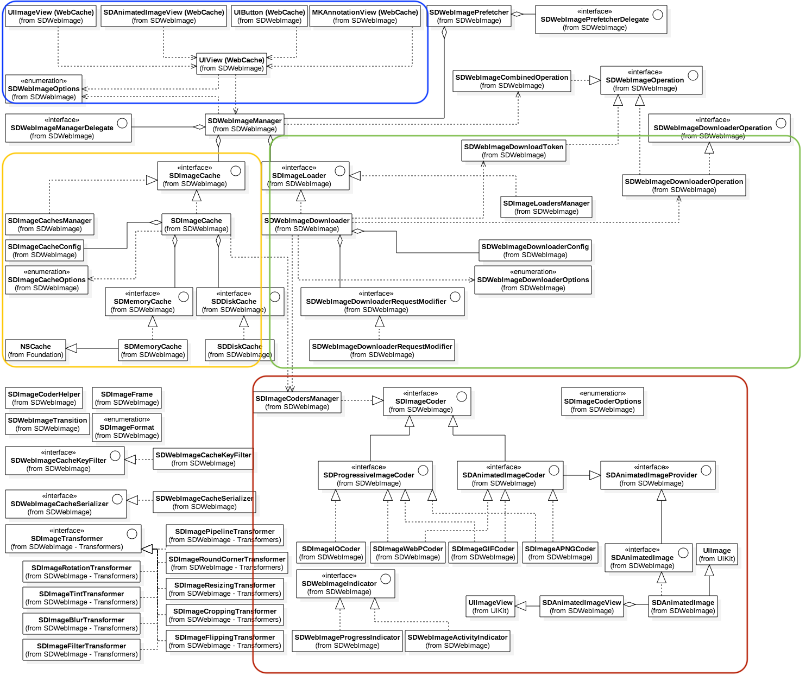

# SDWebImage

>  参考文献：
>
> [SDWebImage Code Architecture Analysis](https://github.com/SDWebImage/SDWebImage/wiki/5.6-Code-Architecture-Analysis)
>
> [sdwebimage框架](https://sela521.github.io/2018/07/13/SDWebImage%E6%A1%86%E6%9E%B6%E7%9A%84%E5%AD%A6%E4%B9%A0/)
>
> [通过UML类图迅速学习SDWebImage源码设计](https://juejin.cn/post/6844903687182090253)
>
> [SDWebImage源码学习](https://juejin.cn/post/7097932069103697927)

SDWebImage是iOS开发中主流的图像加载库，它帮我们处理内存缓存、磁盘缓存与及图像加载的一系列操作。

##### 这个框架的几大特征：

- 在UIImageView，UIButton，MKAnnotationView等类目中添加了网络图片和缓存的管理；
- 异步图片加载器；
- 带有自动缓存过期处理的异步内存+磁盘图片缓存机制；
- 后台图片解压；
- 同一个URL不会被多次下载；
- 虚假URL不会被重复尝试下载；
- 主线程不会被阻塞；
- 高性能；
- 使用GCD和ARC；


### 1. 设计架构

> Prerequisite:
>
> 理解uml类图[关联、聚合、组合的区别](https://zhuanlan.zhihu.com/p/359672087)

#### UML类图：



如图，其框架大致可分为UIKit扩展view category模块，承上启下Image Manager模块，图片缓存模块，图片下载模块，图片编解码模块，图片transform模块，及其他辅助功能。

#### 框架


Top level： 一系列分类组成的调用， 分类调用的核心逻辑汇总到uiview webcache中，是真正发起业务逻辑的地方，加载一张图片（分为请求和缓存）把任务交给manager，manager相当于一个中间者，负责调度，将我们需要的任务交给对应的类去完成对应的职责


#### 面向对象设计原则

##### 单一职责原则

###### **定义：一个类应该是一组相关性很高的函数、数据的封装。**

`SDImageCache`专门负责图片的缓存逻辑，`SDWebImageDownloader`专门负责图片下载逻辑；

##### 接口隔离原则

###### **定义：客户端不应该依赖他不需要的接口。**

`SDWebImageDownloader`就是接口隔离运用，`SDWebImageManager`只需要知道该下载对象有`downloadImageWithURL`下载图片的接口即可。下载图片的具体实现对`SDWebImageManager`隐藏，他用最小化接口隔离了实现细节。

##### 迪米特原则

###### **定义：一个对象应该对其他对象有最少的了解。**

UIkit扩展模块就很明显的体现了这种思想，只需要知道有一个调用方法`sd_setImageWithURL:`能够设置图片，外部调用者（也就是程序员）不需要具体的图片下载缓存逻辑和缓存策略。

## 

### 2. 源码理解

#### View Category ：

集成 SDWebImageManager 的图片下载和缓存功能到各个UI控件的方法中，在 `UIView + WebCache` 之上为使用者提供便利方法。

包括：

- UIImageView+WebCache

- UIImageView+HighlightedWebCache （用于加载 highlighted 状态的图片）

- UIButton+WebCache

- NSButton+WebCache

- MKAnnotationView WebCache  (MapKit定义标注，可以创建静态图片作为大头针图片)

- SDAnimatedImageView +WebCache 

  > **SDAnimatedImageView** is a brand new mechanism for supporting animated images in SDWebImage 5.0. This includes animated image loading, rendering, decoding, and also supports customizations (for advanced users).  详见[Animated Image](https://github.com/rs/SDWebImage/wiki/Advanced-Usage#animated-image-50)

所有 View Category 的 `setImageUrl:` 最终收口到 `UIView + WebCache` 这个方法:

```objective-c
- (nullable id<SDWebImageOperation>)sd_internalSetImageWithURL:(nullable NSURL *)url
                                              placeholderImage:(nullable UIImage *)placeholder
                                                       options:(SDWebImageOptions)options
                                                       context:(nullable SDWebImageContext *)context
                                                 setImageBlock:(nullable SDSetImageBlock)setImageBlock
                                                      progress:(nullable SDImageLoaderProgressBlock)progressBlock
                                                     completed:(nullable SDInternalCompletionBlock)completedBlock;
```

> 为什么不是UIImageView+WebCache而要上一层到UIView的分类里呢？ 因为SDWebImage框架也支持UIButton的下载图片等方法，所以需要在它们的父类：UIView里面统一一个下载方法。


###### 这个方法做了什么：

1. 将 [`SDWebImageContext`](#SDWebImageContext) 复制并转换为 immutable，获取其中的 `validOperationKey` 值作为校验 id，默认值为当前 view 的类名；
2. 执行 `sd_cancelImageLoadOperationWithKey` 取消上一次任务，保证没有当前正在进行的异步下载操作, 不会与即将进行的操作发生冲突；
3. 设置占位图；
4. 初始化 `SDWebImageManager` 、`SDImageLoaderProgressBlock` , 重置 `NSProgress`、`SDWebImageIndicator`;
5. 开启下载`loadImageWithURL:` 并将返回的 `SDWebImageOperation` 存入 `sd_operationDictionary`，key 为 `validOperationKey`;
6. 取到图片后，调用 `sd_setImage:` 同时为新的 image 添加 Transition 过渡动画；
7. 动画结束后停止 indicator。

```objc
    if (context) {
        // copy to avoid mutable object
        //将 SDWebImageContext 复制并转换为 immutable
        context = [context copy];
    } else {
        context = [NSDictionary dictionary];
    }
    //取其中的 validOperationKey 值作为校验 id，默认值为当前 view 的类名
    NSString *validOperationKey = context[SDWebImageContextSetImageOperationKey];
    if (!validOperationKey) {
        // pass through the operation key to downstream, which can used for tracing operation or image view class
        validOperationKey = NSStringFromClass([self class]);
        SDWebImageMutableContext *mutableContext = [context mutableCopy];
        mutableContext[SDWebImageContextSetImageOperationKey] = validOperationKey;
        context = [mutableContext copy];
    }
    self.sd_latestOperationKey = validOperationKey;
    
    //取消上一次任务，保证没有当前正在进行的异步下载操作, 不会与即将进行的操作发生冲突
    [self sd_cancelImageLoadOperationWithKey:validOperationKey];
    self.sd_imageURL = url;
    
    //初始化 SDWebImageManager
    SDWebImageManager *manager = context[SDWebImageContextCustomManager];
    if (!manager) {
        manager = [SDWebImageManager sharedManager];
    } else {
        // remove this manager to avoid retain cycle (manger -> loader -> operation -> context -> manager)
        SDWebImageMutableContext *mutableContext = [context mutableCopy];
        mutableContext[SDWebImageContextCustomManager] = nil;
        context = [mutableContext copy];
    }
    
    BOOL shouldUseWeakCache = NO;
    if ([manager.imageCache isKindOfClass:SDImageCache.class]) {
        shouldUseWeakCache = ((SDImageCache *)manager.imageCache).config.shouldUseWeakMemoryCache;
    }
    //在不延迟添加占位图的option下 添加站位图
    if (!(options & SDWebImageDelayPlaceholder)) { //位操作
        if (shouldUseWeakCache) {
            NSString *key = [manager cacheKeyForURL:url context:context];
            // call memory cache to trigger weak cache sync logic, ignore the return value and go on normal query
            // this unfortunately will cause twice memory cache query, but it's fast enough
            // in the future the weak cache feature may be re-design or removed
            [((SDImageCache *)manager.imageCache) imageFromMemoryCacheForKey:key];
        }
        dispatch_main_async_safe(^{
            [self sd_setImage:placeholder imageData:nil basedOnClassOrViaCustomSetImageBlock:setImageBlock cacheType:SDImageCacheTypeNone imageURL:url];
        });
    }
    
    id <SDWebImageOperation> operation = nil;
    
    
    if (url) {
        // reset the progress 重置进度 mageProgress
        NSProgress *imageProgress = objc_getAssociatedObject(self, @selector(sd_imageProgress));
        if (imageProgress) {
            imageProgress.totalUnitCount = 0;
            imageProgress.completedUnitCount = 0;
        }
        
#if SD_UIKIT || SD_MAC
        // 重置 sd_imageIndicator
        // check and start image indicator
        [self sd_startImageIndicator];
        id<SDWebImageIndicator> imageIndicator = self.sd_imageIndicator;
#endif
        //初始化 SDImageLoaderProgressBlock
        SDImageLoaderProgressBlock combinedProgressBlock = ^(NSInteger receivedSize, NSInteger expectedSize, NSURL * _Nullable targetURL) {
            if (imageProgress) {
                imageProgress.totalUnitCount = expectedSize;
                imageProgress.completedUnitCount = receivedSize;
            }
#if SD_UIKIT || SD_MAC
            if ([imageIndicator respondsToSelector:@selector(updateIndicatorProgress:)]) {
                double progress = 0;
                if (expectedSize != 0) {
                    progress = (double)receivedSize / expectedSize;
                }
                progress = MAX(MIN(progress, 1), 0); // 0.0 - 1.0
                dispatch_async(dispatch_get_main_queue(), ^{
                    [imageIndicator updateIndicatorProgress:progress];
                });
            }
#endif
            if (progressBlock) {
                progressBlock(receivedSize, expectedSize, targetURL);
            }
        };
        
        //开启下载loadImageWithURL,
        @weakify(self);
        operation = [manager loadImageWithURL:url options:options context:context progress:combinedProgressBlock completed:^(UIImage *image, NSData *data, NSError *error, SDImageCacheType cacheType, BOOL finished, NSURL *imageURL) {
            @strongify(self);
            //self是否被释放
            if (!self) { return; }
            // if the progress not been updated, mark it to complete state
            if (imageProgress && finished && !error && imageProgress.totalUnitCount == 0 && imageProgress.completedUnitCount == 0) {
                imageProgress.totalUnitCount = SDWebImageProgressUnitCountUnknown;
                imageProgress.completedUnitCount = SDWebImageProgressUnitCountUnknown;
            }
            
#if SD_UIKIT || SD_MAC
            // check and stop image indicator
            if (finished) {
                [self sd_stopImageIndicator];
            }
#endif
            
            BOOL shouldCallCompletedBlock = finished || (options & SDWebImageAvoidAutoSetImage);
            BOOL shouldNotSetImage = ((image && (options & SDWebImageAvoidAutoSetImage)) ||
                                      (!image && !(options & SDWebImageDelayPlaceholder)));
            SDWebImageNoParamsBlock callCompletedBlockClosure = ^{
                if (!self) { return; }
                if (!shouldNotSetImage) {
                    [self sd_setNeedsLayout];
                }
                if (completedBlock && shouldCallCompletedBlock) {
                    completedBlock(image, data, error, cacheType, finished, url);
                }
            };
            
            // case 1a: we got an image, but the SDWebImageAvoidAutoSetImage flag is set
            // OR
            // case 1b: we got no image and the SDWebImageDelayPlaceholder is not set
            if (shouldNotSetImage) {
                dispatch_main_async_safe(callCompletedBlockClosure);
                return;
            }
            
            UIImage *targetImage = nil;
            NSData *targetData = nil;
            if (image) {
                // case 2a: we got an image and the SDWebImageAvoidAutoSetImage is not set
                targetImage = image;
                targetData = data;
            } else if (options & SDWebImageDelayPlaceholder) {
                // case 2b: we got no image and the SDWebImageDelayPlaceholder flag is set
                targetImage = placeholder;
                targetData = nil;
            }
            
#if SD_UIKIT || SD_MAC
            // check whether we should use the image transition
            SDWebImageTransition *transition = nil;
            BOOL shouldUseTransition = NO;
            if (options & SDWebImageForceTransition) {
                // Always
                shouldUseTransition = YES;
            } else if (cacheType == SDImageCacheTypeNone) {
                // From network
                shouldUseTransition = YES;
            } else {
                // From disk (and, user don't use sync query)
                if (cacheType == SDImageCacheTypeMemory) {
                    shouldUseTransition = NO;
                } else if (cacheType == SDImageCacheTypeDisk) {
                    if (options & SDWebImageQueryMemoryDataSync || options & SDWebImageQueryDiskDataSync) {
                        shouldUseTransition = NO;
                    } else {
                        shouldUseTransition = YES;
                    }
                } else {
                    // Not valid cache type, fallback
                    shouldUseTransition = NO;
                }
            }
            if (finished && shouldUseTransition) {
                transition = self.sd_imageTransition;
            }
#endif
            dispatch_main_async_safe(^{
#if SD_UIKIT || SD_MAC
                //取到图片后，调用 sd_setImage: 同时为新的 image 添加 Transition 过渡动画
                [self sd_setImage:targetImage imageData:targetData basedOnClassOrViaCustomSetImageBlock:setImageBlock transition:transition cacheType:cacheType imageURL:imageURL];
#else
                [self sd_setImage:targetImage imageData:targetData basedOnClassOrViaCustomSetImageBlock:setImageBlock cacheType:cacheType imageURL:imageURL];
#endif
                callCompletedBlockClosure();
            });
        }];
        //返回的 SDWebImageOperation 存入 sd_operationDictionary，key 为 validOperationKey
        [self sd_setImageLoadOperation:operation forKey:validOperationKey];
    } else {
#if SD_UIKIT || SD_MAC
        [self sd_stopImageIndicator];
#endif
        dispatch_main_async_safe(^{
            if (completedBlock) {
                NSError *error = [NSError errorWithDomain:SDWebImageErrorDomain code:SDWebImageErrorInvalidURL userInfo:@{NSLocalizedDescriptionKey : @"Image url is nil"}];
                completedBlock(nil, nil, error, SDImageCacheTypeNone, YES, url);
            }
        });
    }
    
    return operation;

```

##### 相关内容：

###### 1. UIView+WebCacheOperation

> These methods are used to support canceling for UIView image loading.
>
> 它是一个 **strong - weak **的 NSMapTable，而这个字典是``UIView+WebCacheOperation``分类的关联对象，它的存取方法使用运行时来操作通过关联值 (?) 添加的, 用 weak 是因为 operation 实例是保存在 SDWebImageManager 的 runningOperations，这里只是保存了引用，以方便 cancel 
>
> 

###### 2. SDWebImageContext

> **SDWebImageContext** 是以 `SDWebImageContextOption`为key的dictionary，它贯穿图片处理的整个流程，将数据逐级带入各个处理任务中，存在两种类型的 ImageContext:
>
> `typedef NSDictionary<SDWebImageContextOption, id> SDWebImageContext;` 
>
> `typedef NSMutableDictionary<SDWebImageContextOption, id> SDWebImageMutableContext;`
>
> 
>
> **SDWebImageContextOption**是一个可扩展的string枚举, it is used as the operation key for view category to store the image load operation. This is used for view instance which supports different image loading process. If nil, will use the class name as operation key. 
>
> `typedef NSString * SDWebImageContextOption NS_EXTENSIBLE_STRING_ENUM;` 目前有15种类型，简单做了如下分类：
>
> 


#### SDWebImageManager(承上启下部分)

`SDWebImageManager`同时管理`SDImageCache`和`SDWebImageDownloader`两个类

SDImageManager 作为整个库的调度中心，各种逻辑的集大成者，它把各个组件串联，从视图 > 下载 > 解码器 > 缓存。而它暴露的核心方法就一个，就是 loadImage:

```objc
 // ==============  SDWebImageManager.h ============== //
@property (strong, nonatomic, readonly, nonnull) id<SDImageCache> imageCache;//管理缓存
@property (strong, nonatomic, readonly, nonnull) id<SDImageLoader> imageLoader;//下载器*imageDownloader
@property (strong, nonatomic, nullable) id<SDImageTransformer> transformer;
@property (nonatomic, strong, nullable) id<SDWebImageCacheSerializer> cacheSerializer;
//ImageCache 会直接将 downloadData 进行缓存，而当我们使用其他图片格式进行传输时，例如 WEBP 格式的，那么磁盘中的存储则会按 WEBP 格式来。这会产生一个问题，每次当我们需要从磁盘读取 image 时都需要进行重复的解码操作。而通过 CacheSerializer 可以直接将 downloadData 转换为 JPEG/PNG 的格式的 NSData 缓存，从而提高访问效率。
@property (nonatomic, strong, nullable) id<SDWebImageOptionsProcessor> optionsProcessor;
@property (nonatomic, class, nullable) id<SDImageCache> defaultImageCache;
@property (nonatomic, class, nullable) id<SDImageLoader> defaultImageLoader;

@property (nonatomic, class, readonly, nonnull) SDWebImageManager *sharedManager;//Returns global shared manager instance.
@property (nonatomic, strong, nullable) id<SDWebImageCacheKeyFilter> cacheKeyFilter; 
// 默认情况下，是把 URL.absoluteString 作为 cacheKey ，而如果设置了 fileter 则会对通过 cacheKeyForURL: 对 cacheKey 拦截并进行修改
```

```objc
- (nullable SDWebImageCombinedOperation *)loadImageWithURL:(nullable NSURL *)url
                                                   options:(SDWebImageOptions)options
                                                   context:(nullable SDWebImageContext *)context
                                                  progress:(nullable SDImageLoaderProgressBlock)progressBlock
                                                 completed:(nonnull SDInternalCompletionBlock)completedBlock;


```

#### 这个方法做了什么？

1. 内部通过对 url 的 nil 判断以及对 NSString 类型的兼容 (强制转成 NSURL) 以保证后续的流程，否则结束调用
2. 先加载缓存： callCacheProcessForOperation   （在下载前尝试callOriginalCacheProcessForOperation）
3. 开始网络请求下载：callDownloadProcessForOperation
4. 存储：callStoreCacheProcessForOperation
5. 转换：callTransformProcessForOperation
6. 执行回调： callCompletionBlockForOperation
7. 清理回调：safelyRemoveOperationFromRunning

每个方法都是针对 operation 的操作，operation 在 loadImage 时会准备好，然后开始缓存查询。

```objc
    if ([url isKindOfClass:NSString.class]) {
        url = [NSURL URLWithString:(NSString *)url];
    }

    // Prevents app crashing on argument type error like sending NSNull instead of NSURL
    if (![url isKindOfClass:NSURL.class]) {
        url = nil;
    }

    //创建中间者SDWebImageCombinedOperation
    SDWebImageCombinedOperation *operation = [SDWebImageCombinedOperation new];
    operation.manager = self;

    BOOL isFailedUrl = NO;
    if (url) {
        SD_LOCK(_failedURLsLock);
        isFailedUrl = [self.failedURLs containsObject:url];
        SD_UNLOCK(_failedURLsLock);
    }

    if (url.absoluteString.length == 0 || (!(options & SDWebImageRetryFailed) && isFailedUrl)) {
        NSString *description = isFailedUrl ? @"Image url is blacklisted" : @"Image url is nil";
        NSInteger code = isFailedUrl ? SDWebImageErrorBlackListed : SDWebImageErrorInvalidURL;
        [self callCompletionBlockForOperation:operation completion:completedBlock error:[NSError errorWithDomain:SDWebImageErrorDomain code:code userInfo:@{NSLocalizedDescriptionKey : description}] url:url];
        return operation;
    }

    SD_LOCK(_runningOperationsLock);
    [self.runningOperations addObject:operation];
    SD_UNLOCK(_runningOperationsLock);
    
    // Preprocess the options and context arg to decide the final the result for manager
    SDWebImageOptionsResult *result = [self processedResultForURL:url options:options context:context];
    
    //先加载缓存
    // Start the entry to load image from cache
    [self callCacheProcessForOperation:operation url:url options:result.options context:result.context progress:progressBlock completed:completedBlock];

    return operation;
```

SDImageCache的引用需要调用 queryCacheOperationForKey方法来在缓存中查询该url对应的图片缓存，并返回。

SDWebImageDownloader的引用需要调用 downloadImageWithURL方法去下载URL所对应的图片，并返回。

对于下载成功的图片，需要SDImageCache的引用调用 storeImage方法将下载完成的图片储存在缓存中，以便下次调用。

[具体每个步骤的分析参考文档](https://looseyi.github.io/post/sourcecode-ios/source-code-sdweb-1/)

**loadImage** 过程是使用了 SDWebImageCombinedOperation (聚合类)，它是 combine 了 cache 和 loader 的操作任务，使其可以一步到位清理缓存查询和下载任务的作用, 对于外层调用者都是操作SDWebImageCombinedOperation。其声明如下：

```objc
// 中间者，cache download 和 manager 解耦
/**
 A combined operation representing the cache and loader operation. You can use it to cancel the load process.
 */
@interface SDWebImageCombinedOperation : NSObject <SDWebImageOperation>

/**
 Cancel the current operation, including cache and loader process
 */
- (void)cancel;

/**
 The cache operation from the image cache query
 */
@property (strong, nonatomic, nullable, readonly) id<SDWebImageOperation> cacheOperation;

/**
 The loader operation from the image loader (such as download operation)
 */
@property (strong, nonatomic, nullable, readonly) id<SDWebImageOperation> loaderOperation;

@end
```

##### 相关内容：

SDImageCache协议声明的方法：


SDImageLoader协议声明的方法：


#### Image Cache

图片缓存包括**内存缓存**和**磁盘缓存**，总共就两个类：`SDImageCacheConfig`缓存配置类和`SDImageCache`缓存核心类

1. ##### SDImageCacheConfig 以配置缓存的过期时间，容量大小，读写权限，以及动态可扩展的 MemoryCache/DiskCache。主要属性如下:

```objc
- (instancetype)init {
    if (self = [super init]) {
        _shouldDecompressImages = YES; // 解压缩下载和缓存的图像可以提高性能，但会占用大量内存。默认为YES。 如果由于过多的内存消耗而遇到崩溃，请将此项设置为NO。
        _shouldDisableiCloud = YES; // 禁止iCloud备份，默认为YES
        _shouldCacheImagesInMemory = YES; // 是否使用内存缓存，默认为YES，禁用内存缓存时，也会禁用弱内存缓存。
        _shouldUseWeakMemoryCache = YES; // 弱内存缓存，默认为YES
        _diskCacheReadingOptions = 0; // 从磁盘读取缓存时的读取选项。 默认为0，可以将其设置为`NSDataReadingMappedIfSafe`以提高性能。
        _diskCacheWritingOptions = NSDataWritingAtomic; // 将缓存写入磁盘时的写入选项。默认为`NSDataWritingAtomic`。 可以将其设置为“NSDataWritingWithoutOverwriting”以防止覆盖现有文件。
        _maxCacheAge = kDefaultCacheMaxCacheAge; // 图片保留在缓存中的最长时间（以秒为单位），默认为7天。
        _maxCacheSize = 0; // 缓存的最大大小，以字节为单位，默认为0。
        _diskCacheExpireType = SDImageCacheConfigExpireTypeModificationDate; // 清除磁盘缓存时将检查清除缓存的属性，默认为修改日期
    }
    return self;
}
```


2. ##### `SDImageCache`类

   负责调度 SDMemoryCache、SDDiskCache

   ###### 主要Properties 

   ```objc
   @property (nonatomic, copy, nonnull, readonly) SDImageCacheConfig *config;
   @property (nonatomic, strong, readonly, nonnull) id<SDMemoryCache> memoryCache;
   @property (nonatomic, strong, readonly, nonnull) id<SDDiskCache> diskCache;
   @property (nonatomic, class, readonly, nonnull) SDImageCache *sharedImageCache;
   ```

   > 说明：memoryCache 和 diskCache 实例是依据 CacheConfig 中定义的 class 来生成的，默认为 SDMemoryCache 和 SDDiskCache。

   作为缓存协议，memoryCache 和 diskCache的接口声明基本一致，都是对数据的 CURD，区别在于 MemoryCache Protocl 操作的是 **id** 类型 (NSCache API 限制)，DiskCache 则是对 NSData。分别看一下：

   `SDMemoryCache`类

    ```objc
    @property (nonatomic, strong, nonnull) NSMapTable<KeyType, ObjectType> *weakCache; // strong-weak cache
    @property (nonatomic, strong, nullable) SDImageCacheConfig *config;
    ```

   `SDMemoryCache`继承`NSCache`，专门处理内存缓存。[缓存原理分享](./SDWebImage分享/#内存缓存实现原理)

   > `NSCache`是苹果官方提供的缓存类，和`NSMutableDictionary`类似，但有如下优点：
   >
   > 1. 线程安全
   >
   > 2. 自动清理
   >
   > 最主要是`SDMemoryCache`里面有一个`NSMapTable`类型的的`weakCache`属性进行二级缓存，他的主要作用是当内存警告，缓存被清除时, 图像实例可以由其他实例保留例如imageViews而存活，在这种情况下，我们可以同步弱缓存，而不需要从磁盘缓存加载。[NSMapTable: more than an NSDictionary for weak pointers](https://link.juejin.cn?target=http%3A%2F%2Fwww.cocoawithlove.com%2F2008%2F07%2Fnsmaptable-more-than-nsdictionary-for.html)。
   >
   > 3. `NSCache`的Key只是对对象进行强引用，不是拷贝(`NSDictionary`对key会进行拷贝)
   >
   > 实现：key（重写hash isequal），value（nschacheentry，双向列表），根据countlimit或者costlimit 从头节点进行删除操作，（参考yycache使用LRU缓存删减操作）  

   `SDDiskCache`类

   >  内部使用 NSFileManager 管理图片数据读写， 调用 SDDiskCacheFileNameForKey 将 key MD5 处理后作为 fileName，存放在 diskCachePath 目录下。另外就是过期缓存的清理

   

   ###### SDImageCache 核心方法：

   ```objc
   - (void)storeImage:(nullable UIImage *)image
            imageData:(nullable NSData *)imageData
               forKey:(nullable NSString *)key
               toDisk:(BOOL)toDisk
           completion:(nullable SDWebImageNoParamsBlock)completionBlock;
   ```

   1. 确保 image 和 key 存在；
   2. 当 *shouldCacheImagesInMemory* 为 YES，则会调用 `[self.memoryCache setObject:image forKey:key cost:cost]` 进行 memoryCache 写入；
   3. 进行 diskCache 写入，操作逻辑放入 ioQueue 和 autoreleasepool 中。

   ```objc
   - (void)storeImage:(nullable UIImage *)image
            imageData:(nullable NSData *)imageData
               forKey:(nullable NSString *)key
             toMemory:(BOOL)toMemory
               toDisk:(BOOL)toDisk
           completion:(nullable SDWebImageNoParamsBlock)completionBlock {
       if ((!image && !imageData) || !key) {
           if (completionBlock) {
               completionBlock();
           }
           return;
       }
       // if memory cache is enabled
       if (image && toMemory && self.config.shouldCacheImagesInMemory) {
           NSUInteger cost = image.sd_memoryCost;
           [self.memoryCache setObject:image forKey:key cost:cost];
       }
       
       if (!toDisk) {
           if (completionBlock) {
               completionBlock();
           }
           return;
       }
       dispatch_async(self.ioQueue, ^{
           @autoreleasepool {
               NSData *data = imageData;
               if (!data && [image conformsToProtocol:@protocol(SDAnimatedImage)]) {
                   // If image is custom animated image class, prefer its original animated data
                   data = [((id<SDAnimatedImage>)image) animatedImageData];
               }
               if (!data && image) {
                   // Check image's associated image format, may return .undefined
                   SDImageFormat format = image.sd_imageFormat;
                   if (format == SDImageFormatUndefined) {
                       // If image is animated, use GIF (APNG may be better, but has bugs before macOS 10.14)
                       if (image.sd_isAnimated) {
                           format = SDImageFormatGIF;
                       } else {
                           // If we do not have any data to detect image format, check whether it contains alpha channel to use PNG or JPEG format
                           format = [SDImageCoderHelper CGImageContainsAlpha:image.CGImage] ? SDImageFormatPNG : SDImageFormatJPEG;
                       }
                   }
                   data = [[SDImageCodersManager sharedManager] encodedDataWithImage:image format:format options:nil];
               }
               [self _storeImageDataToDisk:data forKey:key];
               [self _archivedDataWithImage:image forKey:key];
           }
           
           if (completionBlock) {
               dispatch_async(dispatch_get_main_queue(), ^{
                   completionBlock();
               });
           }
       });
   }
   ```

   

   另一个重要的方法就是查询缓存 image query，定义在 SDImageCache 协议中：

   ```objc
    1- (id<SDWebImageOperation>)queryImageForKey:(NSString *)key options:(SDWebImageOptions)options context:(nullable SDWebImageContext *)context completion:(nullable SDImageCacheQueryCompletionBlock)completionBlock {
    2    SDImageCacheOptions cacheOptions = 0;
    3    if (options & SDWebImageQueryMemoryData) cacheOptions |= SDImageCacheQueryMemoryData;
    4    if (options & SDWebImageQueryMemoryDataSync) cacheOptions |= SDImageCacheQueryMemoryDataSync;
    5    if (options & SDWebImageQueryDiskDataSync) cacheOptions |= SDImageCacheQueryDiskDataSync;
    6    if (options & SDWebImageScaleDownLargeImages) cacheOptions |= SDImageCacheScaleDownLargeImages;
    7    if (options & SDWebImageAvoidDecodeImage) cacheOptions |= SDImageCacheAvoidDecodeImage;
    8    if (options & SDWebImageDecodeFirstFrameOnly) cacheOptions |= SDImageCacheDecodeFirstFrameOnly;
    9    if (options & SDWebImagePreloadAllFrames) cacheOptions |= SDImageCachePreloadAllFrames;
   10    if (options & SDWebImageMatchAnimatedImageClass) cacheOptions |= SDImageCacheMatchAnimatedImageClass;
   11    
   12    return [self queryCacheOperationForKey:key options:cacheOptions context:context done:completionBlock];
   13}
   ```

   ```objc
   - (nullable SDImageCacheToken *)queryCacheOperationForKey:(nullable NSString *)key options:(SDImageCacheOptions)options context:(nullable SDWebImageContext *)context cacheType:(SDImageCacheType)queryCacheType done:(nullable SDImageCacheQueryCompletionBlock)doneBlock {
      // ==============  SDImageCache.m ============== //
   - (nullable NSOperation *)queryCacheOperationForKey:(nullable NSString *)key done:(nullable SDCacheQueryCompletedBlock)doneBlock {   
       if (!key) {
           if (doneBlock) {
               doneBlock(nil, nil, SDImageCacheTypeNone);
           }
           return nil;
       }
   		
       //================查看内存的缓存=================//
       UIImage *image = [self imageFromMemoryCacheForKey:key];
       
       // 如果存在，直接调用block，将image，data，CaheType传进去
       if (image) {
       
           NSData *diskData = nil;
           
           //如果是gif，就拿到data，后面要传到doneBlock里。不是gif就传nil
           if ([image isGIF]) {
               diskData = [self diskImageDataBySearchingAllPathsForKey:key];
           }
           
           if (doneBlock) {
               doneBlock(image, diskData, SDImageCacheTypeMemory);
           }
           
           //因为图片有缓存可供使用，所以不用实例化NSOperation，直接范围nil
           return nil;
       }
   
       //================查看磁盘的缓存=================//
       NSOperation *operation = [NSOperation new];
       
       //唯一的子线程：self.ioQueue
       dispatch_async(self.ioQueue, ^{
           
           if (operation.isCancelled) {
               // 在用之前就判断operation是否被取消了，作者考虑的非常严谨
               return;
           }
   
           @autoreleasepool {
               
               NSData *diskData = [self diskImageDataBySearchingAllPathsForKey:key];
               UIImage *diskImage = [self diskImageForKey:key];
               
               if (diskImage && self.config.shouldCacheImagesInMemory) {
                   
                   // cost 被用来计算缓存中所有对象的代价。当内存受限或者所有缓存对象的总代价超过了最大允许的值时，缓存会移除其中的一些对象。
                   NSUInteger cost = SDCacheCostForImage(diskImage);
                   
                   //存入内存缓存中
                   [self.memCache setObject:diskImage forKey:key cost:cost];
               }
   
               if (doneBlock) {
                   dispatch_async(dispatch_get_main_queue(), ^{
                       doneBlock(diskImage, diskData, SDImageCacheTypeDisk);
                   });
               }
           }
       });
   
       return operation;
   }

#### Image Loader

(待后续补充)


---

### 3. 使用SDWebImage

##### 使用方法：

```
#import <SDWebImage/UIImageView+WebCache.h>
...
...
[imageView sd_setImageWithURL:[NSURL URLWithString:@"http://www.domain.com/path/to/image.jpg"]
             placeholderImage:[UIImage imageNamed:@"placeholder.png"]];
...
...
```


---

### 4. Others

##### 1. 运行时存取关联对象：

通过键值来得到绑定的的关联对象（分类，可以通过它来扩展方法；关联对象，可以通过它来扩展属性）的值赋值给可变字典类型的`operations`，如果`operations`不为空，那么返回该关联对象的值。暂时就这样理解。如果为空，就通过键值与关联策略（传递`nil`以清除现有关联）为给定对象设定关联值。这就是`operationDictionary`的实现。 再说回来我们来看一下取消队列中下载的实现，其先为每个每一个`UIView+WebCache` 创建`operationDictionary`。假设我们第一次进行这个操作，所以其不会进入第一个`if`中进行判断，因为一开始默认的`loadOperationKey`为静态变量，没有进行赋值操作。自然也没有`key`值，所以后面的`if`也不会走。 同样我们也看一下如果前面已经有相同的`key`值其是怎么进行取消与判断的，后面的代码。 如果有两个键值相同的内容进入队列，那么通过前面字典的创建得到的关联对象的值也是一样的，传入`key`在返回的字典中查找是否已经存在，如果存在则取消所有操作，`conformsToProtocol`方法如果符合这个协议（协议中声明了取消方法），也调用协议中的取消方法。 实际上，所有的操作都是由一个实际上，所有的操作都是由一个`operationDictionary`字典维护的,执行新的操作之前，`cancel`所有的`operation`。 

- 针对一个`UIImageView`，取消前一个操作，省时、省流量
- 也就是避免对一张图片进行重复下载。加载图片完成后, 回调时会先检查任务的`Operation`还在不在, 不在，则不回调显示, 反之回调显示并移除`Operation`。
- 当程序中断导致链接失效时，当前的下载还在操作队列中，但是按道理应该是失效状态，我们可以通过先取消当前正在进行的下载来保证操作队列中的链接不存在这种情况。

**存：**

```ruby
objc_setAssociatedObject(self, &loadOperationKey, operations, OBJC_ASSOCIATION_RETAIN_NONATOMIC);
//将operations对象关联给self，地址为&loadOperationKey，语义是OBJC_ASSOCIATION_RETAIN_NONATOMIC。
复制代码
```

**取：**

```ini
SDOperationsDictionary *operations = objc_getAssociatedObject(self, &loadOperationKey);
//将operations对象通过地址&loadOperationKey从self里取出来
```


##### 2. 判断是否实现协议

`- (BOOL)conformsToProtocol:(Protocol *)aProtocol;`

e.g.

```objc
if ([context[SDWebImageContextImageCache] conformsToProtocol:@protocol(SDImageCache)]) {
            imageCache = context[SDWebImageContextImageCache];
}
```


##### 3. 位操作 配合位移enum使用 进行判断

```objc
typedef NS_OPTIONS(NSUInteger, SDWebImageOptions) {

    SDWebImageRetryFailed = 1 << 0,

    SDWebImageLowPriority = 1 << 1,

    SDWebImageProgressiveLoad = 1 << 2,

    SDWebImageRefreshCached = 1 << 3,

    SDWebImageContinueInBackground = 1 << 4,

    SDWebImageHandleCookies = 1 << 5,

    SDWebImageAllowInvalidSSLCertificates = 1 << 6,

    SDWebImageHighPriority = 1 << 7,

    SDWebImageDelayPlaceholder = 1 << 8,

    SDWebImageTransformAnimatedImage = 1 << 9,

    SDWebImageAvoidAutoSetImage = 1 << 10,

    SDWebImageScaleDownLargeImages = 1 << 11,

    SDWebImageQueryMemoryData = 1 << 12,

    SDWebImageQueryMemoryDataSync = 1 << 13,

    SDWebImageQueryDiskDataSync = 1 << 14,

    SDWebImageFromCacheOnly = 1 << 15,

    SDWebImageFromLoaderOnly = 1 << 16,

    SDWebImageForceTransition = 1 << 17,

    SDWebImageAvoidDecodeImage = 1 << 18,

    SDWebImageDecodeFirstFrameOnly = 1 << 19,

    SDWebImagePreloadAllFrames = 1 << 20,

    SDWebImageMatchAnimatedImageClass = 1 << 21,

    SDWebImageWaitStoreCache = 1 << 22,

    SDWebImageTransformVectorImage = 1 << 23
};
```

```objc
if (options & SDWebImageRefreshCached) {...}
```

4. ##### 数组的写操作需要加锁（多线程访问，避免覆写）

```less
//给self.runningOperations加锁
//self.runningOperations数组的添加操作
    @synchronized (self.runningOperations) {
        [self.runningOperations addObject:operation];
    }

//self.runningOperations数组的删除操作
- (void)safelyRemoveOperationFromRunning:(nullable SDWebImageCombinedOperation*)operation {
    @synchronized (self.runningOperations) {
        if (operation) {
            [self.runningOperations removeObject:operation];
        }
    }
}
```

5. ##### 确保在主线程的宏：

```scss
dispatch_main_async_safe(^{
 				 //将下面这段代码放在主线程中
            [self sd_setImage:placeholder imageData:nil basedOnClassOrViaCustomSetImageBlock:setImageBlock];
        });

//宏定义：
#define dispatch_main_async_safe(block)\
    if (strcmp(dispatch_queue_get_label(DISPATCH_CURRENT_QUEUE_LABEL), dispatch_queue_get_label(dispatch_get_main_queue())) == 0) {\
        block();\
    } else {\
        dispatch_async(dispatch_get_main_queue(), block);\
    }
#endif
复制代码
```

6. ##### 设置不能为nil的参数

```ini
- (nonnull instancetype)initWithCache:(nonnull SDImageCache *)cache downloader:(nonnull SDWebImageDownloader *)downloader {
    if ((self = [super init])) {
        _imageCache = cache;
        _imageDownloader = downloader;
        _failedURLs = [NSMutableSet new];
        _runningOperations = [NSMutableArray new];
    }
    return self;
}
复制代码
```

> 如果在参数里添加了nonnull关键字，那么编译器就可以检查传入的参数是否为nil，如果是，则编译器会有警告

7. ##### 容错，强制转换类型

```ini
if ([url isKindOfClass:NSString.class]) {
        url = [NSURL URLWithString:(NSString *)url];
}
复制代码
```

> 在传入的参数为NSString时（但是方法参数要求是NSURL），自动转换为NSURL

8. ##### 关于nscopying协议

> [reference](https://www.jianshu.com/p/e8429bea0bcb)

9. ##### autoreleasepool：

一个pool对应一个线程，一个线程对应多个autoreleasepool，当添加了autoreleasepool，自动加入到tsd（私有数据）中，当线程退出自动释放当前线程私有数据和runloop