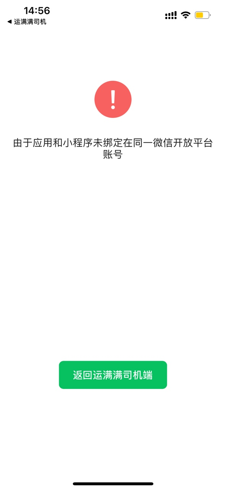
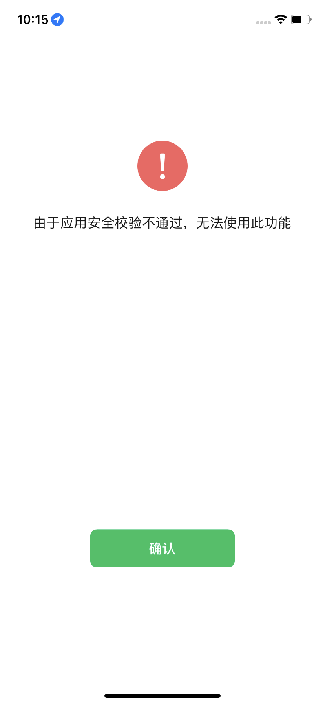

# 常见问题

## 1. 目前集团 app 支持分享到哪些第三方平台？

参考表格：

|      | 运满满司机 | 运满满货主 | 货车帮司机 | 货车帮货主 | 冷运 | 短途 |
| ---- | ---------- | ---------- | ---------- | ---------- | ---- | ---- |
| 微信 | ✅         | ✅         | ✅         | ✅         | ✅   | ✅   |
| QQ   | ✅         | ✅         | ✅         | ❌         | ❌   | ❌   |
| 抖音 | ❌         | ❌         | ✅         | ✅         | ❌   | ❌   |
| 快手 | ✅         | ✅         | ✅         | ✅         | ❌   | ❌   |

(截止 2023 年 11 月 30 日)

## 2. 目前 app 内分享渠道分别支持分享哪些内容类型？

参考表格：

|                    | 文字类型 | 图片类型 | 网页类型 | 小程序类型 | 视频类型 |
| ------------------ | -------- | -------- | -------- | ---------- | -------- |
| 微信聊天           | ✅       | ✅       | ✅       | ✅         | ❌       |
| 微信朋友圈         | ✅       | ✅       | ✅       | ❌         | ❌       |
| qq 聊天            | ✅       | ✅       | ✅       | ❌         | ❌       |
| qq 空间            | ✅       | ✅       | ✅       | ❌         | ❌       |
| 快手               | ❌       | ❌       | ❌       | ❌         | ✅       |
| 抖音               | ❌       | ❌       | ❌       | ❌         | ✅       |
| 保存图片到本地相册 | ❌       | ✅       | ❌       | ❌         | ❌       |
| 保存视频到本地相册 | ❌       | ❌       | ❌       | ❌         | ✅       |
| 发短信             | ✅       | ❌       | ❌       | ❌         | ❌       |

> 打电话分享不限制类型

(截止 2023 年 11 月 30 日)

## 3. 分享小程序到微信，出现如下提示，是什么原因？

需要分享小程序到微信时，发起分享的 App 与小程序属于同一微信开放平台账号。 
具体参考 [微信官方说明](https://developers.weixin.qq.com/miniprogram/introduction/#%E7%A7%BB%E5%8A%A8%E5%BA%94%E7%94%A8%E5%85%B3%E8%81%94%E5%B0%8F%E7%A8%8B%E5%BA%8F)

## 4. iOS 端测试包进行微信分享时，出现如下应用安全校验不通过提示，是什么原因？

分享跳转到微信平台时，部分情况微信会校验 app 的 universal link， 公司现有账号下的测试包对应的 universal link 微信无法正常识别，属于正常现象。 
解决方式：
使用 tf 包进行测试。
