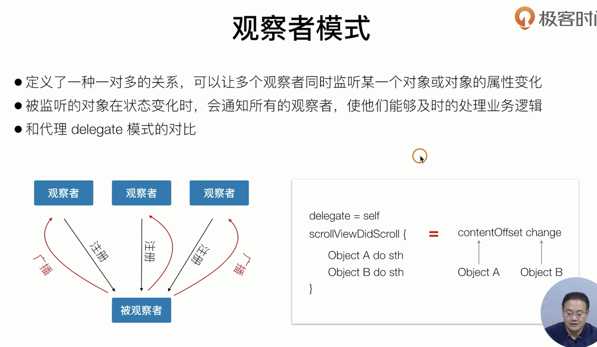
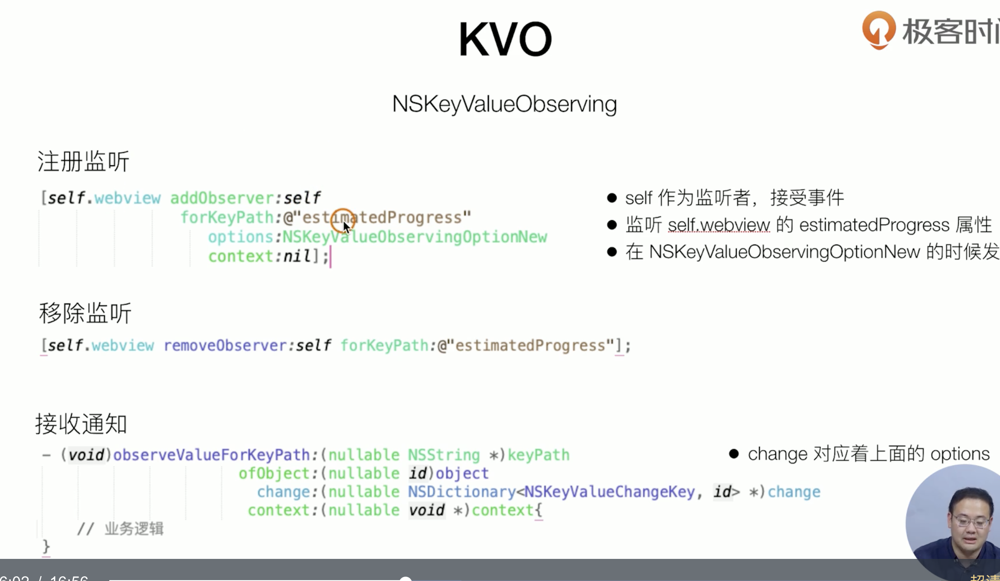

## ios开发 - oc

##### [UIView](./1_UIView.md)

##### [UIViewController](./2_UIViewController.md)

##### [UIKit 常用控件](3_UIKit 常用控件.md)

##### [WebView](./4_WebView.md)

##### [IOS动画](./5_IOS动画.md)

##### [网络通信](./6_网络通信.md)

##### [数据的序列化与存储](./7_数据序列化与存储.md)

##### [多线程](./8_多线程.md)

##### [App 生命周期](./9_app生命周期.md)

##### [组件化方案](./10_组件化方案.md)

##### [签名和证书](./11_签名和证书.md)

##### [cocoapods](./12_cocoapods.md)

##### [日志和上报](./13_日志和上报.md)

##### [Framework制作与集成](./14_Framework制作与集成.md)

##### [xcode工程配置](./15_xcode配置)

##### [DevOps](./16_DevOps)

##### [iOS 单元测试和 UI 测试](./17_iOS单元测试和UI测试)


##### 机型适配

##### autolayout


[总结-常见面试题](https://juejin.cn/post/6990228005293408270)

---

#### 补充：


##### KVO



对比delegate只能实现一对一， 然后借助一个controller来做中转，才能实现一对多



###### delegate，block， kvo理解

使用delegate和block，两者其实都是一种回调机制，实现的是一对一的关系。使用delegate需要区分设计者和使用者。设计者提供一些使用者可以自定义的操作，在对应的时机，让delegate执行对应方法，使用者需要遵守协议，按需实现delegate对应的方法。类似于delegate，block需要区分谁产生事件需要回调block，和谁响应事件需要传递block，相比而言，delegate更适用于注重过程信息的传输，比如发起一个网络请求，可能想要知道此时请求是否已经开始、是否收到了数据、数据是否已经接受完成等；block更加简洁直接且轻便灵活，注重结果的传输：比如对于一个事件，只想知道成功或者失败，并不需要知道进行了多少或者额外的一些信息。 区别于前两种，kvo定义了一对多的关系，可以让多个观察者同时监听某一个对象的属性变化，被监听的对象在状态变化时，会通知所有的观察者，使他们能够及时处理业务逻辑。kvo可以常用与需求是数据变化的场景。通过查阅相关苹果源码文档，发现可以被监听的属性会在注释中标注出来，比如webview的加载进度属性，所以可以在这个属性上注册监听实现进度条。


##### 解决循环引用

block外： `__weak typeof(self) weakSelf = self;`

block内：`__strong typeof(weakSelf) strongSelf = weakSelf;`


**@property** (**nonatomic**, **copy**, **readwrite**) dispatch_block_t deleteBlock;

dispatch_block_t : () -> () closure


##### 创建singleton

> ```objectivec
> //创建singleton
> + (instancetype)sharedInstance {
>     static JitsiMeet *sharedInstance = nil;
>     static dispatch_once_t onceToken;
> 
>     dispatch_once(&onceToken, ^{
>         sharedInstance = [[self alloc] init];
>     });
> 
>     return sharedInstance;
> }
> ```


---

#### confusing points

1. __kindof


