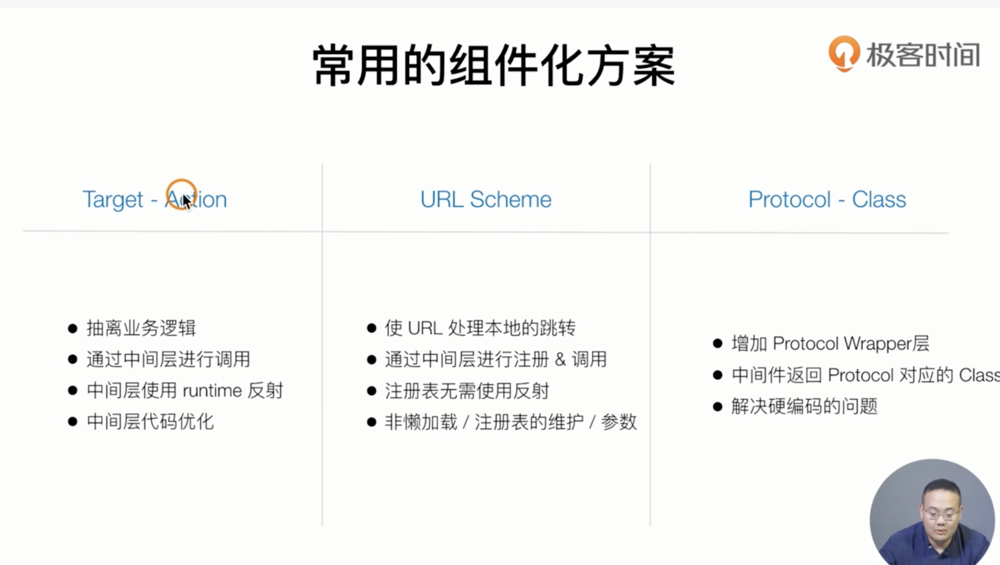
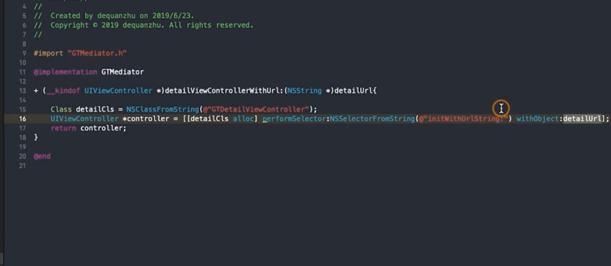
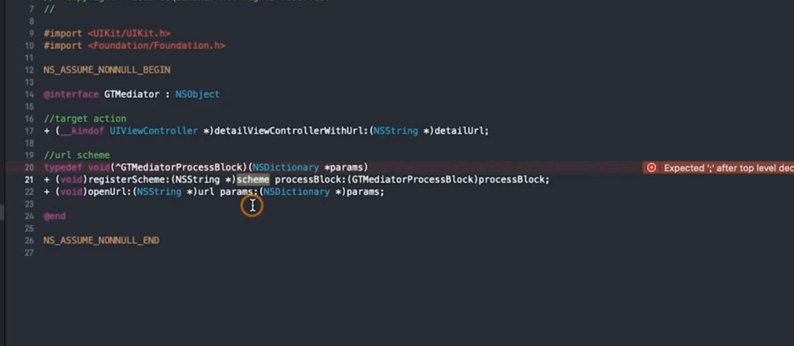
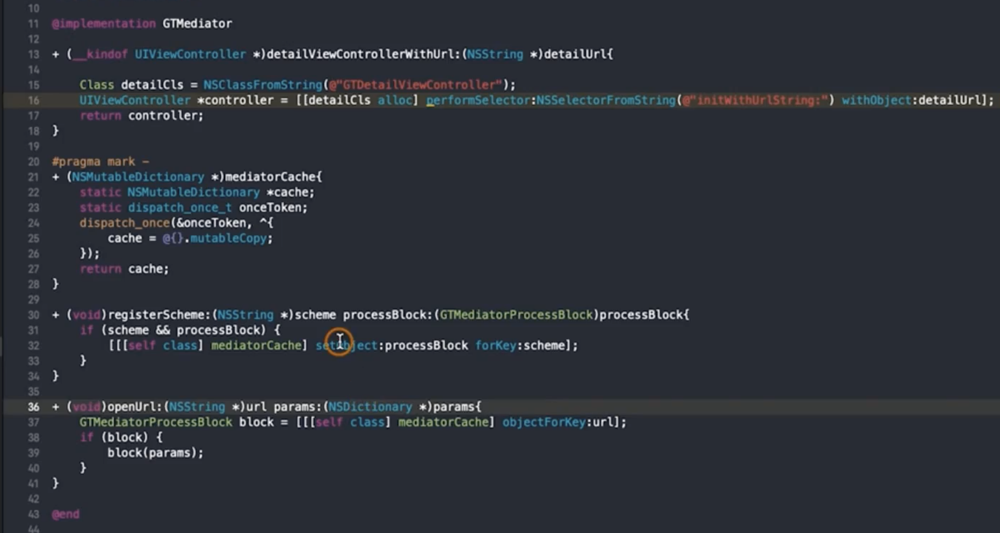
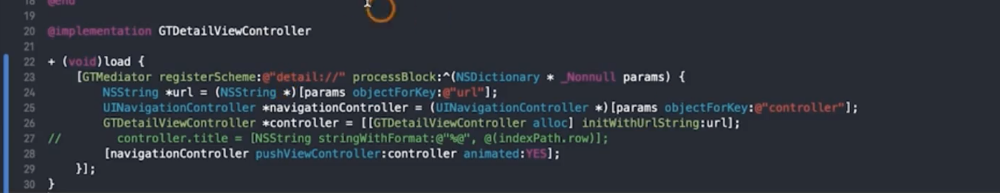
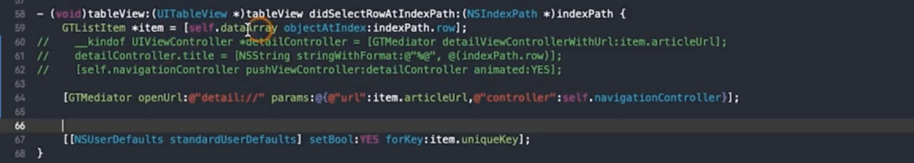
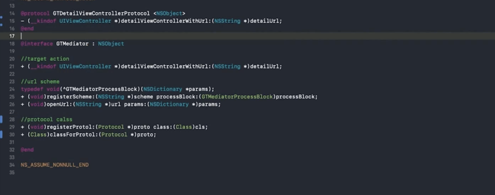
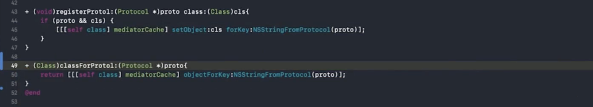
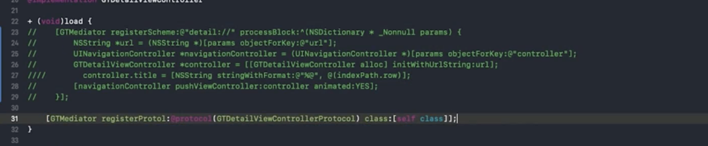
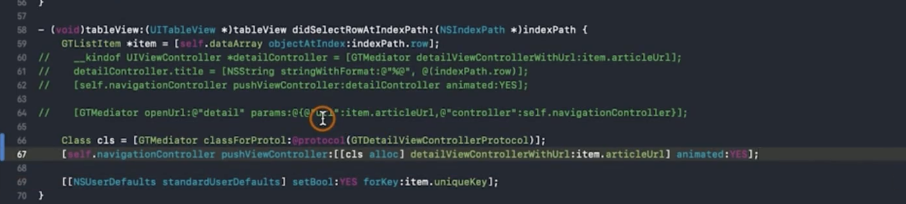

### 组件化方案

1. ###### target-action

通过oc runtime反射机制，实现无需引用通过字符串形式解耦

> [performSelector和直接调用方法的区别](https://www.jianshu.com/p/672c0d4f435a?u_atoken=99c57f1a-8191-4b9c-ab28-5f183ae4ffcd&u_asession=01iwyqpQnJr7GI65fxXnM6lc1cqqdMxG6Qp8lUSm_lKWMmy4xBia6_ph9KtLDoxErLX0KNBwm7Lovlpxjd_P_q4JsKWYrT3W_NKPr8w6oU7K-kkkkXbrFOqY5dRUCBaOK9yuYfe7vWV-zsHJifFo5DumBkFo3NEHBv0PZUm6pbxQU&u_asig=05cR52hcjdMgru4HQOxSwv1xnNeHfC-1NPOacYOsYCEKL0Xd_qVS10xmh5a0PHRGZN1lio36KIPUxP5IibbLLsy23U0MtfnJMtRY9oRkyPAom2IBT_Rls-85dzZjuJRknvY83tsa9Gudge5Llcdhjj6DFWELffiaL79JF3C5x_j3_9JS7q8ZD7Xtz2Ly-b0kmuyAKRFSVJkkdwVUnyHAIJzfZpz9Im-04KXD_HQF1myF_51S7930jsDSPmY7gT0T1tfqft3yiexPr1Pj5ASov3mu3h9VXwMyh6PgyDIVSG1W--k7rUz-BJQ4HwaHf07sTR2Zf4WZVagF8qPkvdORCi_7AKEgQJJR9Ekknnmi8BqAwgrJZQDDaqlv1uwnmr-i_wmWspDxyAEEo4kbsryBKb9Q&u_aref=L4%2BWFcF36w2uEDdcuc4%2BbsvKoJo%3D)

问题：

1. 虽然没有引用，但是用字符串硬编码, 业务逻辑仍然存在于mediator中 -> 使用扩展；注册方式实现
2. target action perfromselector对于传递参数是有限制的 最多两个 -> 参数传递使用字典等
3. 大规模解耦，mediator会很大 -> 将每个相应的函数变成扩展

###### 2. url scheme

调用

在load时加载

在响应事件上调用

不足：

参数传递使用 NSDictionary 需要查阅

openurl跨app跳转为内部跳转

但是为了规范和兼容，push跳转，从微信拉起等场景依然建议使用scheme，而且使用dictionary才可以传送object

###### 3. protocol-class

在mediator class中声明protocol（以及其需要实现的响应方法），提供注册方法和调用方法

对应class实现protocol，并在load时注册到mediator

响应位置时调用protocol 方法

