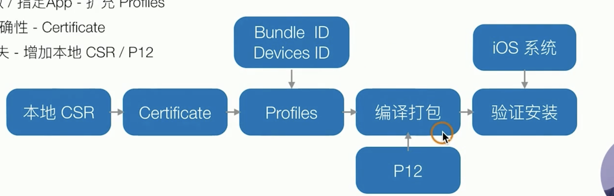
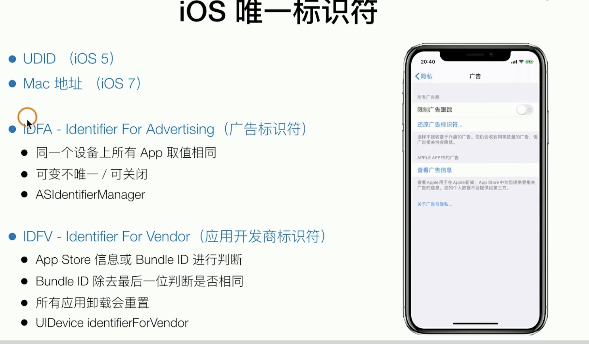

prerequisite

签名/公钥/私钥

钥匙串

app的签名和证书

- 保证了app的稳定性和苹果的控制权 - 正式版本app

  App Store 自动将开发好的二进制包进行签名和加密， 手机下载后，内部ios系统会解密（公钥私钥） ，验证app是经过app store验证封装的 

  

  

- 本地支持可控的开发版本的安装

  不方便每次开发好的临时版本都上传给app store验证安装
  
  苹果提供方案
  
  不能随意设备安装本地测试包 -> 苹果将一些限制（[bundle id](#Bundle ID)，devices id）写入profiles文件传入到本地编译过程中
  
  保证profiles准确性 -> certificate
  
  保证profiles文件不会丢失/篡改 -> 本地csr / p12
  
  
  
  
  
  
  
  

1. CSR文件 .certSigningRequest

   创建csr文件的时候 这时候会生成一对公私钥， CSR 包含了公钥和标识名称（开发者信息）

2. CER文件

   要想生成证书，需要向证书颁发机构(CA) (此处指苹果开发者网站) 提交CSR文件，苹果用自己后台的私钥去签名csr文件里提交的公钥，返回证书，开发者双击安装，会和对应的私钥绑定并保存在keychain上（如果和本地钥匙串里的私钥配对，开发者可以使用）

   证书文件，包含公钥&开发者个人信息+签名。

   分为developer 版本和distribution版本。

3. p12文件

   在keychain中找到对应的证书，选择导出 输入密码得到的就是p12备份文件，P12 = CER文件 + 私钥

4. Provisioning Profile文件

   继续在苹果开发者网站上，创建profiles文件：

   选择类型对应的developer / distribution版本

   设置App的Bundle ID

   设置可以使用的cer证书

   设置该App的权限

   设置设备，设置可安装该App的设备UDID

   苹果私钥将这些进行签名，组成一个provisioning profile，格式为.mobileprovision，下载回来双击安装，会保存在`~/Library/MobileDevice/Provisioning Profiles`中，文件名为它的UUID

5. 

#### 编译打包成 `.app`或者`.ipa`文件

当需要把一个App安装在iOS设备上时，都会先把iOS项目编译打包成`.app`文件

而打包成可安装在iOS设备上的`.app`文件的前提是，设置该App的`Provisioning Profile`，最后使用合法的证书对源代码编译后的各种文件进行签名，步骤如下：

1. 用mac os的公钥验证provsioning profile，获取信息

2. 检验bundle id是否一致，app权限是否对应

3. 用公钥验证provisioning profile的证书文件，再判断是否有其中一张证书在这台Mac电脑里

4. 验证通过，从keychain中取出最符合条件的最新创建的证书，拿到对应私钥

   如果有.framework，watch目录下的extension，.dylib，插件，分别使用私钥进行签名

   把`Provisioning Profile`改名为`embedded.mobileprovision`放在`.app`文件里面

   使用私钥对整个`.app`文件进行签名，得到签名信息`CodeResources`也放会在`.app`文件里面

5. 如果需要生成`.ipa`文件，则会把`.app`文件放在`Payload`文件夹里，把`Payload`文件夹和一些其他信息文件（非必要），一起压缩形成一个`.ipa`文件

#### 把`.ipa`文件或者`.app`文件安装在iOS设备上时

###### 非app store：

1. 先使用iOS设备上的`公钥A`对`.app`文件里面的`embedded.mobileprovision`文件进行验证，获取里面的证书

2. 再使用`公钥A`对`embedded.mobileprovision`文件里面存在的证书进行验证，取出一张对应的证书，得到`公钥L`

3. 使用`公钥L`对`.app`里面所有签名信息进行验证，如果验证通过，证明该`.app`文件是完整合法，没有被篡改的

4. 获取`embedded.mobileprovision`文件里面的可安装该App的设备UDID列表，判断该iOS设备是否可以安装

5. 如果前面的验证都通过，则App会安装在iOS设备上

###### app store：

当需要在App Store发布App时，则先需要把`.ipa`文件上传到App Store。

苹果会用一种非常简单的方式进行重新签名，这是因为在把`.ipa`文件上传到App Store之前，会先进行类似于上面步骤的一系列验证，只有通过验证才会上传成功，所以这已经进行过一次复杂的验证，代表苹果已经认同了这个`.ipa`文件，而用户又是从App Store下载的，所以也保证了`.ipa`文件来源是权威的，最后只需要在用户设备上进行简单的验证就可以

1. 苹果用`私钥A`对`.app`文件里面需要签名的文件进行重新签名
2. 用户下载App Store上面的`.ipa`文件进行安装时，用iOS设备上的`公钥A`对`.app`文件里所有签名信息进行验证，如果验证通过，则会安装在iOS设备上

- 在使用Xcode的`Automatic signing`功能的时候，无论是什么类型的账号，无论是直接`Run`进行真机调试，还是`Archive`，`Code Signing Identity`只能选用`iOS Developer`，只会使用`iOS App Development`类型的证书签名

- Mac电脑中证书的作用：1. 证明这台电脑是合法的；2. 找到对应的`私钥L`来对`.app`文件进行签名

- `Provisioning Profile`中证书的作用：1. 判断这台电脑是否可以进行签名，也就是判断这个台电脑的合法性；2. 安装App时检验`.app`文件

> Reading: [code signing system](https://juejin.cn/post/6844903902605737997)

---

### iOS的Keychain可以实现App间的数据共享

[iOS 钥匙串 Keychain 安全机制](https://www.cocoafei.top/2017/05/iOS-%E9%92%A5%E5%8C%99%E4%B8%B2-Keychain-%E5%AE%89%E5%85%A8%E6%9C%BA%E5%88%B6/)

[iOS 开发keychain 使用](https://www.jianshu.com/p/6bc772bdeece)

iOS设备中的Keychain是一个安全的存储容器，可以用来为不同应用保存敏感信息比如用户名，密码，网络密码，认证令牌。苹果自己用keychain来保存Wi-Fi网络密码，VPN凭证等等。它是一个在所有app之外的sqlite数据库。

Keychain的特点

Keychain会对保存在其中的数据进行加密（但可能也不绝对安全，越狱手机或许能拿到其中数据）；
Keychain是存在与沙盒之外的，当应用删除之后，app存储的数据并没有被删掉，第二次安装时只要读取Keychain里的数据，即可得到以前存储的信息；
相同Team Id的App可以通过Keychain来共享数据
获取设备唯一标识目前最佳的办法是IDFV+Keychain组合。IDFV是设备区别应用提供商的，可以作为应用唯一标示符。但是IDFV缺陷就是当设备删除了该所有应用提供商的app之后，IDFV值会发生变化。利用Keychain上面的第2个特点可以解决这个问题。

两个 App 间共享数据的前提是有相同的 Team ID，所以不同账号的开发者想共享 Keychain 数据是无法实现的。

在保证同一个 Team ID 的前提下首先开启 Keychain share, 选中项目的 Target -> Capabilities 添加 ‘keychain Sharing’ 选项，并添加 ‘Keychain Groups’。然后在另一个项目中按同样的操作添加相同的 ‘Keychain Groups’。

创建 Keychain Item 的时候，使用相同的 Account & Service。这样就可以在两个 App 间访问同一份数据了。

---

##### 名词

###### Bundle ID

[reference](https://zhuanlan.zhihu.com/p/60854366)

- Explicit App ID「明确的 App ID」，一般格式是：com.company.appName；这种 id 只能用在一个app上，每一个新应用都要创建并只有一个。
- Wildcard App ID「通配符 App ID」， 一般格式是：com.domainname.* ；这种 id 可以用在多个应用上，虽然方便，但是使用这种id的应用不能使用通知功能，所以不常用。

###### UDID

UDID，是 iOS 设备的一个唯一识别码，每台 iOS 设备都有一个独一无二的编码，这个编码，我们称之为识别码，也叫做UDID（ Unique Device Identifier）

##### 

[mac安全技术](https://juejin.cn/post/7007407763408191525)

