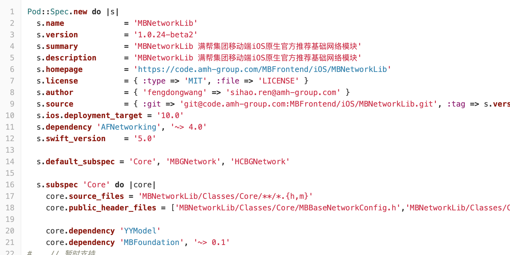

###  Cocoapods

>  ios开发应用最广泛的包管理工具

[官网](https://guides.cocoapods.org/making/making-a-cocoapod.html)

###### 1. Making a Cocoapod

```
pod lib create [pod name]
```

set you up with a well thought out library structure allowing you to easily include your files and get started quickly

###### 2. The Pod Files

 `.podspec` and `LICENSE`

###### 3. Development

You can work on the library from its folder on your system.

> Alternatively you can work from an application project using the `:path` option:

```
pod 'Name', :path => '~/code/Pods/'
```

###### 4. Testing

```
$ cd ~/code/Pods/NAME
$ pod lib lint
```

###### 5. development pods

Since CocoaPods assumes it has sole control of the Pods it checks out, you should not change the CocoaPod directly, as that would mean that CocoaPods might discard your changes and you could lose your changes on a thoughtless `pod update`. 

Instead, install your pod as a development pod.

```
pod 'AwesomeView', :path => '/Users/yourusername/path/to/pod/repo/AwesomeView'
```

So it references your local checkout of your pod's repository. Then go into your *project* directory and update only that Pod:

```
$ cd /path/to/project/folder
$ pod update AwesomeView
```

Now you should see a `Development Pods` group in your `Pods` project, containing a group showing all your Pod's source files, for you to conveniently edit. These are the files where you checked them out (not write-protected copies like usual checkouts of Pods), so you can safely edit them and push your changes to your repository just as you normally would without CocoaPods.

###### 6. Specs Repo

When you are preparing a podspec for submission, you should make sure to do the following:

1. Run `pod spec lint`. This is used to validate specifications. Your podspec should pass without any errors or warnings.
2. Update your library to use [Semantic Versioning](http://semver.org/), if it already does not follow that scheme. Essentially it makes everyone's life easier.
3. Make sure any updates you submit do not break previous installations.
4. Perform manual testing of your Podspec by [including the local Podspec](https://guides.cocoapods.org/syntax/podfile.html#pod) in the Podfile of a real application and/or your demo application, and ensuring it works as expected. **You alone** are responsible for ensuring your Podspec functions properly for your users.

---

##### 1. [iOS 组件化实践思考](https://juejin.cn/post/6844903506751520776)

一个项目可以拆分为以下几种组件：

- 基础组件；
- 功能组件；
- 业务组件；


基础组件

- 基本配置
  - 常量；
  - 宏定义；
- 分类
  - 各种系统类的扩展；
- 网络
  - 对 AFN 的封装；
  - 对 SDWebImage 的封装；
- 工具类
  - 文件处理；
  - 设备信息；
  - 时间日期处理；


功能组件

- 控件
  - 弹幕；
  - 轮播；
  - 菜单；
  - 瀑布流；
- 功能
  - 断点续传；
  - 音视频处理；
  - GPUImage 封装；

功能组件分为可见和不可见两种，可见的是控件，不可见的是功能。功能组件的作用顾名思义，就是实现了一个功能。


业务组件

业务组件，也就是业务的具体实现了，比如一个 App 的骨架如下：

- 首页；
- 发现；
- 我的；

首页下又分为这样：

- 侧滑菜单；
- Banner；
- 热门；

这里的每个部分，都可以称为业务组件。


规则：

基础组件和基础组件之间不应该产生依赖。功能组件和基础组件之间不应该产生依赖。功能组件和功能组件也不应该产生依赖。

基础组件和功能组件都是为业务服务的，因此业务组件可以依赖于基础组件和功能组件，快速的实现业务，但是**业务组件和业务组件之间不应该产生依赖**。


后期学习：

- [ ] 组件之间的通讯


##### 2. [你真的会用 CocoaPods 吗？](https://juejin.cn/post/6844903506734759949)


本地索引库

`~/.cocoapods/repos/`

本地索引文件

当执行 `pod search` 命令时，如果本地索引文件不存在，会创建这个文件。


##### 创建私有库

>  参考：[CocoaPods搭建私有库](https://www.jianshu.com/p/e191ea44d1ea)

1. 创建私有 Git 远程仓库；

2. 创建私有 CocoaPods 远程索引库；

   ```
   $ cd ~/.cocoapods/repos/REPO_NAME
   $ pod repo lint .
   
   pod repo add REPO_NAME SOURCE_URL[远程索引库地址]
    
   注：pod repo add 操作之后会clone远程仓库到.cocoapods/repos文件夹下
   ```

3. 创建 Pod 所需要的项目工程文件，并上传到 Git 远程私有库；

4. 验证 `podspec` 描述文件；

   you can use `--allow-warnings` to ignore warnings

5. 向私有 CocoaPods 远程索引库提交 `podspec` 描述文件；

   ```
    pod repo push REPO_NAME SPEC_NAME.podspec
   ```

   ```
    pod repo push 索引库名称 yourLib.podspec 
   ```

6. 私有库升级

   修改 .podspec 中的 s.version为更高的版本号

   提交到Git，并打上对应tag，然后执行终端指令

   ```
   pod repo push 索引库名称 yourLib.podspec 
   ```

   回到使用者视角，本地的索引文件还没有更新,此时还没有结束，需要在壳工程内执行

   ```
   pod update --no-repo-update
   pod install
   ```

6. 使用 Pod 库；

   

   然后跳转到项目目录，执行终端命令pod install，之后就可以使用了

   
   
   在project中 import 即可
   
   


##### CocoaPods 库依赖

封装某个框架进行替换

在spec文件中设置原框架为dependency

```
Pod::Spec.new do |s|
  s.name             = 'BaseComponent'
  s.version          = '0.2.0'
  s.summary          = '基础组价'
  s.description      = '包括基本配置，常量，扩展，工具类等'
  s.homepage         = 'https://coding.net/u/tianziyao/p/BaseComponent'
  s.license          = { :type => 'MIT', :file => 'LICENSE' }
  s.author           = { 'tianziyao' => 'ziyao.tian@gmail.com' }
  s.source           = { :git => 'https://git.coding.net/tianziyao/BaseComponent.git', :tag => s.version.to_s }
  s.ios.deployment_target = '8.0'
  s.source_files = 'BaseComponent/Classes/**/*'
  s.dependency 'Alamofire'
  s.dependency 'SDWebImage'

end

```

改好之后 `pod install`

`Alamofire` 就安装到了 `BaseComponent` 的测试工程中，直接import即可

测试无误，进行远程私有库升级，相关的库可以从podfile文件去除


---

##### [Podfile Syntax](https://guides.cocoapods.org/syntax/podfile.html)

 `install!` declares the installation method and options to be used during installation.


###### Build configurations

```
pod 'PonyDebugger', :configurations => ['Debug', 'Beta']
```

###### Modular Headers

If you would like to use modular headers per Pod you can use the following syntax:

```
pod 'SSZipArchive', :modular_headers => true
```

Additionally, when you use the `use_modular_headers!` attribute, you can exclude a particular Pod from modular headers using the following:

```
pod 'SSZipArchive', :modular_headers => false
```

###### Source

```
pod 'PonyDebugger', :source => 'https://github.com/CocoaPods/Specs.git'
```

In this case only the specified source will be searched for the dependency and any global sources ignored.

###### Subspecs

When installing a Pod via its name, it will install all of the default subspecs defined in the podspec.

You may install a specific subspec using the following:

```
pod 'QueryKit/Attribute'
```

You may specify a collection of subspecs to be installed as follows:

```
pod 'QueryKit', :subspecs => ['Attribute', 'QuerySet']
```

###### Target

```
target 'ShowsApp' do
  pod 'ShowsKit'

  # Has its own copy of ShowsKit + ShowTVAuth
  target 'ShowsTV' do
    pod 'ShowTVAuth'
  end

  # Has its own copy of Specta + Expecta
  # and has access to ShowsKit via the app
  # that the test target is bundled into

  target 'ShowsTests' do
    inherit! :search_paths
    pod 'Specta'
    pod 'Expecta'
  end
end
```

###### abstract target

```
# Note: There are no targets called "Shows" in any of this workspace's Xcode projects
abstract_target 'Shows' do
  pod 'ShowsKit'

  # The target ShowsiOS has its own copy of ShowsKit (inherited) + ShowWebAuth (added here)
  target 'ShowsiOS' do
    pod 'ShowWebAuth'
  end

  # The target ShowsTV has its own copy of ShowsKit (inherited) + ShowTVAuth (added here)
  target 'ShowsTV' do
    pod 'ShowTVAuth'
  end

  # Our tests target has its own copy of
  # our testing frameworks, and has access
  # to ShowsKit as well because it is
  # a child of the abstract target 'Shows'

  target 'ShowsTests' do
    inherit! :search_paths
    pod 'Specta'
    pod 'Expecta'
  end
end
```

###### inherit!

Available Modes: + `:complete` The target inherits all behaviour from the parent. + `:none` The target inherits none of the behaviour from the parent. + `:search_paths` The target inherits the search paths of the parent only.

```
target 'App' do
  target 'AppTests' do
    inherit! :search_paths
  end
end
```

###### source

Specifies the location of specs

```
source 'https://github.com/artsy/Specs.git'
source 'https://github.com/CocoaPods/Specs.git'
```


use_ modular_ headers！该特性是 Cocoapods 1.5.0 引入的配置，目的是为了满足 Xcode 9 以后支持的 Swift Static Libraries ，将 Swift Pods 构建成为静态库


##### [Podspec Syntax](https://guides.cocoapods.org/syntax/podspec.html)

[参考](https://www.jianshu.com/p/9eea3e7cb3a1)





###### Root specification/Source: 

The location from where the library should be retrieved.

supported keys:

```
:git` => `:tag`, `:branch`, `:commit`, `:submodules
:svn` => `:folder`, `:tag`, `:revision
:hg` => `:revision
:http` => `:flatten`, `:type`, `:sha256`, `:sha1`, `:headers
```


###### Platform

```
spec.platform = :osx, '10.8'
```

to specify multiple platforms on which this pod is supported — specifying a different deployment target for each.

```
spec.ios.deployment_target = '6.0'
spec.osx.deployment_target = '10.8'
```


###### Build settings

If not defined in a subspec the attributes of this group inherit the value of the parent.

###### dependency

```
spec.dependency 'AFNetworking', '~> 1.0', :configurations => :debug
```


```php
  //是否要求arc（有部分非arc文件情况未考证）
  s.requires_arc = true
```


```php
 //在这个属性中声明过的.h文件能够使用<>方法联想调用（这个是可选属性）
  s.public_header_files = 'UIKit/*.h'
```


```php
  //表示源文件的路径，这个路径是相对podspec文件而言的。（这属性下面单独讨论）
  s.source_files ='AppInfo/*.*'
    
  //表示Classes目录及其子目录下所有文件
  s.source_files = 'AppInfo/**/*'

   //下载HycProject文件夹下名称为AppManInfo和AppWomanInfo的共4项文件
s.source_files ='HycProject/App{Man,Woman}Info.{h,m}'
    
      //需要用到的frameworks，不需要加.frameworks后缀。（这个没有用到也可以不填）
  s.frameworks ='Foundation', 'CoreGraphics', 'UIKit'
```


```php
  //动态库所使用的资源文件存放位置，放在Resources文件夹中
  s.resource_bundles = {
    'Test5' => ['Test5/Assets/*.png']
  } 
  //资源文件（具体使用带考证）
  s.resources = 'src/SinaWeibo/SinaWeibo.bundle/**/*.png' 
```


MBMediaLib,podspec:

```
s.vendored_libraries = 'MBMediaLib/Classes/VoiceConvert/**/*.a'
```

.h文件使用 `source_files`

.a文件使用`vendored_libraries`

.framework文件使用 `vendored_frameworks`


---


##### cocoapods原理

[reference](https://www.jianshu.com/p/52c5035c9a87?u_atoken=35397ab9-ba4f-4bc1-ac02-70fedfe318fd&u_asession=0102HOqkplyI4MiTjDoR0CUo_f37E87PWqlq-tJ4MVxVFrMaUevhRCePnyvMvnCM_pX0KNBwm7Lovlpxjd_P_q4JsKWYrT3W_NKPr8w6oU7K_t7i-eLMYteVKVumTC3ukvPpcarp92QKzyJKyYjREPlmBkFo3NEHBv0PZUm6pbxQU&u_asig=05psoSHU7Wv6_f8KE1VSR9RzLRfRTCVYuqbhNG0kcT_7W23TtyhJ1fGmKVXM72iUWOvON5Xpr7LYY5mnBB6Aar4NfFf6fAcoyX9ElkPQr0rey6Yutg8ZKWMW51cSNEb-U8pT9pCP_1ohAFRdD-usoTyPgg8whSXQLIY4AxqOnYaDb9JS7q8ZD7Xtz2Ly-b0kmuyAKRFSVJkkdwVUnyHAIJzYdwuEoaMsoBPDBeGk97fg9vAGHZPBkSxQ8Lx_agFHCyWPRPQyB_SKrj-61LB_f61u3h9VXwMyh6PgyDIVSG1W_mpOBEqlIZ3T3FrgzGxojukJazJ-vHwBN39DhjYpKlM3nC6OA1nyJ1tOxSn2pSXZKR40WvpqhPCtqqD3j5PkuKmWspDxyAEEo4kbsryBKb9Q&u_aref=l5DAObQKTCd1RlE%2BCMAydd4K8gM%3D)

下载原理：

1. 找到对应git仓库
2. 根据tag定位到对应tag的commit
3. 在commit中检索后缀为.podspec文件（文件可以随便命名）
4. 验证s.name是否与podfile中的一致，不一致会报错
5. Podspec中的s.source_files找到需要导入的代码文件，并通过其他的的数据找到对应的配置文件或资源文件等
6. 将其下载到本地项目中


---

##### further reading

[**Podfile 的解析逻辑**](https://www.desgard.com/2020/09/16/cocoapods-story-4.html)


