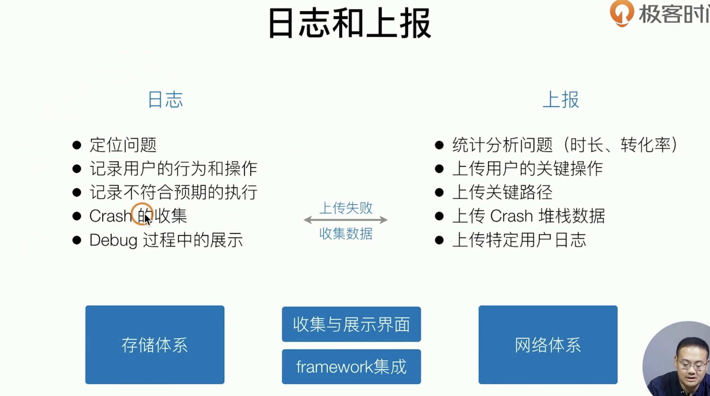
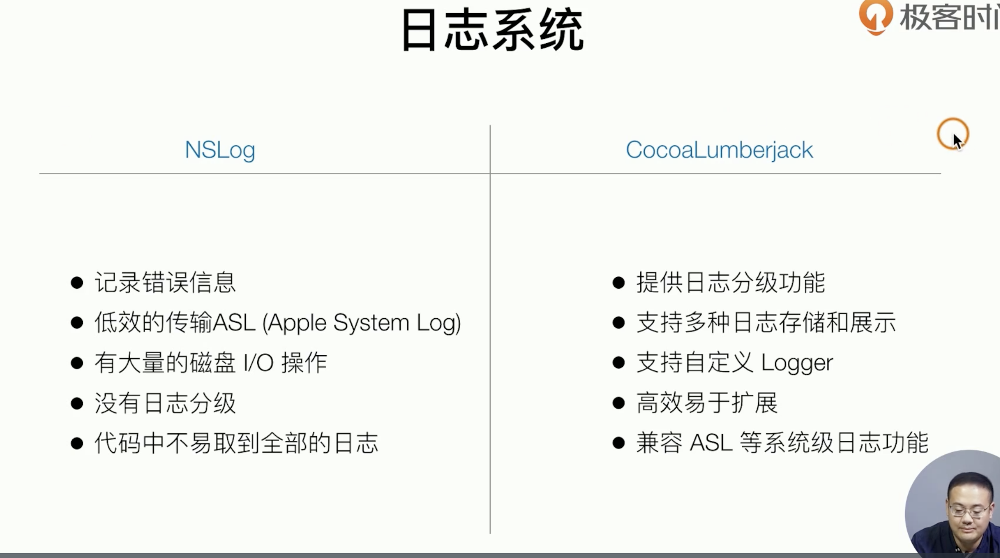
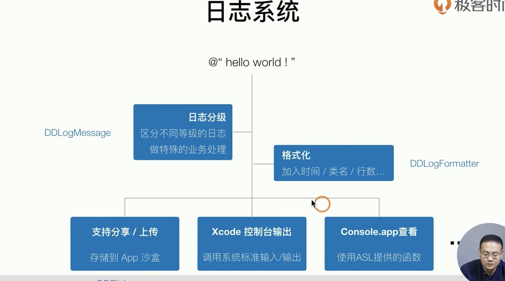
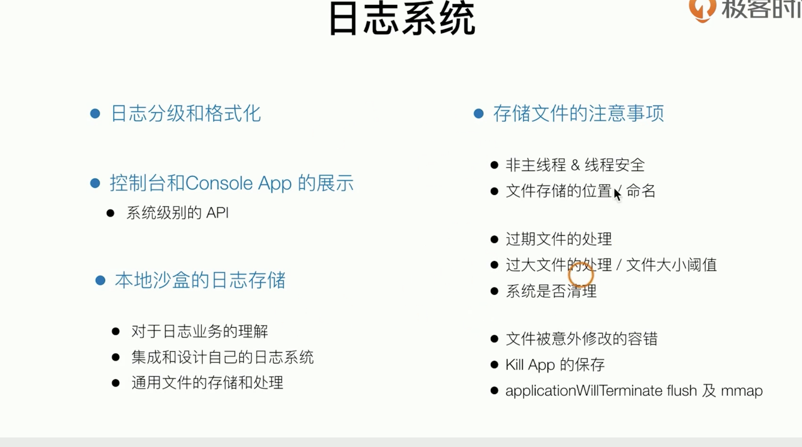
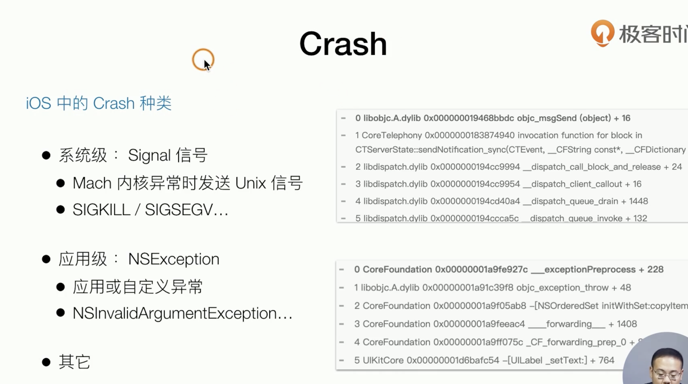
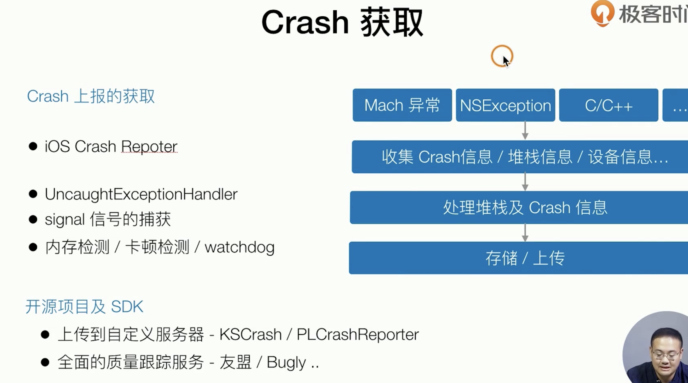
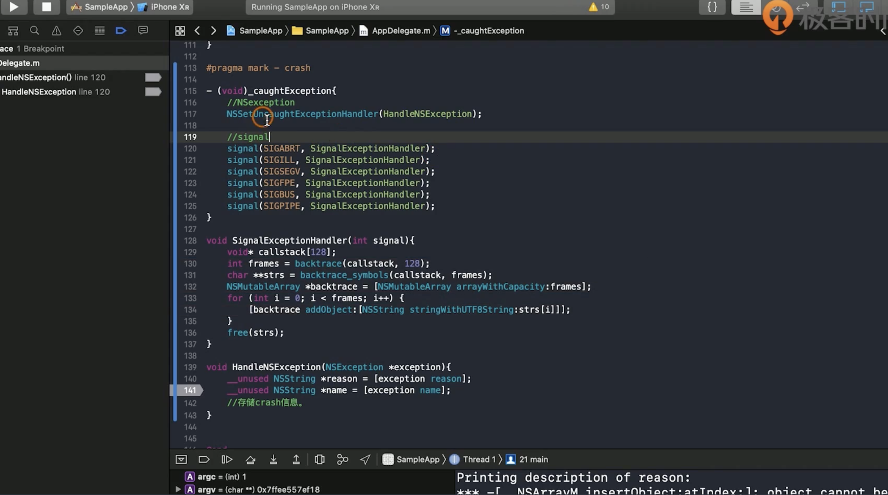

##### 日志和上报

日志系统：围绕着存储的体系定位问题的业务逻辑 包括debug过程中的展示 线上问题的存储和捞取

上报：全量（操作路径 比如a b页面的转换率） 

[埋点（Event Tracking）vs 无埋点（Codeless Tracking） vs 可视化埋点（Visual Event Tracking）](https://www.cnblogs.com/HuZihu/p/11446571.html)](https://www.cnblogs.com/HuZihu/p/11446571.html)

