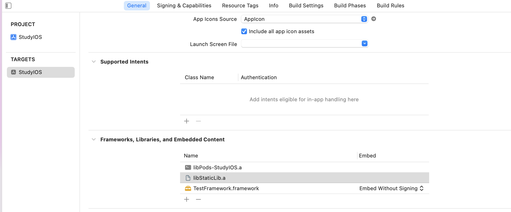

---

2022.1.18更新

> 听到向平老师昨天谈起app大小，说app之间可以共享动态库导致大小没有增加
>
> 于是想起自己学习的动态库静态库区别，于是回顾一下
>
> 迷惑的问题
>
> 1. 苹果禁止动态库？那我们生成的cocoapods framework是怎么集成的？framework是动态库吗？
> 2. framework 静态库 动态库分别指什么？动态库真的能缩小app size？
> 3. use_framework！ 到底在做啥呢？和swift有什么关系？为什么能加快编译速度？
> 4. 分享库引用抖音framework的时候遇到的问题？有的时候需要exclude sourcefile 有的时候又需要不exclude？

静态和动态是相对编译期和运行期而言的：

> 静态库在程序编译时会被链接到目标代码中，程序运行时将不再需要该静态库；动态库在程序编译时并不会被链接到目标代码中，只是在程序运行时才被载入。

误区 framework不是动态库的意思，framework是一种打包方式，包含二进制文件，头文件和相关资源文件等，支持动态/静态库

各自优点：

- 静态库：

  ①、模块化，分工合作，提高了代码的复用及核心技术的保密程度
  ②、避免少量改动经常导致大量的重复编译连接
  ③、也可以重用，注意不是共享使用

- 动态库：

  ①、可以将最终可执行文件体积缩小，将整个应用程序分模块，团队合作，进行分工，影响比较小
  ②、多个应用程序共享内存中得同一份库文件，节省资源
  ③、可以不重新编译连接可执行程序的前提下，更新动态库文件达到更新应用程序的目的
  ④、应用插件化
  ⑤、软件版本实时模块升级
  ⑥、在其它大部分平台上，动态库都可以用于不同应用间共享， 共享可执行文件，这就大大节省了内存。

> 在 iOS8 之前，苹果不允许第三方框架使用动态方式加载，从 iOS8 开始允许开发者有条件地创建和使用动态框架，这种框架叫做 Cocoa Touch Framework。虽然同样是动态框架，但是和系统 framework 不同，苹果系统专属的 framework 是共享的（如 UIKit），使用 Cocoa Touch Framework 制作的动态库在打包和提交 app 时会被放到 app main bundle 的根目录中，运行在沙盒里，而不是系统中。也就是说，不同的 app 就算使用了同样的 framework，但还是会有多份的框架被分别签名、打包和加载。不过 iOS8 上开放了 App Extension 功能，可以为一个应用创建插件，这样主 app 和插件之间共享动态库还是可行的。

[动态库/静态库/framework 概念理解以及生成实践](https://www.jianshu.com/p/662832e16625)

[深入理解库](https://www.cnblogs.com/dins/p/ios-jing-tai-ku-he-dong-tai-ku.html)

问题结论

>1， 2， 3 文章里解答
>
>4还是不太明白，可以看下这个 [参考](https://www.jianshu.com/p/544df88b6a1e)

---

#### framework制作与集成

- url scheme: app间跳转和通信

- app间跳转场景：登录/分享/引导/app下载...

- 登录系统：

  跨平台，跨app

  标记用户，个性化推送

  使用第三方登录（减少注册成本/无须维护敏感信息）

  微信/qq/微博/facebook/twitter

- 登录系统通用技术

  framework的使用和集成 （动态库静态库相关的逻辑）

  常用的第三方认证和账户体系（OAuth 和openid体系）

  业务逻辑的设计和实现

  通用第三方集成思路

ios审核中动态库禁止使用，目前使用的都是系统的动态库

设置暴露的头文件：target - build phases - copy files- add

模拟器和真机底层不一样，二进制文件要分别生成

framework

[详细库讲解和framework](https://www.cnblogs.com/dins/p/ios-jing-tai-ku-he-dong-tai-ku.html)

framework 能在多个app共享

仍然需要打包到app中，不是绝对的动态库

问题：

1. product文件夹[解决iOS Xcode13.2.1 创建framework，没有Products目录](https://www.jianshu.com/p/6590dd79e125)

2. xcode没有embed binaries选择 自动embeded，

Oauth and OpenId

查看sdk文档

集成tencentapi sdk 并实现登录和分享

##### 

