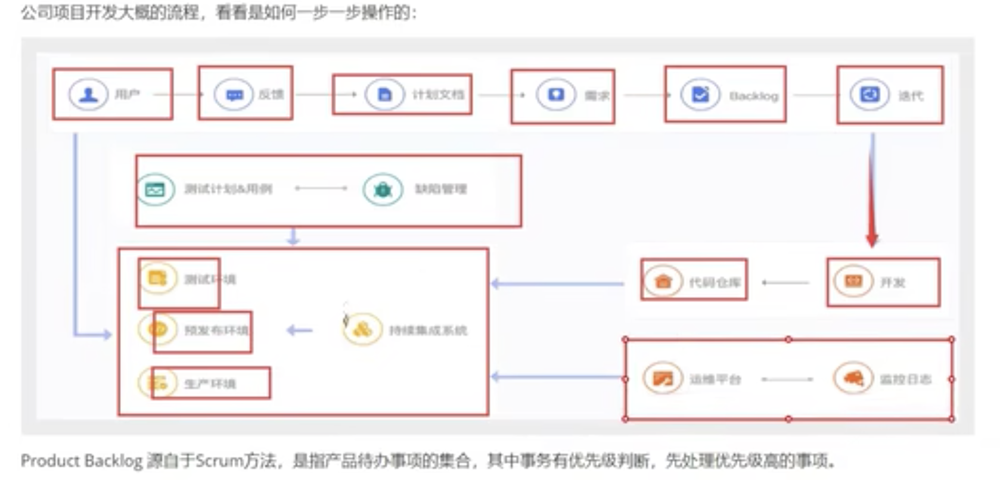
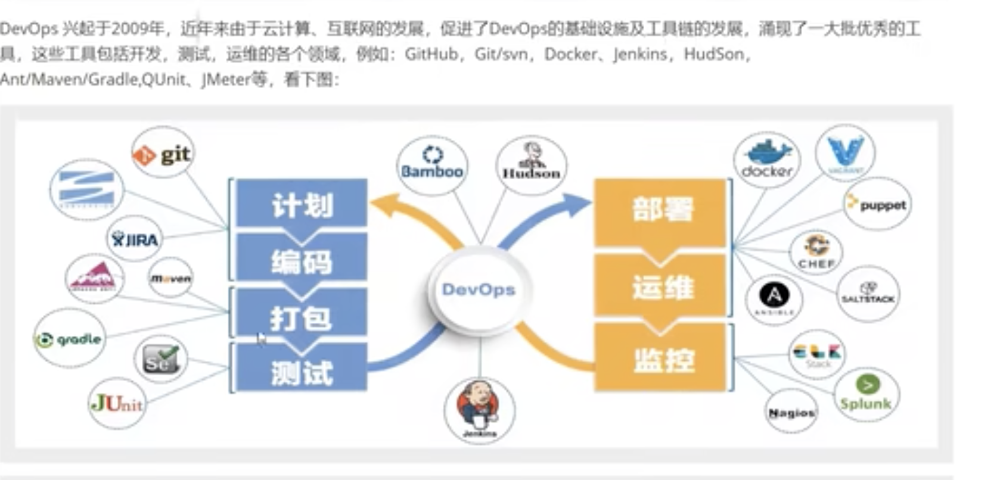
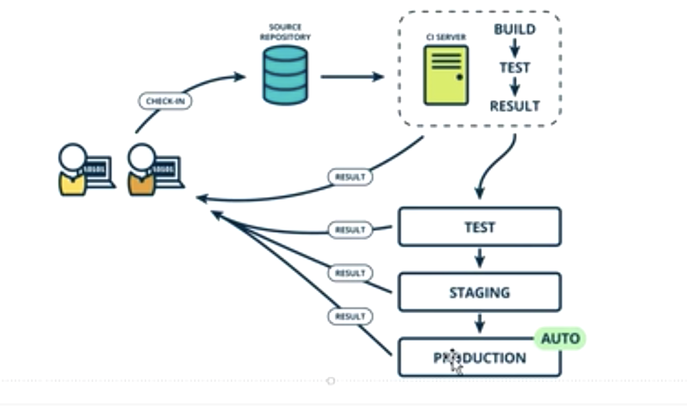
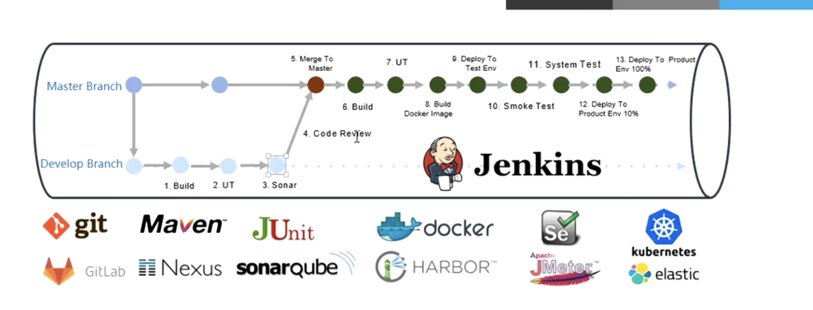

DevOps集文化理念，实践与工具于一身。强调整个组织的合作以及交付和基础设施变更的自动化，从而实现持续集成、持续部署和持续交付。帮助企业快速的发展和改进产品

DevOps平台：代码托管，项目管理，运维平台和持续交付

---

### CI/CD

**持续集成（continuous integration）** ： 持续集成是指多名开发者开发不同功能的代码过程中，可以频繁地将代码合并到一起并互相不影响

**持续部署(continuous deployment)**： 基于工具或平台实现代码自动化构建、测试和部署到线上环境以实现高质量的交付产品，持续部署代表一个开发团队的更新迭代速率

> TEST: 测试环境
>
> STAGING: 预发布环境
>
> PRODUCTION: 生产环境

> Glossary
>
> UT: 单元测试
>
> sonar：代码扫描
>
> smoke test: 冒烟测试 只测主要功能
>
> Deploy To Product Env 10%: 灰度

---

gitlab

下载 安装 配置（configure） 

代码回滚：两种方式

1. 基于git reset 重新编译借助于jenkins重新部署
2. 在web服务器端备份

---

tf ：[testfight](https://zh.m.wikipedia.org/zh-hans/TestFlight) 前三天

dev

rel

---

confusing points

[ios工程架构](https://juejin.cn/post/6950454120826765325)