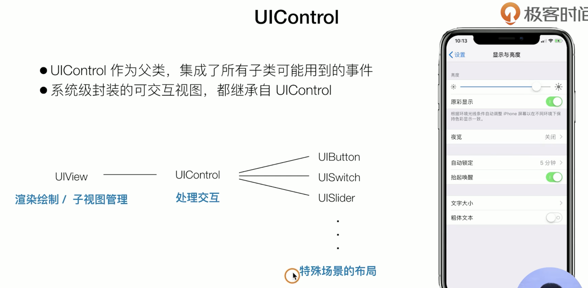
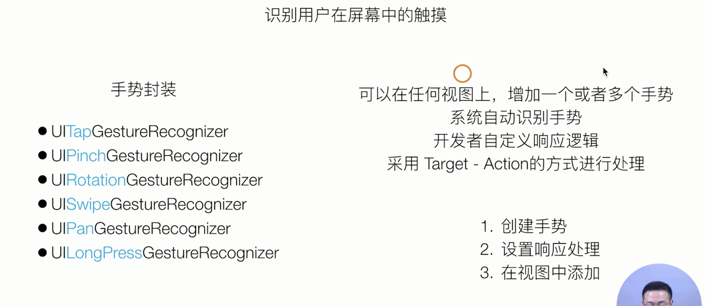
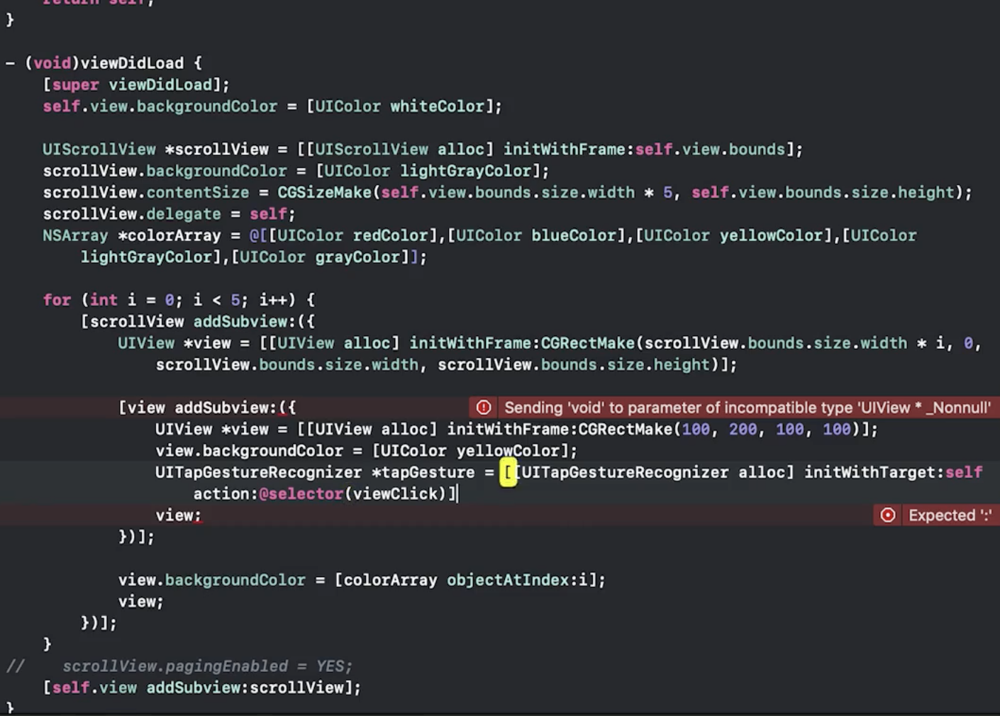

##### UILabel

展示一行或多行文字的视图

属性：

text, font, textColor, textAlignment

numberOfLines: 最大展示行数

lineBreakMode: 行数截断（固定大小的）

-(void) sizeToFit: 可变大小通过sizeToFit返回size

通常结合UITableView替换table cell默认的样式:

- 继承UITableViewCell，重写`- (**instancetype**)initWithStyle:(UITableViewCellStyle)style reuseIdentifier:(**nullable** NSString *)reuseIdentifier`方法

  

- 添加layoutTableViewCell方法，并暴露接口；在每次tableview要布局的时候调用方法（cellForRowAtIndexPath）

  

后期展示复杂样式的字体：通过NSAttributedString设置


##### UIImage

UIImage 使用场景：

- 通过UIImageView视图展示
- 系统封装视图的图片展示。比如tabbaritem的image
- 在上下文绘制

在ios中，图片数据会被系统封装成uiimage: imageNamed, imageWithContentsOfFile, imageWithData, imageWithCGImage ...

展示一张图片或者动图 

UIImageView.animationImages = @[UIImage, UIimage...]

UIImageView.animationDuration = 1

[UIImageView startAnimating]

图片尺寸和UIImageView不符，自定义填充方式(contentMode)


##### UIButton


增加了按钮状态和交互

每种状态下都有对应的视图

```objc
//自定义试图
- (void)setTitle:(nullable NSString *)title forState:(UIControlState)state;  

typedef NS_OPTIONS(NSUInteger, UIControlState) {
    UIControlStateNormal       = 0,
    UIControlStateHighlighted  = 1 << 0,                  // used when UIControl isHighlighted is set
    UIControlStateDisabled     = 1 << 1,
    UIControlStateSelected     = 1 << 2,                  // flag usable by app (see below)
    UIControlStateFocused API_AVAILABLE(ios(9.0)) = 1 << 3, // Applicable only when the screen supports focus
    UIControlStateApplication  = 0x00FF0000,              // additional flags available for application use
    UIControlStateReserved     = 0xFF000000               // flags reserved for internal framework use
};
```


##### target action - 组件化


UIButton 通过Target-Action 模式，处理点击逻辑

系统封装用户操作事件

对应事件开发者实现自定义的方法



在非UIControl视图上添加手势







更复杂场景：借助UIGestureRecognizer的UIGestureRecognizerDelegate

比如根据手势位置个性化设置响应方式

是否响应手势

是否支持多手势

多个手势冲突如何处理等

##### UIAlertView组件

自定义组件思路


UIAlertView 


##### UIKit


