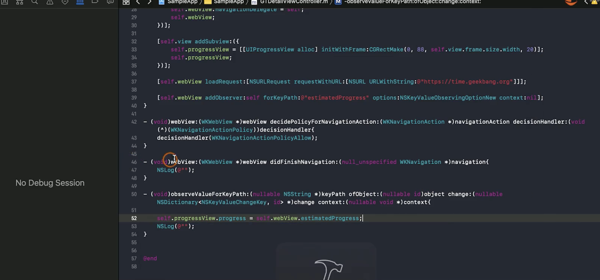
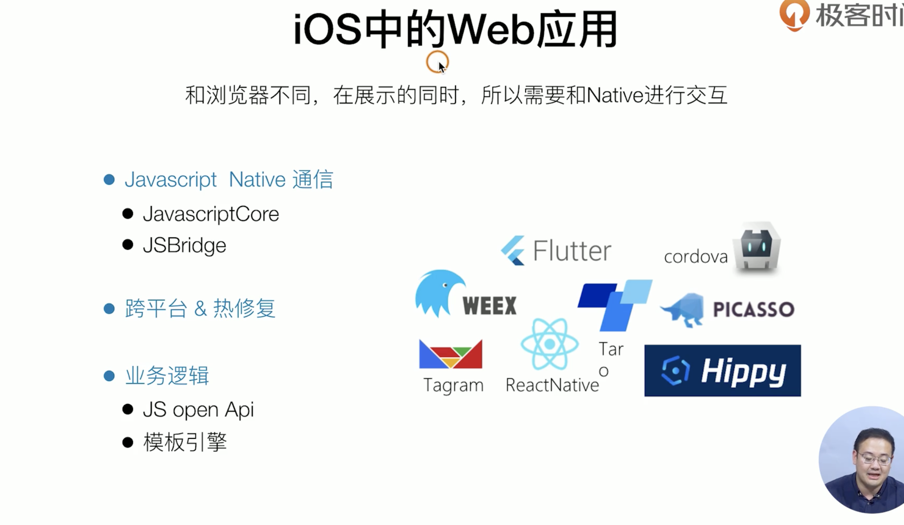

##### WebView 

广泛使用 （跨端）

WKWebView 优势: 

- 独立进程，内存

- crash不影响主app

- 对html和css更好的支持

- 更多更有好的系统函数

- 采用jit技术

##### KVO

对比delegate只能实现一对一， 然后借助一个controller来做中转，才能实现一对多

实现一个进度条

开源kvo： KVOController (Facebook)

