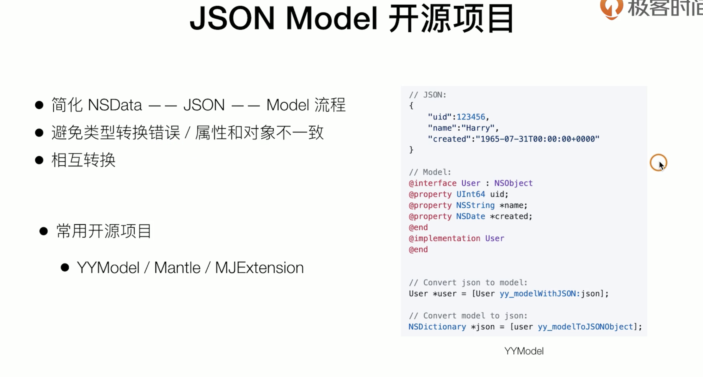

### 文件序列化与存储


#### JSON

轻量级，高可读性，纯文本形式的数据交换格式


#### ios中的json解析

系统类：NSJSONSerialization


#### 结构化数据




#### 总结完整列表加载流程：

1. 通过网络接口加载数据 - NSData
2. 使用NSJsonSerialization解析处理网络请求 - JSON Object
3. cast类型为合适的集合类型，注意类型检查 -Dictionary/Array
4. 数据model化 -Model

---

#### ios文件管理

##### 系统文件夹 & 沙盒机制

-  bundles： 每一个app独立自己的系统文件夹，保存plist和二进制文件&资源
- data： 自己的文件夹，存取数据
  - documents： 可以进行备份和恢复，体积较大，一般存档用户数据，可以用来存储需要分享的数据（配合plist文件配置）
  - library： 开发者最经常使用的文件夹，可以定义子文件夹
    - caches： 不需要缓存的，体积较大
    - preferences： 用户偏好设置 NSUserDefault
    - ...： 自定义，比如httpdata， picdata， 一般为url倒序
  - systemdata
  - tmp：不会备份，可能被清除

沙盒机制：只能访问程序自己的目录，每个app特有的文件夹

##### 获取沙盒地址

NSPathUtilities 系统提供函数：

```objc
    //cache directory所在地址
    NSArray *pathArray = NSSearchPathForDirectoriesInDomains(NSCachesDirectory, NSUserDomainMask, YES);
    // 返回值为array，一般取第一个为寻找的地址，类型为nsstring*
    NSString *cachePath = [pathArray firstObject];
```


##### NSFileManager

- 单例， 提供app内文件&文件夹的管理功能
- 创建文件/删除文件/查询文件/移动和复制等
- 读取文件内容/属性（不主要常用语load全部文件内容）
- 通过nsurl 或者 nsstring作为path

```objective-c
NSFileManager *fileManager = [NSFileManager defaultManager];

//在cache文件夹中添加directory
NSString *dataPath = [cachePath stringByAppendingPathComponent:@"NewsData"];
NSError *createError;
[fileManager createDirectoryAtPath:dataPath withIntermediateDirectories:YES attributes:nil error:&createError];

//创建文件
[fileManager createFileAtPath:listDataPath contents:contentData attributes:nil];

//判断文件是否存在
fileExistAtPath
  
//获取内容
  contentsOfDirectoryAtPath
  contentsAtPath
  attributesOfItemAtPath
  
//删除
  removeItemAtPath
```

NSFileManagerDelegate 回调： 提供移动 复制 删除等操作的具体自定义实现


##### NSFileHandle

- 读取文件&写文件
- 读取指定的长度&在指定位置追加/截断
- 截断&立即刷新
- 常用于追加数据

```objc
//创建nsfile handler实例
+ (nullable instancetype)fileHandleForReadingAtPath:(NSString *)path;
+ (nullable instancetype)fileHandleForWritingAtPath:(NSString *)path;
+ (nullable instancetype)fileHandleForUpdatingAtPath:(NSString *)path;

//功能
- (nullable NSData *)readDataUpToLength:(NSUInteger)length error:(out NSError **)error
- (BOOL)writeData:(NSData *)data error:(out NSError **)error
- (BOOL)seekToEndReturningOffset:(out unsigned long long *_Nullable)offsetInFile error:(out NSError **)error
  
  
//添加内容例子 deprecated
    NSFileHandle *fileHandler = [NSFileHandle fileHandleForUpdatingAtPath:listDataPath];
    [fileHandler seekToEndOfFile];
    [fileHandler writeData:[@"456" dataUsingEncoding:NSUTF8StringEncoding]];
    [fileHandler synchronizeFile];
    [fileHandler closeFile];
```


##### 序列化和反序列化

###### NSCoder

- 归档（序列化） & 解归档（反序列化）
- 提供简单的函数，在object和二进制数据间进行转换
- 抽象类，具体功能需要子类实现

```objc
- (void)encodeObject:(nullable id)object forKey:(NSString *)key;
- (void)encodeBool:(BOOL)value forKey:(NSString *)key;
...
  
- (nullable id)decodeObjectForKey:(NSString *)key;
- (BOOL)decodeBoolForKey:(NSString *)key;

//使用key进行归档
```


###### NSKeyedArchiver

- NScoder 的子类

- 提供简单的函数，在object和二进制数据间进行转换
- 提供基本的delegate
- 需要object自己处理key value对应关系 （nscoding 协议）

```objc
// NSKeyedArchiver 
+ (nullable NSData *)archivedDataWithRootObject:(id)object 
  requiringSecureCoding:(BOOL)requiresSecureCoding 
  error:(NSError **)error;

//例子
NSData *contentData = [NSKeyedArchiver archivedDataWithRootObject:array requiringSecureCoding:YES error:nil];
  
// NSKeyedUnarchiver
+ (nullable id)unarchivedObjectOfClass:(Class)cls fromData:(NSData *)data error:(NSError **)error;
   
+ (nullable NSArray *)unarchivedArrayOfObjectsOfClass:(Class)cls fromData:(NSData *)data error:(NSError **)error;

//例子
    id unarchivedData = [NSKeyedUnarchiver unarchivedObjectOfClasses:[NSSet setWithObjects:[NSArray class],[NewsListItem class], nil] fromData:fileData error:nil];
    id unarchivedData = [NSKeyedUnarchiver unarchivedArrayOfObjectsOfClass:[NewsListItem class] fromData:fileData error:nil];
```


###### NSCoding 协议

对于object的序列号 & 反序列化协议

- nsarray 和 nsdictionary等类型系统已经实现协议
- **NSSecureCoding **
  - 解决文件替换攻击
  - 序列化时规定class

```objc
//nscoding 协议
- (void)encodeWithCoder:(NSCoder *)coder{
    [coder encodeObject:self.category forKey:@"category"];
    [coder encodeObject:self.picUrl forKey:@"picUrl"];
    ...
}

- (nullable instancetype)initWithCoder:(NSCoder *)coder{
    self = [super init];
    if(self) {
        self.category = [coder decodeObjectForKey:@"category"];
        self.picUrl = [coder decodeObjectForKey:@"picUrl"];
        ...
    }
    return self;
}

//nssecurecoding协议需要补充
+ (BOOL) supportsSecureCoding {
    return YES;
}
```


##### NSUserDefault


提供简单的key-value存储 （key value 和存储文件在某一个路径同一纬度）

- 单例，存取轻量级数据
- 一般用于用户的偏好设置
- 升级安装后还可以继续使用
- 文件存储在/library/preference下
- 支持基本的数据类型 （integer float double bool nsarray nsdata nsstring nsdictionary）
- 复杂的model需要转化成nsdata

```objective-c
- (void)setObject:(nullable id)value forKey:(NSString *)defaultName;
- (nullable NSString *)stringForKey:(NSString *)defaultName;
- (nullable NSArray *)arrayForKey:(NSString *)defaultName;
- (nullable NSDictionary<NSString *, id> *)dictionaryForKey:(NSString *)defaultName;
- (nullable NSData *)dataForKey:(NSString *)defaultName;
- (void)removeObjectForKey:(NSString *)defaultName;
```

---


---

##### 缓存新闻数据和已读状态

- 使用nskeyedarchiver保存列表数据到文件

  加载本地数据->网络请求成功后替换

- 使用NSUserDefault保存已读状态

  key ： hasRead

  Value:   NSArray 列表序号

- 实际项目中的使用

  结合项目架构，选择存储方式

  数据库/kv/系统级 （复杂关系比如微信群组 数据库）

##### 优化网络和存储流程

