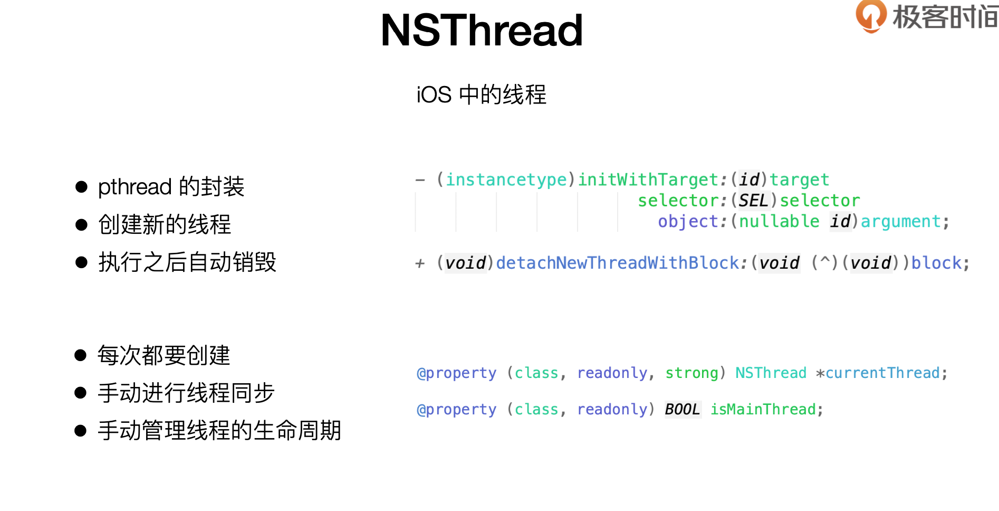
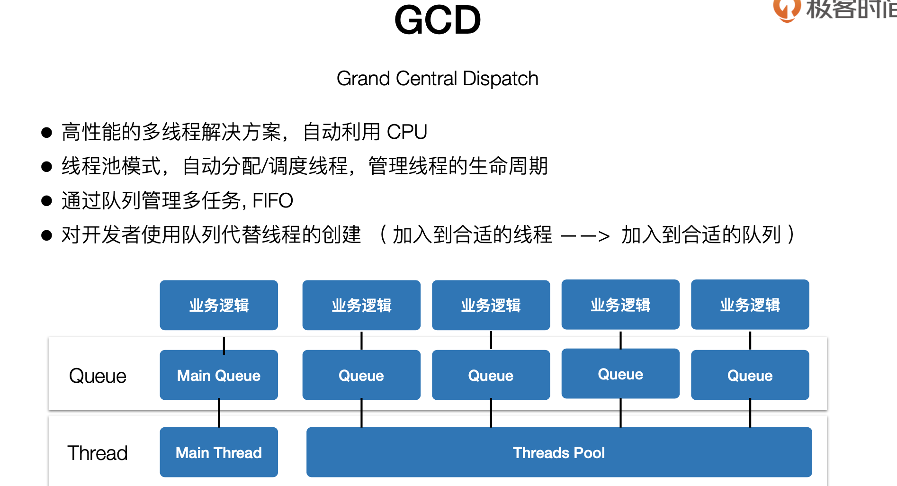
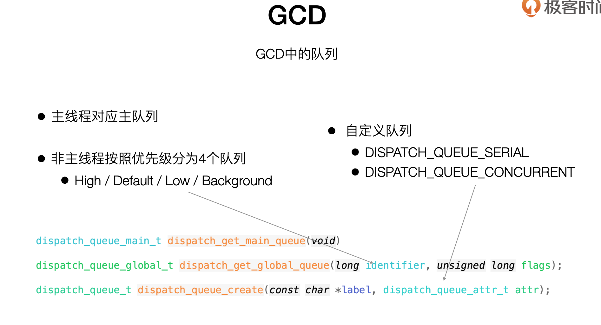
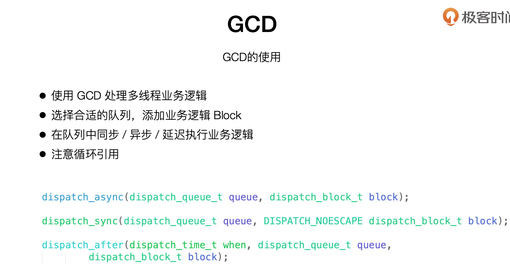
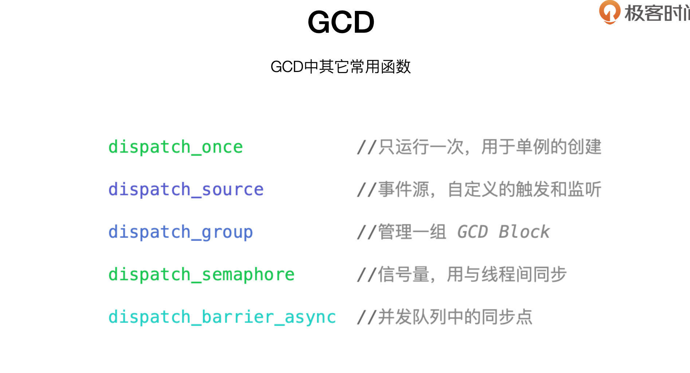
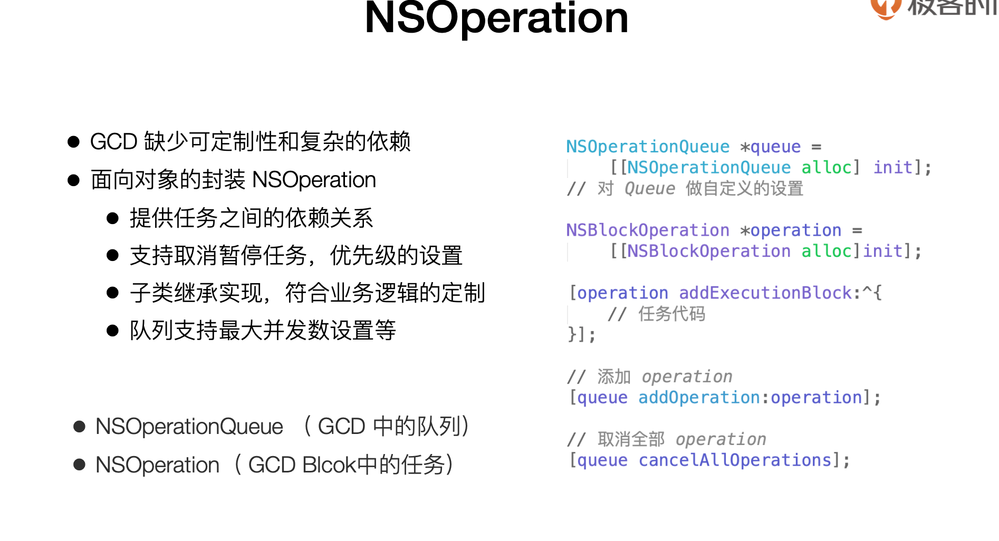

### 多线程

[iOS多线程：『GCD』详尽总结](https://juejin.cn/post/6844903566398717960)

[GCD 源码浅析](https://juejin.cn/post/6984238272352354317)

[iOS 多线程--GCD 串行队列、并发队列以及同步执行、异步执行](https://dandan2009.github.io/2018/04/15/multithreading-gcd/)




```objc
- (instancetype)initWithTarget:(id)target selector:(SEL)selector object:(nullable id)argument;
- (instancetype)initWithBlock:(void (^)(void))block);


//    downloadImageThread.name = @"downloadImageThread";
//    [downloadImageThread start];
```







```objective-c

    dispatch_queue_global_t downloadQueue = dispatch_get_global_queue(DISPATCH_QUEUE_PRIORITY_DEFAULT, 0);
    dispatch_queue_main_t mainQueue = dispatch_get_main_queue();

```



```objc
    dispatch_async(downloadQueue, ^{
        UIImage *image = [UIImage imageWithData:[NSData dataWithContentsOfURL:[NSURL URLWithString:item.picUrl]]];
        dispatch_async(mainQueue, ^{
            self.rightImageView.image = image;
        });
    });
```




