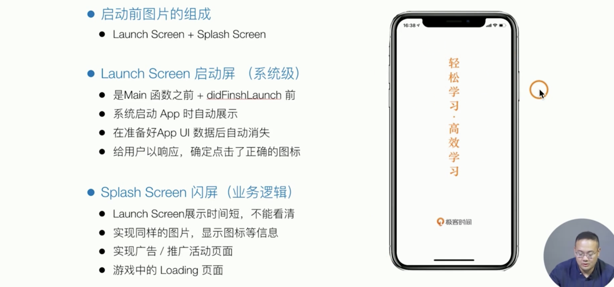

# IOS Development

### app生命周期

[生命周期](https://juejin.cn/post/6966236013760872462)


(Ios13之后，UI的生命周期交给新增的Scene Delegate处理)

##### Pre-main 阶段

> [app启动流程学习](https://blog.csdn.net/qq_55655826/article/details/123555306?spm=1001.2014.3001.5502)

- dylib loading 动态库加载
- rebase/binding：就是对动态库的链接和绑定
- objc setup：主要就是维护一张关于全部类的一些属性和方法，类名等等东西的一张表
- `initialize time:`这一份指代的是执行`+initialize`方法的时间

> 所以优化根据每个步骤都有一个优化方向：
>
> 1.减少动态库
>
> 2.少写点类，或者把不用的类移除掉
>
> 3.使用懒加载

##### Main函数执行+生成application

```objective-c
    NSString * appDelegateClassName;
    @autoreleasepool {
        // Setup code that might create autoreleased objects goes here.
        appDelegateClassName = NSStringFromClass([AppDelegate class]);
    }
    return UIApplicationMain(argc, argv, nil, appDelegateClassName);
```

- 生成ui application对象 实现delegate （app delegate提供为我们操作业务逻辑的时机）

###### UI Application 

- 处理app生命周期/内存警告
- 处理window以上层级的UI, e.g.Statusbar, 图标消息数,方向
- 处理openURL(跨进程通信)

###### 提供Delegate / Notification两种方式处理业务逻辑

###### 根据app状态调整业务逻辑：Not running; Inactive; Active; Background; Suspended

##### AppDelegate

功能：负责app的启动和结束以及对UIscene对象的管理

1. 处理 App 生命周期和系统级事件

   ```objective-c
    - (BOOL)application:(UIApplication *)application didFinishLaunchingWithOptions:(NSDictionary *)launchOptions{}
   // application 参数用来获取应用程序的状态、变量等，值得注意的是字典参数：(NSDictionary *)launchOptions，该参数存储程序启动的原因
   // e.g. 应用可以被某个其它应用调起（作为该应用的子应用），要实现单点登录，那就需要在启动代码的地方做出合理的验证，并跳过登录。
   ```

2. 新的 Scene Session 生命周期

   ```objective-c
       // MARK: UISceneSession Lifecycle   scene生命周期
       func application(_ application: UIApplication, configurationForConnecting connectingSceneSession: UISceneSession, options: UIScene.ConnectionOptions) -> UISceneConfiguration {
           // Called when a new scene session is being created.
           // Use this method to select a configuration to create the new scene with.
           return UISceneConfiguration(name: "Default Configuration", sessionRole: connectingSceneSession.role)
       }//启动scene的配置
    
       func application(_ application: UIApplication, didDiscardSceneSessions sceneSessions: Set<UISceneSession>) {
           // Called when the user discards放弃 a scene session.
           // If any sessions were discarded while the application was not running, this will be called shortly after application:didFinishLaunchingWithOptions.
           // Use this method to release any resources that were specific to the discarded scenes, as they will not return.
       }//关闭和scene的会话
   ```

##### SceneDelegate

> [Xcode11新变化：SceneDelegate](https://juejin.cn/post/6844903952853499918)
>
> [UIScene 和 UIWindowScene](https://blog.csdn.net/qq_55655826/article/details/123566948)

一个应用程序对应一个UIScene实例，相互独立，同时进行，每一个实例有不同的状态，可能一个在前台运行一个在后台运行，拥有独立的Windows和controllers,这些实例统一油UIApplication.shared管理，并且通过代理UISceneDelegate处理整个生命周期和事件。

e.g. 根控制器设置 设置uiwindow

```swift
func scene(_ scene: UIScene, willConnectTo session: UISceneSession, options connectionOptions: UIScene.ConnectionOptions) {
    guard let windowScene = (scene as? UIWindowScene) else { return }
    window?.frame = windowScene.coordinateSpace.bounds
    let tabVc = UITabBarController()
    tabVc.view.backgroundColor = UIColor.blue
    window?.rootViewController = tabVc
    window?.makeKeyAndVisible()
 }
```

```objective-c
- (void)scene:(UIScene *)scene willConnectToSession:(UISceneSession *)session options:(UISceneConnectionOptions *)connectionOptions {
    UIWindowScene *windowScene = (UIWindowScene *)scene;
        self.window = [[UIWindow alloc] initWithWindowScene:windowScene];
        self.window.frame = windowScene.coordinateSpace.bounds;
         UITabBarController *tabVc  = [UITabBarController new];
        tabVc.view.backgroundColor = UIColor.redColor;
        self.window.rootViewController = tabVc;
        [self.window makeKeyAndVisible];
}
```

---

##### 应用一：自定义splash view




具体实现

1. 直接在当前window上addSubview（image view）

   页面结构保证在最上面

2. 创建新的window成为key window

   调整window的level

   多window的管理

[Xcode11添加引导页](https://www.jianshu.com/p/e86c5ea1e5fd)

1. 创建uiimageview子类


注意给splashview类添加用户互动

2. `- (void)scene:(UIScene *)scene willConnectToSession:(UISceneSession *)session options:(UISceneConnectionOptions *)connectionOptions`执行的最后给当前window添加subview

---

##### 应用二：app跳转

唤起app通过url scheme

url scheme支持app启动，跳转以及参数传递 (分享/登陆/拉起app store等)

- https://time.geekbang.org/
- weixin:// 
- test://

如何使app支持scheme唤起？

1. 设置url types (target->info->URL Types -> 添加url schemes)，然后在safari上输入schemestring:// 就会跳转到app

   存在问题/风险：多个app可以使用同一个urlscheme唤起

2. 在 UIApplication （appdelegate）中处理参数和业务逻辑：比如根据参数跳转指定页面实现指定功能

```objective-c
/// @param url 完整的url
/// @param options 字典：包括source application key（来源app的bundle id） 调用来源/回调方式等等
- (BOOL)application:(UIApplication *)app openURL:(NSURL *)url options:(NSDictionary<UIApplicationOpenURLOptionsKey, id> *)options{
  //处理url中的参数，跳转到指定页面或者实现指定功能
    return YES;
}

options
{
  openinplacekey = 0,
  souceapplicationkey = "com.apple.mobile.safari"
}
```

如何唤起其他app？


```objc
- (BOOL)canOpenURL:(NSURL *)url API_AVAILABLE(ios(3.0));
// 只能判断添加在info.plist里白名单（lsapplicationqueriesschemes）的app是否被安装，如果安装返回yes，返回no也有可能被成功拉起

// 使用这个函数拉起其他app，如果没有安装app就会调入app store进行下载
- (void)openURL:(NSURL*)url options:(NSDictionary<UIApplicationOpenExternalURLOptionsKey, id> *)options completionHandler:(void (^ __nullable)(BOOL success))completion API_AVAILABLE(ios(10.0)) NS_EXTENSION_UNAVAILABLE_IOS(""){
  
}
```


universal link


