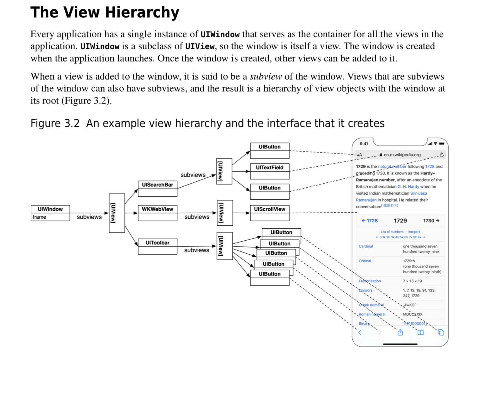
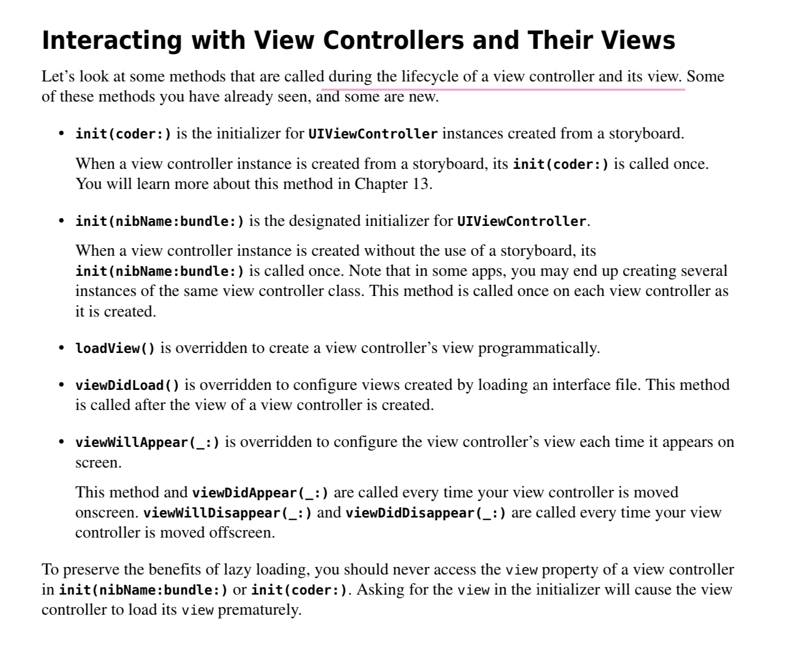

# CS193 (2017)


## lecture 1 && lecture 2

- Target/action and outlets and outlets collections

  e.g. touchCard method ...

- methods and properties (aka instance variables)

- Property observer (didSet)

  e.g. when flipCount change, set didSet to change the UI

- Array<Element>

  .firstIndex(of : ...)

  .remove(at: )

- MVC

- Value types (structs) vs. reference types (class)

- initializeres

- Type (static) methods

  static func getUniqueIdentifier

  static var identifierFactory

- lazy properties

- For in loops

  Iterating over a sequence (countable range, string, array)

- Dictionary<key, value>

- Type conversion 

  e.g. UInt32(anInt)

- Optionals

- 快捷键

- comment mark, todo, fixme

  


## lecture 3 && Lecture 4

- UIStackView and auto layout

  1. stack view

     - Axis: vertical / horizontal

     - Distribution: fill equally
     - spacing：use standard value

  2. adjust position (auto layout)
     - Ctrl + 拖拽
     - constant： use standard value
     - fix warning： update frame -> 随内容大小增大缩小
     - 两个模块vertical position： relation ： greater or equal

- Range 

  Countable range (小数)

  Stride: `for i in stride(from 0.5, through: 15.25, by: 0.3) {}` -> closed countable range

- Tuple 

  return multiple values from a function / method

- computed properties

  ```swift
  var foo: Double {
    get {
      // return the calculated value of foo
    }
    set (newValue) {
      do something based on the fact that foo has changed to newValue
    }
  }
  ```

- Access control

  - internal (default)
  - private
  - private(set)
  - fileprivate
  - public (for frameworks only)
  - open

- Extensions

  不能添加存储属性，不能reimplement 方法和属性

  不要滥用extension

  使用例子：

  ```let randomIndex = Int(arc4random_uniform(UInt32(emojiChoices.count)))```

- Enum

  - check an enum's state -> switch
  - methods yes, (stored) properties no
  - 模式匹配
  - modifying self in an enum (mutating before functions before enum is a value type) (copy on write)

- Optional

  Declaring/assigning `?`

  Unwrapping `print(hello!)` ` if let x = hello {}`

  Implicitly unrapped optional `!`

  Nil-coalescing operator `??`

  opitonal chaining `x?.foo()?.bar?.z`

- Data structure

  - class 

    Auto matic referene counting

    influcing arc 

    - strong 
    - weak (weak only applies to optional pointers to reference types) e.g. outlets , delegations
    - Unowned (break memory cycles between objects -> closures)

  - struct

    Pass copies

    copy on write -> mutating functions in structs

  - enum

  - protocol

    使用场景：

    1. make API more flexible and expressive

    2. Blind, structured communication between view and controller (delegation)

    3. mandating behavior (the keys of a dictionary must be hashable)

    4. sharing functionality in disparate types

    5. Multiple inheritance( of functionality, not data)

    optional methods in a protocol

    - 使用optional 标记的protocol，必须be marked @objc
    - implements an optional protocol must inherit from NSObject
    - for delegation

    mutating function, protocol for class

    protocol inheritance & Multiple inheritance

    e.g. countable range implements many protocols, such as

    - sequence: makeIterator -> for in
    - collection: subscripting, index(offsetBy:), index(of:)

    Delegation:

    - How it works? 6 steps

    Protocol & extension:

- Init (inheritance) 

- functional programming 

- String

  - made up of unicodes (not ascii)

  - a single character is  made up of mutiple unicodes( e.g. cafe)

  - the index into a string cannot be an Int -> String.Index

    ```swift
    String.Index
    
    //to get an index 
    startIndex, endIndex, index(of:)
    
    //move to another index
    index(String.Index, offsetBy:Int)
    
    //returns an Array<String>
    someString.components(seperatedBy: )
    
    //returns an Array<Character> -> Array has an init that takes any Sequence as an argument
    let characterArray = Array(someString)
    
    // Other String methods
    func hasPrefix(String) -> Bool
    func hasSuffix(String) -> Bool
    var localizedCapitalized/Lowercase/Uppercase: String
    func replaceSubrange(Range<String.Index>, with:)
    
    ```

    - NSAttributedString

      a string with attributes attached to each character

      ```swift
      let attributes: [NSAttributedStringKey: Any] = [
        //.foregroundColor, .backgroundColor
        .strokeColor: UIColor.orange,
        .strokeWidth: 5.0 
      ]
      ```

      To get mutability, you have to use a subclass of it called NSMutableAttributedString

      > NSAttributedString was costructed with NSString in mind -> different encodings because of varying-length unicodes (doesn't matter if the entire string has the same attributes or it doesn't contain wacky unicode characters)

  - function types
  - closures
    - create the function on the fly $0 表示参数
    - 使用场合：
      1. as arguments to methods
      2. tells a method what to do under certain circumstances
      3. repeatedly perform a function e.g. map (ps. the last or only argument to a method is a closure)
      4. Property initialization : execute a closure (often with lazy property initialization)
    - Capturing  -- closures are reference type (attention: memory cycle )

## lecture 5 Drawing

- Errors

  `func save() throws` 

  ```swift
  do {
    try context.save()
  } catch let error {
    //error will be somthing that implements the Error protocol, e.g. NSError
    //usually these are enums that have associated values to get error details
    throw error //this would re-throw the error
  }
  
  try! context.save() // will crash if save() throws an error
  let x = try? errorProneFunctionThatReturnsAnInt() //x will be Int?

- Any & AnyObject

- Casting

- Other interesting classes

  - NSObject : Base class for all Objective-C classes (UI kit classes ... )

  - NSNumber 
  - Date: Calendar, DateFormatter, DateComponents
  - Data: bag of bits

- Views

  - UIView subclass (rectangular area)

  - Hierarchical

    - `var superview: UIView?`
    - `var subviews: [UIView]`

  - UIWindow (only matters 投屏) (iOS app all about views not windows)

  - construct hierarchy

     `func addSubview(_ view: UIView)`

     `func removeFromSuperview()`

    The top of the view hierarchy is the controller's `var view: UIView` （bounds hchange on rotation)

  - 初始化 UIView ？ 

    - 两种初始化方法 

      ```swift
      init(frame: CGRect) // from code
      init(coder: NSCoder) // from a storyboard
      ```

    - if you need an initialiser, implement them both

      ```swift
      func setup() {...}
      override init(frame: CGRect) { // ad designated initializer
        super.init(frame: frame)
        setup() //might have to be before super.init
      }
      required init?(coder aDecoder: NScoder) { // a required , failable initializer
        super.init(coder: aDecoder)
        setup()
      }
      ```

    - Another alternative to initializers in UIView

      ```swift
      awakeFromNib()
      //如果你需要在视图展示之前就要操作某些东西的时候使用这个方法，但是只有storyboard中的视图才会调用这个方法
      ```

  - core graphics (2D)

    - CGFloat (coordinate value)

    - CGPoint

    - CGSize

    - CGRect

      - var minX: CGFloat
      - var midY: CGFloat
      - intersects(CGRect) -> Bool
      - intersect(CGRect)
      - contains(CGPoint) -> Bool

    - 坐标系统

      - points（点）vs. pixels（像素）

        UIView's `var contentScaleFactor: CGFloat `每个点返回多少像素

      - 绘图边界

        - `var bounds: CGRect`
        - in its own coordinate system,  因为视图可以被拉伸、旋转或者变换
        - orgin normally is (0 ,0), (scroll view中会更改它的原点到目前滚动的位置), 大部分情况下需要关心的是它的长和宽

      - frame, center (相对父视图) vs bounds

        `var center: CGPoint`

        `var frame: CGRect`

        frame的size和bounds的size大多数情况下总是相同的，代表一个矩形要完全包含另一个矩形，但是也有例外，因为视图是可以旋转的

  - Custom views

    - via storyboard (大多数) using identity inspector 或者 via code (少数)

    - 如果你只是需要使用一些常规的组件那么直接使用系统自带的就可以，如果你想要绘制一些特殊的图形，或者相对不同的触摸手势做出不同的反应的话 -> custom views

      ```swift 
      override func draw(_ rect: CGRect)  
      //CGRect only for optimisation
      //UIView's bounds describes the entire drawing area
      
      ```

      永远都不要调用drawRect方法！drawRect是被系统调用的 

      调用`setNeedDisplay(_ rect: CGRect)`  或者 `setNeedDisplay()`, 系统会在适合的时机调用drawRect，但是首先它会设置一些东西，你周围的其他视图，它们必须先被组织起来。

    - implement my `draw(CGRect)`

      1. get a drawing context `UIGraphicsGetCurrentContext()` and tell it what to draw (create paths -> set drawing attributes -> stroke or fill the paths with the given attributes)

      2. create a path of drawing using UIBezierPath class

         ```swift
         //create a UIBezierPath
         let path = UIBezierPath()
         //move around, add lines or arcs to the path
         path.move(to: CGPoint(80, 50))
         path.addline(to: CGPoint(140, 150))
         ...
         //close the path (if you want)
         path.close()
         //set attributes and stroke/fill
         UIColor.green.setFill()
         UIColor.red.setStroke()
         path.linewidth = 3.0
         path.fill()
         path.stroke()
         //draw common shapes with UIBezierPath
         let roundedRect = UIBezierPath(roundedRect: CGRect, cornerRadius: CGFloat)
         ...
         //clipping your drawing 
         addClip()
         //hit detection
         func contains(_ point: CGPoint) -> Bool
         
         ```

  - UIColor

    background color of a UIView -> `var backgroundColor : UIColor`

    Colors can have alpha (transparency) -> `let semitransparentYellow  = UIColor.yellow.withAlphaComponent(0.5)`

    Draw in your view with transparency -> setting the UIView's `var opaque = false ` (涉及到cpu compositing)

    Make the entire UIView transparent -> `var alpha: CGFloat`

  - Layers (CALayer) (see ppt)

  - view transparency

    Subviews overlap

    completely hiding a view without removing it from hierarchy `var isHidden: Bool`

  - drawing text

    - UILabel
    - to draw in draw(CGRect), use NSAttributedString
    - accessing a range of characters in an NSAttributedString -> NSRange has an init which can handle the String vs. NSString weirdness ... (see ppt)

  - Fonts

    - set fonts in UI elements like UIButton, UILabel, etc.

      Be sure to choose a "preferred font" for user content in the Inspector in InterfaceBuilder

    - get a font in code 

      ```swift
      //get preferred font for a given text style  -> UIFont's preferredFont function
      static func preferredFont(forTextStyle: UIFontTextStyle) -> UIFont 
      UIFontTextStyle.headline
      UIFontTextStyle.body
      UIFontTextStyle.footnote
      
      //the size of the font you get is determined by user setting
      ```

    - more advanced way

    ```swift
    let font = UIFont(name: "Helvetica", size: 36)
    //don't use this fixed size font
    //use the font from the user's side by
    let metrics = UIFontMetrics(forTextStyle: .body) //or UIFontMetrics.default
    let fontToUse = metrics.scaledFont(for: font)
    //now get metrics for the text style you want and scale font to the user's desired size
    ```

    - system fonts (appear on things like buttons)

  - Drawing Images

    - UIImageView (like UILabel for images)

    - Creating a UIImage object

      ```swift
      let image : UIImage? = UIImage(named: "foo") //optional
      ```

      add foo.jpg to your project in the Assets.xcassets file

      images will have different resolutions for different devices

    - create one from files in the file system

      ```swift
      let image: UIImage? = UIImage(contentsOfFile: pathString)
      let image: UIImage(data: aData) // raw jpg, png, tiff, etc.
      ```

    - create one by drawing with core graphics

    - drawing images: 

      ```swift
      let image :UIImage = ...
      image.draw(at point: aCGPoint) //the upper left corner put at aCGPoint
      image.draw(in rect: aCGRect) //scales the image to fit aCGRect
      image.drawAsPattern(in rect: aCGRect) //tiles the image into aCGRect
      ```

  - Redraw on bounds change

    ```swift
    // UIView property to control this
    var contentMode: UIViewContentMode
    UIViewContentMode
    
    .left/ .right/ .top/ .bottom /.topRight ... /.center //don't scale the view, just place the bits somewhere
    
    ./scaleToFill/.scaleAspectFill/.scaleAspectFit //.scaleToFill is the default
    
    .redraw
    ```

  - layout on bounds change

    ```swift
    1. autolayout constrains
    
    2. manually reposition your views by overriding ...
    
    override func layoutSubviews() {
      super.layoutSubviews()
      //reposition my subviews frames based on my new bounds
    }
    ```

  - demo

    - Storyboard

      - Autolayout

        constraints: 

        1. make the card as big as possible  -> width + priority
        2. aspect ratio

## Lecture 6 multitouch 

- Gestures

  - gestures are recognized by instances of `UIGestureRecognizer` class which is abstract

  - using a gesture recogniser:

    1. Adding a gesture recognizer to a UIView  (usually done by a controller)
    
       ```swift
       @IBOutlet weak var pannableView: UIView {
         didSet {
           let panGestureRecognizer = UIPanGestureRecognizer (
           target: self, action: #selector(ViewController.pan(recognizer:)))
         }
         pannableView.addGestureRecognizer(panGestureRecognizer)
       }
       
       // the target gets notified when the gesture is recognized (usualy UIController itself or UIView)
       // the action is the method invoked an recognition
       // ask the UIView to actually start trying to recognize this gesture in ints bound
       ```
    
    2. providing a method to "handle" that gesture (provided by the UIView or a Controller)
    
       - A handler for a gesture needs gesture-specific information
    
       ```swift
       // UIPanGestureRecognizer provides 3 methods
       func translation(in: UIView) -> CGPoint //cumulative since start of recognition
       func velocity(in: UIView) -> CGPoint //how fast the finger is moving (points/s)
       func setTranslation(CGPoint, in: UIView?) //reset the translation 
       ```
    
       - The abstract superclass also provides state information
    
         ```swift
         var state: UIGestureRecognizerState { get }
         .possible //unitl recognition starts
         .began  .changed  .ended  //for a continuous gesture
         .ended  .recognized  //for a discrete gesture
         .cancelled   .failed
         ```
    
         ```swift
         func pan(recognizer: UIPanGestureRecognizer) {
           switch recognizer.state {
             case .changed: fallthrough
             case .ended: 
             let translation = recognizer.translation(in: pannableView)
             //update anything that depends on the pan gesture using translation.x and .y
             recognizer.setTranslation(CGPoint.zero, in: pannableView)
           }
         }
         ```
    
  - Other gestures
  
    ```swift
    // UIPinchGestureRecognizer
    var scale: CGFloat
    var velocity: CGFloat {get}
    
    // UIRotationGestureRecognizer
    var rotation: CGFloat //in radians
    var velocity: CGFloat {get} //radians per second
    
    // UISwipeGestureRecognizer
    // set up the direction and number of fingers you want
    var direction: UISwipeGestureRecognizerDirection
    var numberOfTouchesRequired: Int
    
    // UITapGestureRecognizer
    // this is discrete, but you should check for .ended to actually do sth
    // set up the number of taps and fingers you want
    var numberOfTapsRequired: Int //single tap, double tap, etc
    var numberOfTouchesRequired: Int //finger count
    
    // UILongPressRecognizer
    // this is a continuous gesture (i.e. you'll get .changed if the finger moves)
    // you still configure it up-front
    var minimumPressDuration: TimeInterval // how long to hold before its recognized
    var numberOfTouchesRequired: Int // finger count
    var allowableMovement: CGFloat // how far finger an move and still recognize
    //very important to pay attention to .cancelled because of drag and drop
    ```


## Lecture 7 Multiple MVCs

##### IOS provides some controllers whose View is "other MVCs"

```swift
UITabBarController
UISplitViewController
UINavigationController // a stack of cards
```

##### UITabBarController

- in bar item (title + icon) is determined by each MVC themselves via `var tabBarItem: UITabBarItem! `(usually set with storyboard)

##### UISplitViewController

- two MVCs side-by-side (master + detail)

- ! 注意xcode版本 默认风格设置问题 -> unspecified(Discouraged)

  [详见issue solving](https://developer.apple.com/forums/thread/677867)

##### UINavigationController

- pushes and pops MVCs off of a stack (like a stack of cards)

- Each MVC communicates these contents via its UIViewController's `navigationItem` property

- pushing / popping

  ```swift
  func pushViewController (_ vc: UIViewController, animated: Bool)
  func popViewConroller (animated: Bool)
  ```

  Instead we usually use Segues

##### Accessing the sub-MVCs

- get the sub-MVCs via the viewController's property `var viewControllers: [UIViewController]? { get set }` //can be optional

- know the SVC, TBC or NC it is currently in

  ```swift
  var tabBarController: UITabBarController {get}
  var splitViewController: UISplitViewController {get}
  var navigationController: UINavigationContrller? {get}
  
  //e.g. to get the detail of the split view controller you are in ...
  if let detail: UIViewController? = splitViewController?.viewControllers[1] { ... }
  ```

##### Wiring up MVCs

1. Split View Controller : drag out a Split View Controller from library and ctrl+drag it to the master and detail MVCs (only do its thing properly on iPad/iPhone+)
2. Editor -> Embed In -> Navigation Controller / Tab Bar Controller

##### Segues

- one MVC can cause another to appear

- kinds of segues
  1. Show Segue (will push in a NC, else modal)
  2. Show Detail Segue (will show in Detail of a split view or will push in a NC)
  3. Modal Segue (take over the entire screen while the MVC is up)
  4. Popover Segue (make the MVC appear in a little popover window)

- **Segues always create a new instance of an MVC**

- How do we make these segues happen?

  1. ctrl+drag in a storyboard from an instigator to the MVC to segue to   /  code

  2. select the kind of segue you want (usually show or show detail)

  3. click on the segue and open the attributes inspector

  4. Give the segue a unique identifier here (descriptive) 

     Identifier 用法

     ```swift
     // 1. to invode this segue from code using this UIViewController method
     func performSegue(withIdentifier: String, sender: Any?)
     //you can ctrl-drag from the controller itself to another controller if you are segueing via code because in that case, you'll be specifying the sender above
     ```

     More important use of the identifier: preparing for a segue

     ```swift
     // 2. prepare for a segue
     
     //the method is called in the instigator's controller
     func prepare(for segue: UIStoryboardSegue, sender: Any?) {
       if let identifier = segue.identifier {
         switch identifier {
           case "Show Graph":
           if let vc = segue.destination as? GraphController {
             vc.property1 = ...
             vc.callMethodToSetItUp(...)
           }
           default: break
         }
       }
     }
     // the segue contains 1. .identifier 2. the controller of the mvc you are segueing to by .destination
     //!!! it is crucial to understand this preparation is happening before outlets get set (在destination文件中进行判断预防)
     
     //remember the MVC segued to is always a fresh instance -> we learnt how to reuse the old one by conditional segueing 
     // for splitview on ipads: change the suitable property e.g. theme
     // for navgation view on iphones: push view controller with  navigationController?.pushViewController(cvc, animated: true)
     // for else: performSegue(withIdentifier: , sender: )
     ```

     ```swift
     // 3. preventing segues
     func shouldPerformSegue(withIdentifier identifier: String?, sender: Any?) -> Bool
     ```

## Lecture 8  Animation

##### Timer

- use to execute code periodically

- ```swift
  // fire one off with this method ...
  class func scheduledTimer(
    withTimeInterval: TimeInterval,
    repeats: Bool,
    block: (Timer) -> Void
  )
  
  //Example
  private weak var timer: Timer?
  timer = Timer.scheduledTimer(withTimeInterval: 2.0, repeats: true) { timer in
     //code here
  }
  ```

- the var we stored the timer in is weak, that's okay because the run loop will keep a strong pointer to this as long as it's scheduled

- stopping a repeating timer: `timer.invalidate()`

- Tolerance: `timer.tolerance = 10`

##### Animation

- kinds of animation:

  1. Animating UIView properties
  2. Animating controller transitions (as in a UINavigationController)
  3. Core animation
  4. openGL and metal - 3d
  5. SpritekIT - 2.5D animation
  6. Dynamic Animation

- UIView Animation

  - UI Properties: 

    Frame / center

    bounds

    transform

    alpha

    backgroundColor


## Lecture 9 View Controller Lifecycle and Scroll View


problem solving: 

Scrollview ambigious width or height: uncheck content layout guide

## Lecture 10 MultiThreading and AutoLayout

##### Queue

- main queue

  All UI activity MUST occur on this queue and this queue only. 

  Non-UI activity that is at all time consuming must NOT occur on that queue.

- global queue

  For non-main-queue work, you’re usually going to use a shared, global, concurrent queue

##### MultiThreading

- getting a queue

  ```swift
  // main queue
  let mainQueue = DispatchQueue.main
  
  //background queue
  let backgroundQueue = DispatchQueue.global(qos: DispatchQoS) 
  /* 
  DispatchQoS.userInteractive -> high priority, only do something short and quick
  DispatchQoS.userInitiated -> high priority, but might take a little bit of time
  DispatchQoS.background -> not directly initiated by user, so can run as slow as needed
  DispatchQoS.utility -> long-running background processes, low priority
  */
  ```

- putting a block of code on the queue

  ```swift
  // You can just plop a closure onto a queue and keep running on the current queue ...
  queue.async { ... }
  // or you can block the current queue waiting until the closure finishes on that other queue ...
  queue.sync { ... }
  ```

- getting a non-global queue

  ```swift
  let serialQueue = DispatchQueue(label: “MySerialQ”) //Your own serial queue (use this only if you have multiple, serially dependent activities) ...
  
  let concurrentQueue = DispatchQueue(label: “MyConcurrentQ”, attributes: .concurrent) //Your own concurrent queue (rare that you would do this versus global queues) ...
  ```

- OperationQueue and Operation -> for more complicated multithreading / dependency management

- Other stuff: you can do locking, protect critical sections, readers and writers, synchronous dispatch, etc. 

  Check out the documentation if you are interested

##### Multithreaded iOS API

iOS might ask you for a function (a closure, usually) that executes off the main thread. Don’t forget that if you want to do UI stuff there, you must dispatch back to the main queue!

```swift
let session = URLSession(configuration: .default)


//Let’s look at when each of these lines of code executes ...
if let url = URL(string: “http://stanford.edu/...”) {  //1
     let task = session.dataTask(with: url) { (data: Data?, response, error) in  //2
          // do something with the data   //3
          DispatchQueue.main.async {  //4
             // do UI stuff here  //5
          }
         print(“did some stuff with the data, but UI part hasn’t happened yet”)  //6
      }            
      task.resume()  //7
}
print(“done firing off the request for the url’s contents”)  //8


//1 2 6 7 3 4 6 5
```

###### Demo Cassini

> - Dealing with crash
>
> 1. debugger console: 
>
> 2. check variables from the left pane: self -> children    [scrollView nil]
>
> 3. go through the thread calling stacks: setter -> didst -> prepare   [outlet not set]
>
> 4. scrollView?.outlet
>
> - Always remember to put things in optional in case people attempting to access it

##### autolayout

- Autolayout from earlier

###### storyboard:

蓝线定位

Ctrl-drag 相对其他view或者edge定位

size inspector

document outline

###### code

Search for the words “anchor” and “auto layout” in the UIView documentation.

- Concentration

Reposition the views entirely? geometry changes so drastically? e.g. concentration

-> We can vary our UI based on its “size class”  (“compact” or “regular” width or height.)

1. interface

   manage properties: +

   constraints: installed or not

2. Code

   ```swift
   let myHorizSizeClass: UIUserInterfaceSizeClass = traitCollection.horizontalSizeClass
   //The return value is an enum ... either .compact or .regular (or .unspecified).
   ```

## lecture 11 


### Drag and Drop

- 可互操作

- 使用

  ```swift
  //注册drag drop动作，我们通常使用interaction
  let drag/dropInteraction = UIDrag/DropInteraction(delegate: theDelegate)
  view.addInteraction(drag/dropInteraction)
  
  
  //starting a drag
  //the delegate gets  
  func dragInteraction(_ interaction: UIDragInteraction,itemsForBeginning session: UIDragSession) -> [UIDragItem]
  //and can return the items it is willing to have dragged from the view. Returning an empty array means “don’t drag anything after all.”
  //a drag item
  let dragItem = UIDragItem(itemProvider: NSItemProvider(object: provider)) 
  //item provider :  NSAttributedString, NSString, UIImage, NSURL, UIColor, MKMapItem, CNContact.
  
  //In the middle of a drag, users can add more to their drag if you implement ...
  func dragInteraction(_ interaction: UIDragInteraction, itemsForAddingTo session: UIDragSession) -> [UIDragItem]
  //... and returns more items to drag.
  
  
  //accepting a drop
  //When a drag moves over a view with a UIDropInteraction, the delegate gets ... 
  func dropInteraction(_ interaction: UIDropInteraction,
        canHandle session: UIDragSession
    ) -> Bool
  //... at which point the delegate can refuse the drop before it even gets started.
  //To figure that out, the delegate can ask what kind of objects can be provided ...
  let stringAvailable = session.canLoadObjects(ofClass: NSAttributedString.self) 
  let imageAvailable = session.canLoadObjects(ofClass: UIImage.self)
  //... and refuse the drop if it isn’t to your liking.
  
  //If you don’t refuse it in canHandle:, then as the drag progresses, you’ll start getting ... 
  func dropInteraction(_ interaction: UIDropInteraction,
  sessionDidUpdate session: UIDragSession
  ) -> UIDropProposal
  //... to which you will respond with UIDropProposal(operation: .copy/.move/.cancel). 
  //.cancel means the drop would be refused
  //.copy means drop would be accepted
  //.move means drop would be accepted and would move the item (only for drags within an app)
  //If it matters, you can find out where the touch is with session.location(in: view)
  
  //If all that goes well and the user let’s go of the drop, you get to go fetch the data ...
  func dropInteraction(_ interaction: UIDropInteraction,
      performDrop session: UIDropSession
  )
  //You will implement this method by calling loadObjects(ofClass:) on the session. ofClass can be image, attributed string, color or URL etc.
  //This will go and fetch the data asynchronously from whomever the drag source is. 
  session.loadObjects(ofClass: NSAttributedString.self) { theStrings in
  // do something with the dropped NSAttributedStrings 
  }
  //The passed closure will be executed some time later on the main thread. 
  //You can call multiple loadObjects(ofClass:) for different classes.
  //You don’t usually do anything else in dropInteraction(performDrop:).
  ```

- demo

  >  Why seperate drop zone and emojiArtView?
  >
  > 1. keep track of at the controller level what's dropped in. remember the url of what's dropped in. all the keeping track of the document has to happen at the controller level. we don't want the view doing that
  > 2. sometimes if we wanna put the view into a scroll view which might be small, it might not be filling the space anymore, so I want the drop zone to be as big as possible

  


### UITableView and UICollectionView

- UIScrollView subclasses used to display unbounded amounts of information

###### How do they look like? 

- **Table View** presents the information in a long (possibly sectioned) list.

  Layout :

  basic / sectioned / with simple ancillary info / grouped (static and fixed)

  风格：a. subtitle Style 下方, b. Left Detail Style 左侧, c.Right Detail Style 在行末, d.Basic Style下不显示, e. Custom Style 自定义

- **Collection View** presents the information in a 2D format (usually “flowing” like text flows).

  Layout : only custom (can be sectioned)

###### How can we get one?

- 如果局部使用：drag **Table View** or **Collection View** into storyboard
- 如果全局使用：use their “prepackaged” MVCs 

###### Where does the data come from?

“views are not allowed to own their data” 

`var dataSource: UITableViewDataSource/UICollectionViewDataSource`: We set a var called dataSource, the type of which is a protocol (like a delegate) with methods that supply the data. 

`var delegate: UITableViewDelegate/UICollectionViewDelegate`: Table View and Collection View also have a delegate that controls how they look.

These are automatically set for you if you use the prepackaged MVCs.

###### How can the data be retrieved with UITableView/CollectionViewDataSource protocol?

```swift
// UITableView
func numberOfSections(in tableView: UITV) -> Int
func tableView(_ tv: UITV, numberOfRowsInSection section: Int) -> Int
func tableView(_ tv: UITV, cellForRowAt indexPath: IndexPath) -> UITableViewCell 
// UICollectionView
func numberOfSections(in collectionView: UICV) -> Int
func collectionView(_ cv: UICV, numberOfItemsInSection section: Int) -> Int
func collectionView(_ cv: UICV, cellForItemAt indexPath: IndexPath) -> UICollectionViewCell

// you get the section the row or item is in from indexPath.section.
// In TV, you get which row from indexPath.row; in CV you get which item from indexPath.item.
```

###### how can we implement these methods?

For the first 2 methods, just return the num of sections or rows/items.

```swift
func tableView(_ tv: UITV, cellForRowAt indexPath: IndexPath) -> UITableViewCell { 
  let prototype = decision ? “FoodCell” : “CustomFoodCell”
  let cell = tv.dequeueReusableCell(withIdentifier: prototype, for: indexPath)
  //It is reusing a UITableViewCell with the given identifier if possible.
  //Otherwise it is making a copy of the prototype in the storyboard.
  cell.textLabel?.text = food(at: indexPath)
  cell.detailTextLabel?.text = emoji(at: indexPath)
  
  // Well, for UITableView only, the default UITableViewCell has a few basic things ...textLabel,detailTextLabel and imageView
}
```

- resuing cells : The fact that cells are reused has serious implications for multithreading! By the time something returns from another thread, a cell might have been reused.


Demo:

splitview+navigation: incaseof portrait

Tableviewcontroller (with prepared code) -> add data, set section numbers, row numbers, configure table view cell (basic cell: UITableViewCell  / custom cell: subclass of UITableViewCell )

goto storyboard, set table view prototype  cells to 1, content to static cells (or dynamic prototype), set cell style to basic, name the identifier

go back to Tableviewcontroller, continue configuring table view cell, change the identifier, set the cell (if is basic default one)'s textLabel(optional) text to the data retrieved using pathIndex.row

Add a bar button item. drag a bar button item, not a normal button. choose the system item (predefined button, i.e. camera, save, add) , hook up the action to the controller, add new item to the array, using the extend function "string".madeUnique(withRespectTo: [array]), tableview.reloadData()

Swipe to delete: 

method `canEditRow`: by default returns true

method `commit editingStyle`: 

```swift
    if editingStyle == .delete {
        // Delete the row from the data source
        emojiArtDocuments.remove(at: indexPath.row)
        tableView.deleteRows(at: [indexPath], with: .fade)
      
      // these two methods have to be perfectly in sync, otherwise it says number of rows in the table do not match
    }
```


- 当切屏使用时，splitview收回master设置：

Splitview has a property called `preferred display mode`

set in viewwilllayoutsubviews method, pay attention to relayout (infinite loops)

- Make emojiArt scrollable/zoomable/centered

Add scrollview, turn off content layout guides in attibute inspector, [详见](https://www.i4k.xyz/article/cuibo1123/119889500)

hook up scrollView, deconnect emojiArtView, set up didset observer for scrollView and viewForZooming function

```swift
    @IBOutlet weak var scrollView: UIScrollView! {
        didSet {
            scrollView.minimumZoomScale = 0.1
            scrollView.maximumZoomScale = 5.0
            scrollView.delegate = self
            scrollView.addSubview(emojiArtView)
        }
    }
```

- keep the scrollview centered

Autolayout: center scrollView, edges from equal to greater or equal, fix the width and height, low priority for the width and height in case of outbounds connect the width and height constraints to the code and change its constant within the func `scrollViewDidScroll`


- add collection view on the top

Height of collection view: normally decided by the user's accessibility font (create height constraint, wire it up into code and set it based on the accessibility font the user sets)

set cell size, scroll direction to horizontal, (never make your cell size bigger than the non-scollable size)

补充:

- how can we change the number of prototype numbers?

  In storybaord, select table view, attribute inspector

- how can we custom cell? 

  drag view and customize (autolayout etc) in storyboard

  make a subclass of UITableViewCell to have outlets to the items in storyboard

/ / removing a row: be in sync, number of rows of the table didn't match when I want to update the rows


Tips:

new editor disabled: unfocus the editor

---

# IOS Programming (7th edition)

## Chapter 1:  A Simple iOS Application (Quiz)

### Auto layout menus

1. Align menu (multiple/single) (ctrl + 拖拽)

2. add new constraints menu (ctrl + 拖拽)  

   Redo : will not replace old ones

   -> Select resolve auto layout issues menu and select clear constraints

### Making connections 

- check connection in the connection inspector

## Chapter 2: The Swift Language 

## Chapter 3: Views and the View Hierarchy (WorldTrotter)

### View basics

- UIView (or its subclass) 实例
- 处理events
- know how to draw itself
- view hierarchy

### The View Hierarchy



1. Each view in the hierarchy, including the window, draws itself. It renders itself to its layer, which you can think of as a bitmap image. 
2. The layer of all the views are composited together on the screen

### Views and Frames

### The Auto Layout System

- the alignment rectangle and layout attributes

- Constraints : 

  you need at least two constraints per dimension

  the nearest neighbor is the closest silbling view in the specifiied direction

- intrinsic content size: implicit width and height constraints by removing the explicit width and height

- misplaced views:

- click the update the frame icon

补充：

[CALayer-CAGradientLayer(梯度图层)](https://www.jianshu.com/p/1c8ef3116b42)


## Chapter 4 View Controller



## Chapter 5 Programmatic Views

##### Create a view programmatically

override loadView() to create an instance of MKMapView

##### Programmatic constraints

##### Anchors -> to create constraints

##### Layout guides 

- safe area layout guide -> `layoutMarginsGuide`

##### Margins

- layoutMargins property that denotes the default spacing to use when laying out content -> `layoutMarginGuide`

##### Explicit constraints

##### Programmatic controls

.touchDown

.touchUpInside

.valueChanged

.editingChanged


## Chapter 6 Text Input and Delegation

##### Text editing

- UITextField
- set keyboard for the app

##### keyboard attributes

- UITextField's preperty called the UITextInputTraits

##### responding to text field changes


---

## xcode快捷键


Cmd + R: run

Cmd + shift + L : open library   opt+drag: stay the library open

Cmd + shift + Y : display the console 

Cmd + N : create a new file

cmd + 0 : left pane        

cmd + 1...9 切换标签


cmd + opt + 0 : right pane         

cmd + opt + 1...3 切换标签


cmd + shift + y : bottom console / debugger

cmd + ctrl + t : add new editor

cmd + shift + o : open new file

Rename: 

Ctrl-click/cmd-click the name of a class, method or variable -> refactor -> rename


Cmd + K : toggle software keyboard

select multiple lines && ctrl + i: 自动对齐


## Github and Source Control Workflow
